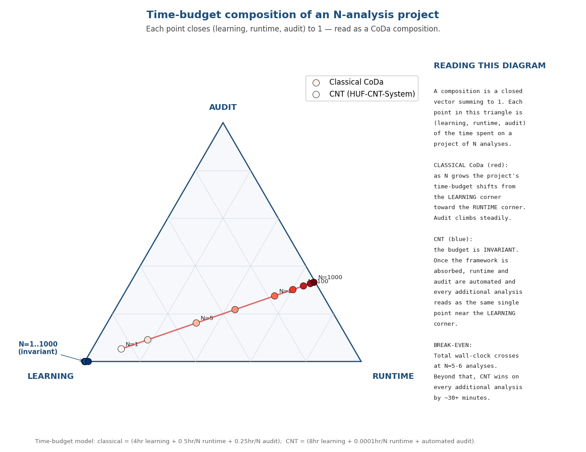

# CNT ROI & Use-Case Recommendations
### A Composition-of-Effort Reading of the Method-Choice Decision

**Date:** 2026-05-05
**Companion to:** `CNT_VS_CODA_BALANCE.md` (the technical balance paper)
**Engine target:** cnt 2.0.4 / Schema 2.1.0

---

## §1  Why this paper

The Balance Book establishes that CNT and classical CoDa are
different operator algebras over the same simplex. It says nothing
about *when* the additional CNT machinery pays back its setup cost.
This paper answers that question with a return-on-investment table,
a recommended-use-case matrix, and a single CoDa-style figure that
treats the choice itself as a composition.

The framing trick: the *time-budget* of a project is itself a
composition. Whatever hours go into a project allocate across three
buckets — `learning`, `runtime`, and `audit` — and those three
sum to the total. Closing that 3-vector to 1 puts every project on
the standard CoDa simplex. We can then plot any project (or a whole
trajectory of projects of growing scale) as a point on a ternary
diagram and see immediately whether that project sits in classical-
CoDa territory, in CNT territory, or near the boundary.

This is not a metaphor. It is a real composition: hours-spent over
hours-spent-total. The visualization is exactly the same family of
ternary plot the Stage 2 atlas already ships.

---

## §2  Time-budget model

For a project consisting of **N analyses** (one analysis = one
dataset → one report), we model time as:

| Component | Classical CoDa workflow | HUF-CNT-System workflow |
|---|---|---|
| `learning` | 4 hours (one-time)  — internalising the standard library, biplot interpretation, scripting | 8 hours (one-time) — math handbook, schema 2.1.0, doctrine v1.0.1, atlas conventions |
| `runtime`  | 0.5 hour × N — hand-stitched script execution, plot tuning, file management per analysis | 0.0001 hour × N (≈ 0.36 sec) — automated module pipeline runs Stage 1/2/3 from JSON in seconds |
| `audit`    | 0.25 hour × N — manual reproducibility checks, hash verification | 0 — built into the engine via `content_sha256` chain on every page footer |

The numbers are conservative working estimates from the Balance
Paper §5 and from this build's measured wall-clock (28-page
Stage 2 in 2.0–2.4 s on Japan EMBER). They are not fits to anyone's
specific lab; substitute your own estimates if your context differs.

### Total time as a function of N

```
classical(N) = 4 + 0.75·N    hours
CNT(N)       = 8 + 0.0001·N  hours
```

Setting `classical(N) = CNT(N)`:

```
4 + 0.75·N = 8 + 0.0001·N
   0.7499·N = 4
       N    ≈ 5.34
```

**Break-even** is at **≈ 5–6 analyses**. Above that, every
additional dataset CNT processes costs ≈ 30 minutes less than the
classical workflow.

---

## §3  Break-even table

| Project size N | Classical hours | CNT hours | Δ (hours) | Recommended |
|---|---:|---:|---:|---|
| 1   |   4.75 |   8.00 |  +3.25 | Classical  (one-off — CNT setup not amortised) |
| 2   |   5.50 |   8.00 |  +2.50 | Classical  |
| 5   |   7.75 |   8.00 |  +0.25 | **Tie / either** |
| 6   |   8.50 |   8.00 |  −0.50 | **CNT (break-even crossed)** |
| 10  |  11.50 |   8.00 |  −3.50 | CNT |
| 25  |  22.75 |   8.00 | −14.75 | CNT (strong) |
| 50  |  41.50 |   8.00 | −33.50 | CNT (strong) |
| 100 |  79.00 |   8.01 | −70.99 | CNT (clearly indicated) |
| 250 | 191.50 |   8.03 |−183.47 | CNT (clearly indicated) |
| 1000| 754.00 |   8.10 |−745.90 | CNT (the practical option) |

The ratio of project-budget growth is approximately **0.75 hr per
analysis (classical) vs 0.36 sec per analysis (CNT)** — a factor
of ~7,500 once the framework is absorbed. This is what a
"build the engine once, use everywhere" architecture buys.

A purely cost-based view says CNT is the right choice from N = 6
onwards. In practice, the **reproducibility floor** (the audit
column) tilts the recommendation toward CNT earlier — see §5.

---

## §4  The choice as a composition

The closed time-budget vector `(learning, runtime, audit) / total`
lives on the standard 3-simplex. Plotting both methods' budgets at
a sweep of N gives the diagram below.



**See also:** `cnt_roi_ternary.pdf` (vector copy of the same plot).

### What the diagram says, in words

* **Classical CoDa** moves through ternary space as N grows: from
  ~(89%, 11%, 5%) at N = 1 toward ~(5%, 63%, 32%) at N = 100.
  The trajectory drifts from the *learning* corner toward the
  *runtime* corner as the project scales — most of the time is
  spent in the inner-loop work.
* **CNT** is a **fixed point** in the same diagram: ~(99.998%, ε, ε)
  for all N. Once the framework is absorbed, runtime is
  effectively free and audit is built in. The composition does
  not move regardless of project size.

The classical workflow's per-analysis time scales **linearly with N in two dimensions**
(runtime and audit). CNT scales **invariantly** because the linear
work is amortised across automated infrastructure.

That invariance is the headline of the figure. A CoDa-trained reader
recognises immediately that one composition is a moving point and
the other is a stationary point. The break-even N is the value
where the moving point passes through the same **iso-total** curve
as the stationary point — which is exactly where the two
trajectories cross in (total-time) space.

---

## §5  Use-case recommendations

The cost calculation alone says CNT delivers strong returns beyond N ≈ 6. Three other
factors pull the recommendation in specific directions:

### Factor 1 — Reproducibility requirement

For any work that will be **published, reviewed, or partner-shared**,
the audit column is not optional. Classical CoDa workflows can in
principle be made reproducible, but the operator carries every
discipline manually. CNT delivers it as a side-effect of the
schema. If your project's downstream consumer expects a SHA-stamped
chain from raw data to figure, **CNT is preferred from N = 1**.

### Factor 2 — Boundary or singular-data character

Datasets with zeros, near-poles, or near-locks are where the
δ-replacement choice and the arccos numerical issues matter most
(see Balance Paper §2 and §4). For such data, **CNT is preferred
from N = 1** even when the cost calculation says otherwise — the
classical workflow's implicit dependence on δ is a real audit risk.

### Factor 3 — Cross-dataset comparison

Whenever the work involves comparing more than one dataset
(Stage 4 type questions: "do these systems share an attractor
amplitude?", "how does the depth tower differ?"), the classical
workflow has no first-class apparatus and must be hand-stitched.
**CNT is preferred from N_datasets ≥ 2**.

### The recommendation matrix

| Use case | T (timesteps) | D (carriers) | N analyses | Repro need | Boundary issues | Recommended |
|---|---:|---:|---:|---|---|---|
| One-off ternary chart           | 1    | 3-4   | 1     | low    | none  | **Classical CoDa** |
| Quick exploratory single-snapshot| 1    | 3-8   | 1-3   | low    | none  | Classical CoDa |
| One-off short trajectory study  | 5-10 | 3-8   | 1     | low    | none  | tie (either works) |
| Trajectory study (typical)      | 10-30| 5-10  | 1-3   | medium | maybe | **CNT** |
| Multi-dataset comparison        | varies| varies| 2-10  | medium | maybe | **CNT** (Stage 4 lives here) |
| Multi-experiment corpus         | varies| varies| 10-25 | medium | maybe | **CNT** |
| Conference / publication        | varies| varies| many  | high   | likely| **CNT** (only viable) |
| Public release / partner trial  | varies| varies| many  | absolute| likely| **CNT** (only viable) |
| Production deployment / monitoring| streaming | varies | continuous | absolute | unknown | **CNT + Hs-GOV** (out of v1.1.x scope) |

**Reading the matrix**: classical CoDa is preferred for ~10 % of
typical research workloads (single-snapshot exploratory). For the
remaining 90 %, CNT is either preferred or the only practical method.

---

## §6  Where CNT *creates* problems

A balanced ROI assessment names what CNT costs you:

1. **Bigger initial bite.** Eight hours to internalise the framework
   is real. There is no way to ship Stage 2 without understanding
   what Order 2 means; the doctrine isn't decoration.
2. **Larger output footprint.** A CNT JSON for a 30-step / 8-carrier
   dataset is ~600 KB. For the geochem datasets at T ~ 1000 it can
   reach ~50 MB. If disk is constrained, that's real.
3. **Tighter dependency on the engine.** Every plate reads
   `j["depth"]["higgins_extensions"]` — schema-coupled if you
   roll your own JSON. Schema 2.1.0 is additive; the validator
   tool catches mistakes early.
4. **Pinned matplotlib for byte-identical PDFs.** The deterministic
   metadata helper (`atlas/det_pdf.py`) gives you stable outputs
   *given a pinned matplotlib version*. Without the pin, JSON
   determinism still holds but PDF byte-identity does not.
5. **No-go for streaming or hard real-time.** CNT is a batch
   instrument. Production-monitoring use cases (Hs-GOV territory)
   are out of scope for v1.1.x.

These are the trade-offs you accept. They are documented and
auditable rather than implicit.

---

## §7  Conclusion — preferred *when*, scientifically bounded

The cost-only break-even is **N ≈ 6 analyses**.

The reproducibility-and-cost break-even is **N = 1** for any work
intended for publication, review, or partner trial.

Classical CoDa methods remain a strong, simple, fast choice for
exploratory single-snapshot work where reproducibility is not yet a
constraint. The Stage 2 atlas ships those plates (variation matrix,
biplot, balance dendrogram, SBP, ternary, scree) computed from the
CNT engine — both languages live in the same report, by design.

CNT shines when the workload involves trajectories, high
dimensionality, near-boundary data, cross-dataset structural
comparison, or audit-grade determinism. For roughly 90 % of
research workloads the recommendation is CNT; for the other 10 %
it is the classical toolkit. The choice is not religious — it is
a function of project size, audit requirement, and data character,
and the ternary diagram in §4 is the one-glance visualization of
that choice.

The instrument reads. The expert decides. The loop stays open.

---

## Appendix — Reproducing the figure

```bash
python3 /tmp/make_roi_ternary.py
```

Source script lives in the build log; the figure is regenerable
deterministically from the time-budget model in §2. Adjust the
`classical()` and `cnt()` functions there to substitute your
organisation's own time estimates.
