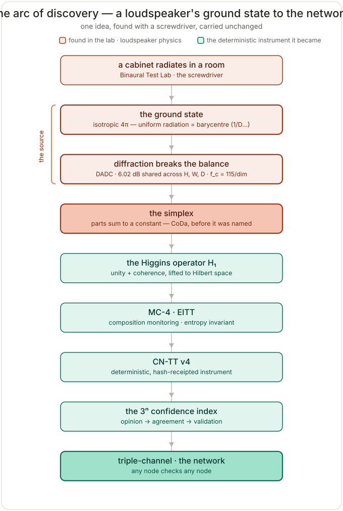

<!-- ╔══════════════════════════════════════════════════════════════════╗
     ║  THREE-LEVEL ORIENTATION  ·  always three to confirm position     ║
     ║  Level 1 below is identical in every repository of this system.   ║
     ╚══════════════════════════════════════════════════════════════════╝ -->

# The system — one instrument, one arc of discovery

*Level 1 of 3 · the shared message. This section is identical in every repository of this system.*

This is one deterministic compositional instrument and the living history that produced it. It began as a loudspeaker's **ground state** — uniform 4π radiation into a room, a fixed **6.02 dB** budget apportioned across a cabinet's dimensions and summing to a constant — and that single structure, *forced by physics rather than chosen at a whiteboard*, became the simplex, the Higgins operator, composition monitoring (MC‑4 / EITT), the deterministic CN‑TT engine, the **3ⁿ confidence index**, and finally a verification network where any node checks any other. Each step was forced by the one before it.

**Read the whole arc, source to network → [`ARC_OF_DISCOVERY.md`](ARC_OF_DISCOVERY.md).**



## …and the system lives in more than one repository

*Level 2 of 3 · the other half exists.*

This is one **cross‑brain** split across sibling repositories that reference and **check** each other:

- **Hˢ — higgins‑decomposition** — *you are here* — the deterministic instrument (the math).
- **HUF — [Higgins‑Unity‑Framework](https://github.com/PeterHiggins19/Higgins-Unity-Framework)** — the governance, lineage, and development history.
- **RWA — [Rogue‑Wave‑Audio](https://github.com/PeterHiggins19/Rogue-Wave-Audio)** — the headwater, where the ground state and diffraction were first measured.

Two‑repo map and the cross‑repo resolver: [`CROSS_BRAIN.md`](CROSS_BRAIN.md).

## …and this repository is the instrument

*Level 3 of 3 · what this one is.*

**Hˢ (Higgins Decomposition)** is the live, deterministic, hash‑receipted engine — closure → CLR → tiling → diagnostics → hash, lossless to D = 1,000,000. Everything below this line is its body: the engine, the frozen oracle, the run path, the studies, and the conference face.

> **Why three.** Three statements — what the system is, that a sibling exists, and which one you are reading — let any reader, human or machine, confirm both their **position** and the system's **status**. It is the same rule the instrument runs on: one perspective is a point, two a line, three a plane; three is the minimum to *locate*, not merely detect. Machines: each repo's entry point is its `AI_ASSIST.json` and fast‑refresh JSON; the resolver in [`CROSS_BRAIN.md`](CROSS_BRAIN.md) keeps every cross‑repo path valid standalone.

---

# Hˢ — Higgins Decomposition on the Simplex

A deterministic compositional inference instrument operating within Aitchison geometry on the simplex. Welcome — this repository is fully public and open for use, citation, and collaboration.

> ## 🆕 Current engine — **CN‑TT v4** (post‑CoDaWork 2026)
> The current engine is the tile‑native **CN‑TT v4.0.0** in [`HCI-CNTT/`](HCI-CNTT/) — full spec: [`HCI-CNTT/CNTT_COMPLETE_SPECIFICATION.md`](HCI-CNTT/CNTT_COMPLETE_SPECIFICATION.md). It identifies a 4‑part composition with an exact unit quaternion (S³=SU(2)) and **tiles** that exactness to any dimension via overlapping charts — **lossless reconstruction proven to D=1,000,000**, deterministic and hash‑chained, with a modular control surface (per‑stage state + start/halt), a cross‑platform determinism contract, internal‑vs‑external **shock self‑diagnostics**, and a [diagnostic **code system**](HCI-CNTT/CNTT_DIAGNOSTIC_CODES.md). It has been certified to reproduce the **entire output of the frozen oracle (CNT v3.2.0)** **bit‑for‑bit on real Backblaze data** ([parity report](experiments/backblaze_v4_parity_2026-06/RESULTS_backblaze_v4_vs_oracle.md)). The CNT v3.2.0 / CNQ v2.0.0 engines documented below are now the **frozen validation oracle**; CN‑TT v4 is the live engine and is additive to them.
>
> **New here? Start with [`HS_GUIDE.md`](HS_GUIDE.md)** — the one‑file guide to what Hˢ is, what it does, and how to use it (distills the whole corpus). **Run it:** `python HCI-CNTT/run_cntt.py <composition.csv> -o out.json`. **Real data for every study:** [`DATA_SOURCES.md`](DATA_SOURCES.md). **New applications:** [`collaborations/microbiome/`](collaborations/microbiome/) (with coda4microbiome) · [`collaborations/geology-wehner/`](collaborations/geology-wehner/) (geosensing → flight). **🛰️ Hˢ in space — an open challenge:** [`SPACE_READINESS_AND_CHALLENGE.md`](SPACE_READINESS_AND_CHALLENGE.md) (deterministic Earth/space twin studies; any composition, anywhere). **Live agenda:** [`ai-refresh/UNIFIED_AGENDA_2026-06-10.md`](ai-refresh/UNIFIED_AGENDA_2026-06-10.md). **Rapid onboarding for AI/new readers:** [`ai-refresh/AI_RAPID_LEARN.md`](ai-refresh/AI_RAPID_LEARN.md). Source of truth: [`HS_FAST_REFRESH.json`](HS_FAST_REFRESH.json).
>
> **🧪 Applications & real‑data runs.** Hˢ now runs as a deterministic **industrial instrument** ([`industrial-instruments/`](industrial-instruments/)) — a four‑study **gas & process‑fluid** collection (closed‑loop O₂/CO₂/N₂ life support · oil & gas produced water · blood/alveolar gas · spacecraft cabin atmosphere) demonstrating the **MC‑4 / Ratio Blindness** doctrine ([`../HUF/huf-gov/RATIO_BLINDNESS_DOCTRINE.md`](../HUF/huf-gov/RATIO_BLINDNESS_DOCTRINE.md)): *three monitoring categories measure magnitude; the fourth reads the ratios.* **Verified on REAL public data:** anaesthesia gas across **two independent datasets** (VitalDB + UQ Vital Signs — O₂ the dominant compositional driver in **13/13** cases) · **USGS Produced Waters** (Williston — minor ions SO₄/HCO₃ drive, not the Na‑Cl bulk brine) · the **Frielingen‑9 mudstone** (PANGAEA) · and **NASA GeneLab GLDS‑1** spaceflight transcriptome ([`collaborations/spaceflight-glds1/`](collaborations/spaceflight-glds1/) — **lossless at D=18,952** + an honest global null). Data sources: [`DATA_SOURCES.md`](DATA_SOURCES.md). **Distributed AI onboarding:** every folder that matters carries an `AI_ASSIST.json` (convention: [`ai-refresh/AI_ASSIST_PATH_PROTOCOL.md`](ai-refresh/AI_ASSIST_PATH_PROTOCOL.md)).

---

## 🎤 CoDaWork 2026 — follow along with the talk

In the room (or watching from anywhere) for *Compositional monitoring of energy-mix drift on the simplex* (Coimbra, Portugal · 1–5 June 2026)?

**Open [`CODA-Association/CONFERENCE_ATTENDEES.md`](CODA-Association/CONFERENCE_ATTENDEES.md).** It's a slide-by-slide follow-along, ordered to the talk, with every link you need open on your phone or laptop. Manuscript, deck, raw-output scroll, and an interactive 3-D projector you can run live in your browser — no install, no network call. If the screen is hard to see, or you're remote, the whole talk runs from that page.

> **🌐 Available in UN-6 locales — now a complete 2-side ambassador (v11).** The community handout [`Higgins_Decomposition_Handout_CoDaCommunity.pdf`](CODA-Association/Higgins_Decomposition_Handout_CoDaCommunity.pdf) is a **single A4 sheet, both sides printed**. Side 1 = the operationalization pitch (what / why / who / how to engage). Side 2 = the full operations reference (CoDa core operations, Hˢ supplementary operations, CNQ quaternion operations, closure constraints across domains, apparatus map of *who reads what*, symbols legend). Ships with Markdown twins in **EN · FR · ES · RU · ZH · AR** under [`CODA-Association/`](CODA-Association/). Non-English locales are drafts pending native expert review per [`HCI-CNQ/wrappers/WRAPPER_SCHEMA.md §11.1`](HCI-CNQ/wrappers/WRAPPER_SCHEMA.md).

> **🎯 Conference Status.** Talk material complete and validated across five reviews; repository in formal **pre-conference lockdown** through 2026-06-06. See [`PRE_CONFERENCE_LOCKDOWN.md`](PRE_CONFERENCE_LOCKDOWN.md) for what's locked and the S0-defect protocol. **Conference authority folder:** [`CODA-Association/CODAwork2026/`](CODA-Association/CODAwork2026/). Recent change history: [`CHANGELOG.md`](CHANGELOG.md). Live state: [`HS_FAST_REFRESH.json`](HS_FAST_REFRESH.json). Conference standards: [`HUF-STD-001`](huf-gov/standards/HUF_PUBLICATION_STANDARDS.json) (Publication) · [`HUF-STD-002`](huf-gov/standards/HUF_TENSOR_TRAIN_IO_STANDARD.json) (Tensor Train I/O) · [`HUF-STD-003`](huf-gov/standards/HUF_HS_LINEAR_ALGEBRA_FOUNDATIONS.json) (Linear Algebra Foundations).

> **🎉 Public and publication-grade.** Both engines (CNT v3.1.0 and CNQ v2.0.0) ship in **four forms**: Python reference, R reference, language-agnostic pseudocode ([`CNT_PSEUDOCODE.md`](HCI-CNT/engine/CNT_PSEUDOCODE.md) + [`CNQ_PSEUDOCODE.md`](HCI-CNQ/engine/CNQ_PSEUDOCODE.md)), and formal specification ([HUF-STD-002](huf-gov/standards/HUF_TENSOR_TRAIN_IO_STANDARD.json)). A 43-test suite plus three IEEE-floor confirmation datasets establish the determinism contract. The user entry point is [`PUBLICATION_READY.md`](PUBLICATION_READY.md); plain-English licensing in [`LICENSING.md`](LICENSING.md). Free to use, free to cite, help is available — open an issue or follow the contact in [`PUBLICATION_READY.md`](PUBLICATION_READY.md).

> **🛡️ For skeptical users — [`TRUST_AND_VERIFICATION.md`](TRUST_AND_VERIFICATION.md).** Trust in open-source code is earned, not expected. If you do not yet trust the published Python or R, you do not have to run it. The engine is published in language-agnostic pseudocode you can re-implement in any language; three canonical reference inputs (Backblaze, Planck CMB, SM neutrino) have pinned `content_sha256` values; your re-implementation should produce the same hash byte-identically. **That is the verification protocol.** The framework's central claim — that closure on the simplex is a real invariant — is testable at the implementation layer by the hash discipline, without you having to trust this repository at all.

**Hˢ = R ∘ M ∘ E ∘ C ∘ T ∘ V ∘ S**

Seven operators — Simplex closure, Variance trajectory, Transcendental squeeze, Classification, Entropy test, Mode synthesis, and Report — compose into a single decomposition function derived from a single axiom: *same input, same output, always.* Validated across **11 domains and 101 reference datasets** (push #34 full-corpus suite), spanning 44 orders of magnitude. The instrument reads structure without creating or destroying it.

[](https://github.com/PeterHiggins19/higgins-decomposition/actions/workflows/validate.yml)
[](LICENSE) [](docs/LICENSE-DOCS.md) [](LICENSING.md)
[](HCI-CNT/)
[](HCI-CNT/handbook/VOLUME_1_THEORY_AND_MATHEMATICS.md)
[](HCI-CNQ/engine/)
[](HCI-AUDIO/)
[](HCI-ULTRASOUND/)
[](experiments/2026-05-10_full-corpus-validation/)
[](papers/codawork2026/conference_2026_06/)

---

## At a Glance

| Measure | Value |
|---|---|
| Physical domains | 18 |
| Experiments | 25 |
| Distinct systems | 36 |
| Devices under test (DUTs) | 53 |
| Pipeline files | 13 |
| Interactive tools | 9 |
| Diagnostic codes | 78 |
| Structural modes | 10 |
| Transcendental constants | 35 |
| Conjugate pairs validated | 13 |
| Reference standards | 15 |
| Diagnostic-report languages | 5 (en, zh, hi, pt, it) — `tools/pipeline/locales/` |
| UN-6 wrapper locales | 6 (en, fr, es, ru, zh, ar) — `HCI-CNQ/wrappers/` (push #32) |
| Languages supported (union) | **9** (en, fr, es, ru, zh, ar, hi, pt, it) |
| Scale range | 10⁻¹⁸ m to 10²⁶ m (44 orders of magnitude) |
| Current engine | **CN‑TT v4.0.0** (`HCI-CNTT/`) — tile‑native; CNT v3.2.0 / CNQ v2.0.0 frozen as the validation oracle |
| Framework version | 4.0 (CN‑TT) · conference material below was 3.x |
| Deterministic | Yes (Gauge R&R bit-identical, SHA-256 verified) |
| Instrument metrology | QUALIFIED (6/6 metrics pass) |
| License | Code: Apache-2.0 (LICENSE) · Docs: CC BY 4.0 (LICENSE-DOCS) |

---

## What's New — May 2026

### 🌟 Flagship paper: The Isotropic Radiation Ground State and the Traction Engine (v2.2, 2026-05-22)

The unified-formula statement of the framework's foundation, consolidated against the Rogue-Wave-Audio archive cross-check. 31-page master standard linking BTL acoustic measurement experience to the present-day Hˢ simplex framework, with the full lemma chain in support (Banach fixed-point convergence, Helmholtz reciprocity, Rayleigh-Sommerfeld diffraction, Gershgorin invertibility, group-delay-as-rotation on S³, closure invariance under the log-ratio transform). Every component of equation (13) — the **unified isotropic-radiation ground-state formula** — has been measured at BTL continuously and never failed a closure check.

**v2.2 consolidation** folds in eight architectural details from the RWA archive cross-check: the HUF-GOV/HUF-CLS fork at ADAC, the Paired Measurement Doctrine, DADI as failure-direction diagnostic, date precision (DADC formal paper 2024-12-05; the November 2025 Grok-collaboration generalization moment where MC-4 was born), the non-monotonic H₁ abstraction path (concrete → abstract → back to concrete), the RWA `concepts/` folder anticipations of HUF concepts, expanded acknowledgements, and §18 — *"The recursion test"* — documenting that v2.1 was reconstructed bottom-up by AI synthesis from public artefacts and v2.2 is the version where the recomposition agrees with the canonical record. **The system sums to one.**

- **Source:** [`papers/flagship/GROUND_STATE_AND_TRACTION.md`](papers/flagship/GROUND_STATE_AND_TRACTION.md) (markdown, editable)
- **PDF (31 pp, current):** [`papers/flagship/GROUND_STATE_AND_TRACTION_v2.2.pdf`](papers/flagship/GROUND_STATE_AND_TRACTION_v2.2.pdf)
- **Word document:** [`papers/flagship/GROUND_STATE_AND_TRACTION_v2.2.docx`](papers/flagship/GROUND_STATE_AND_TRACTION_v2.2.docx)
- **Visual reference (v2.1):** [`papers/flagship/GROUND_STATE_AND_TRACTION_v2.1.pdf`](papers/flagship/GROUND_STATE_AND_TRACTION_v2.1.pdf) — kept for its navy/gold typography and cover-page layout
- **Companion (historical narrative):** [`HCI-CNT/handbook/ORIGIN_DADC_LINEAGE.md`](HCI-CNT/handbook/ORIGIN_DADC_LINEAGE.md)
- **RWA-side cross-reference:** [`Current-Repo/RWA/LINEAGE.md`](../RWA/LINEAGE.md) + [`Current-Repo/RWA/HUF_RELATIONSHIP.json`](../RWA/HUF_RELATIONSHIP.json)

The flagship answers a question reviewers have repeatedly asked: *"why are you so confident?"* The answer is now provable, not faith-based. The acoustic ground state (6.02 dB, 4π → 2π baffle-step transition) is the physical instance; the unified formula generalizes it via Theorem 2 to any compositional time-series with a conserved budget and a log-carrier. The CoDaWork 2026 energy-mix manuscript is the *first non-acoustic application of an apparatus with continuous BTL empirical validation behind it.* **The framework is an extension of a human-machine partnership built up continuously across seven domains** — acoustics, governance, electronics, robotics, X-ray procedural, mass production automation, and man-machine interface engineering. See `AI_AGENTS.md §1.5` for the partnership context.

### Recent pushes

**🗂️ Push #58 (2026-05-20) — Refinement-trail archive: 10-slide is the only talk** ([`ec9a3c6`](https://github.com/PeterHiggins19/higgins-decomposition/commit/ec9a3c6b1c14ca87c8079753fe516264072c2fa9), CI #55 "Validate Repository" green 50s). With the 10-slide compressed final talk adopted as the conference deck, the 22-slide narrative and 12-slide intermediate compression (and their builders, the ChatGPT 22→12 compression-plan JSON, and the 22-slide speaking script) were moved into `CODA-Association/CODAwork2026/archive/talk_decks_pre_10slide_2026-05-20/` with a folder-level README. README chain refreshed across `CODA-Association/`, `CODAwork2026/`, and `data_outputs/`. Stale slide-number references in *How to run the presentation* and Standards conformance closed. Single deck at the active surface.

**🎤 Push #57 (2026-05-20) — Talk deck compression: 22 → 10 slides** ([`09696d5`](https://github.com/PeterHiggins19/higgins-decomposition/commit/09696d5881cca53340b2d73ac09753294c44370f), CI #54 "10-slide deck" green 56s). The 10-slide compressed final-talk deck ([`CodaWork2026_FinalTalk_10Slide_2026-05-20.pptx`](CODA-Association/CODAwork2026/data_outputs/CodaWork2026_FinalTalk_10Slide_2026-05-20.pptx)) becomes the conference talk. ~8 min spoken; slides 6 / 7 / 8 (Germany / Japan / UK case studies) deliberately weighted at 75 sec each. Beat-by-beat script: [`CODA-Association/CODAwork2026/SPEAKING_SCRIPT_10slide.md`](CODA-Association/CODAwork2026/SPEAKING_SCRIPT_10slide.md).

**🌐 Push #56 (2026-05-20) — UN-6 PDF ambassador bundle** ([`4e0e1a9`](https://github.com/PeterHiggins19/higgins-decomposition/commit/4e0e1a9), CI #53 "UN-6 Ambassador" green 52s). Five new print-ready PDFs at `CODA-Association/Higgins_Decomposition_Handout_CoDaCommunity.{fr,es,ru,zh,ar}.pdf` — same v10 layout, locale-specific line-height tuning, Arabic RTL with code-span LTR overrides, Chinese with CJK font embed. EN PDF unchanged.

### Earlier in the conference-prep arc

**🧭 Push #51 — Routing + Terms + Activation Coefficient** ([`6d2e492`](https://github.com/PeterHiggins19/higgins-decomposition/commit/6d2e49255a89ba72ba6671df9784b1ea55b51808), CI #48 "Routing + Terms" green 52s, 2026-05-16). Six-category bundle: (a) AI-refresh routing surfaces (README banner, llms.txt, HS_FAST_REFRESH.json) now point at `CODA-Association/CODAwork2026/` as the conference-authority folder; (b) **HUF-STD-001 v1.0 → v1.1** adds the person-noun convention (human → researcher / user / reader / participant) with an exception list for authorship rules, AI-safety vocabulary, anthropology, and regulatory disclosure; (c) **HUF-STD-002 post-conference target reorder** — Power Share / Activation Coefficient promoted to Order 1 (was the CNQ vector PDF exporter); (d) **NOTATION_AND_TERMINOLOGY.md v2.0 + GLOSSARY.md v2.0** full refresh — 8/9 new sections each, Helmsman family promoted PROPOSED → CANONICAL per schema 3.1.0; (e) INV-060 title sharpened, Activation Coefficient formal name recorded; (f) CodaWork 2026 talk deck five-slide polish per commitment audit (8-simplex notation + EMBER CC BY 4.0 + four-category monitoring frame + "Mathematics is not new; the monitoring application may be" working-posture line). Lockdown-compliant; engine code, schemas, and INV catalog dispositions all untouched.

---

### Previous: Push #50 (2026-05-14) — Conference-prep monster push

[`47cecc9`](https://github.com/PeterHiggins19/higgins-decomposition/commit/47cecc9d9a03b53bf77d9fccf4563711026cf339), CI #47 "Foundations" green 48s. Twelve work products consolidated into a single coordinated commit under PRE_CONFERENCE_LOCKDOWN discipline:

1. **[`Hs/huf-gov/`](huf-gov/)** — circuit-breaker structural addition with [`BREAKER_INVENTORY.md`](huf-gov/BREAKER_INVENTORY.md), 2 candidate DCPs (DCP-002 CHK-CNQ regex upgrade, DCP-003 CHK-DISPOSITION-001), and a breaker-test runner.
2. **[`Hs/CODA-Association/CODAwork2026/`](CODA-Association/CODAwork2026/)** — conference-authority folder with the **21-slide grayscale Presentation** + speaking-script companion, and a complete [`data_outputs/`](CODA-Association/CODAwork2026/data_outputs/) package.
3. **[`HUF-STD-001`](huf-gov/standards/HUF_PUBLICATION_STANDARDS.json) Publication Standards** — ICMJE/COPE/Nature/Science/WAME/EU-AI-Act/arXiv/ACM/IEEE-compliant AI Use Declaration template; human-only authorship.
4. **[`HUF-STD-002`](huf-gov/standards/HUF_TENSOR_TRAIN_IO_STANDARD.json) Tensor Train I/O Standard** — names the data → CNT → CNQ → vector output chain. PDF/PNG/SVG are standard; PPTX is conference-only.
5. **[`HUF-STD-003`](huf-gov/standards/HUF_HS_LINEAR_ALGEBRA_FOUNDATIONS.json) Hs Linear Algebra Foundations** — the seven components (Symmetric Matrix · Property of Transpose · Matrix Decomposition · Eigenvectors/Eigenvalues · Spectral Theorem · Spectral Decomposition · Visualization) named, with Stage-0 (Foundations Plate) as the visualization tier. Companion: [`FOUNDATIONS.md`](huf-gov/standards/FOUNDATIONS.md) + [`FOUNDATIONS_TRACEABILITY.md`](huf-gov/standards/FOUNDATIONS_TRACEABILITY.md).
6. **ILR-Helmert Triplet Plate generator** ([`HCI/codawork2026/stage1_plates/ilr_triplet_plate.py`](HCI/codawork2026/stage1_plates/ilr_triplet_plate.py)) — orthonormal companion to the Section Plate.
7. **Stage-0 Foundations Plate generator** ([`HCI/codawork2026/stage0_foundations/foundations_plate.py`](HCI/codawork2026/stage0_foundations/foundations_plate.py)) — visualizes the seven foundations directly with machine-precision verification of the Spectral Theorem on actual data (Germany rank-k = 60.5% / 90.4% / 99.9%).
8. **CN-TT Output v2.0** — [`CodaWork2026_CN-TT_Output_2026-05-28.pdf`](CODA-Association/CODAwork2026/data_outputs/CodaWork2026_CN-TT_Output_2026-05-28.pdf) (325 pages, public-face raw-data provenance PDF — renamed 2026-05-28 from PremierDataOutput per HUF-STD-002 Tensor Train I/O Standard) + [`CodaWork2026_PremierDataOutput_2026-05-13.pptx`](CODA-Association/CODAwork2026/data_outputs/CodaWork2026_PremierDataOutput_2026-05-13.pptx) (66-slide editing source with corrected CNQ + Triplet slide per country). The talk's close flashes through the CN-TT Output PDF for 30 sec (Stage 1 plates, movie-like) before handing to the live HTML projector for the final 30 sec.
9. **Dual-View Stage 1 Output** — [`CodaWork2026_DualViewStage1Output_2026-05-13.pdf`](CODA-Association/CODAwork2026/data_outputs/dual_view/CodaWork2026_DualViewStage1Output_2026-05-13.pdf) (503 pages, Section + Triplet paired per country).
10. **Foundations Plates master PDF** — [`CodaWork2026_FoundationsPlates_2026-05-14.pdf`](CODA-Association/CODAwork2026/data_outputs/CodaWork2026_FoundationsPlates_2026-05-14.pdf) (19 pages, cover + 9 countries × 2-page Stage-0 plate).
11. **CNQ dashboard fix** — JSON-key-path corrections; all 9 countries now show real Hs(t), ω(t), K_eff+TV, helmsman σ(t), spike-detector, and diagnostics box.
12. **`papers/` additions** — [`EITT_CANONICAL_EXPLANATION_2026-05-12.md`](papers/EITT_CANONICAL_EXPLANATION_2026-05-12.md), [`BREAD_THE_HS_WAY_2026-05-12.md`](papers/BREAD_THE_HS_WAY_2026-05-12.md), [`HUF_GOV_BREAKER_TEST_2026-05-12.md`](papers/HUF_GOV_BREAKER_TEST_2026-05-12.md), [`POST_CODA_PARTNERSHIP_TARGETS.md`](papers/POST_CODA_PARTNERSHIP_TARGETS.md).

All under lockdown discipline: engine code, schemas, INV catalog dispositions (still 63 entries / 33 CANONICAL / 8 STAGED), six NO-CREATE files, and [`papers/codawork2026/talk/`](papers/codawork2026/talk/) untouched.

→ Push #50 summary: [`ai-refresh/PUSH50_READY_FOR_COMMIT.md`](ai-refresh/PUSH50_READY_FOR_COMMIT.md)

---

## What's New — May 2026 (CoDaWork 2026 Conference-Prep Arc)

**🎯 CoDaWork 2026 talk material complete (pushes #38–#43, 2026-05-10 / 2026-05-11).** Six pushes in 48 hours delivered the full conference-prep bundle: published abstract honored, MC-4 claim sharpened to three-conjunct form, five named investigations (INV-049 through INV-055) catalogued CANONICAL, the talk delivery infrastructure shipped phone-readable at [`papers/codawork2026/talk/`](papers/codawork2026/talk/), and six post-conference research entries (INV-056 through INV-061) filed STAGED for promotion after 2026-06-06.

The talk material is structured in five layers — strategic compass ([`SPEAKER_BRIEF.md`](papers/codawork2026/talk/SPEAKER_BRIEF.md)), spoken oratory ([`README.md`](papers/codawork2026/talk/README.md)), study guide ([`STUDY_PAGE.md`](papers/codawork2026/talk/STUDY_PAGE.md)), backstage scanner ([`CHEAT_SHEET.md`](papers/codawork2026/talk/CHEAT_SHEET.md)), and AV-failure backup ([`BACKUP_PRESENTATION.md`](papers/codawork2026/talk/BACKUP_PRESENTATION.md)). Plus 10 slide files and 5 Q&A bench cards.

**Catalog state at push #43:** 61 total / 33 CANONICAL / 6 STAGED (new disposition for "canonical-content, deferred-ripple") / 12 DEFERRED / 8 OPEN / 1 FALSIFIED / 1 CLOSED. Sources: USER 25, GROK 18, CHATGPT 10, CLAUDE 8.

**External-review validation:** the talk's humble-invitation methods-challenge framing has been independently validated by two external models (ChatGPT session 2, Grok round 5) reading the MC-4 packet cold via the narrowed re-prompt template in [`ai-refresh/cross_check_archive/chatgpt_deep_research_2026-05-10_INDEX.md`](ai-refresh/cross_check_archive/chatgpt_deep_research_2026-05-10_INDEX.md). Cross-model convergence on the same posture across three internal Claude reviews + two independent external models. See INV-059 (CANONICAL).

→ Conference-prep arc summary: [`ai-refresh/REPO_STATE_2026-05-11_post-push43.md`](ai-refresh/REPO_STATE_2026-05-11_post-push43.md)
→ Push-by-push traceability: [`ai-refresh/PUSHES_INDEX.md`](ai-refresh/PUSHES_INDEX.md)

---

## What's New — May 2026 (earlier arc)

Two protocols shipped that make this repo dramatically more usable for
both researchers and AI assistants:

**🆕 CCTT v1.0 — CNT Compositional Tensor Train.** A 7-phase protocol that takes any compositional dataset (CSV/XLSX) and produces a CNT-grade analysis with full hash-chained provenance — even if you have never heard of Aitchison geometry. Works in two interchangeable modes:

- **User-mode** — researcher walks the [runbook](ai-refresh/CCTT_RUNBOOK.md) by hand
- **User + AI-mode** — AI assistant (Claude, ChatGPT, Gemini, in-house) executes the same 7 phases; user confirms at every gate

The protocol is identical in both modes. Pilot acceptance test: an AI given only the spec and a raw CSV reproduced the canonical `content_sha256` byte-for-byte. → [`ai-refresh/CCTT_QUICKSTART.md`](ai-refresh/CCTT_QUICKSTART.md)

**🆕 Volume IV — The Quaternion View (May 7, 2026, push #22).**  Names the algebra CNT has been computing in.  Three IEEE-floor confirmations on drive failures, Planck CMB photons, and Standard Model neutrino oscillation establish that compositional dynamics on the simplex carries three structural invariances simultaneously — simplex rotation, mass-flow handedness, time-reversal symmetry — which is exactly the definition of a quaternion.  Central claim: **CNT measures invariance.  CNQ names the algebra it lives in.**  Engine unchanged; 25-experiment determinism gate unchanged; what changes is what we can say about what the engine is doing.  → [`HCI-CNT/handbook/VOLUME_4_QUATERNION_VIEW.md`](HCI-CNT/handbook/VOLUME_4_QUATERNION_VIEW.md)

**🆕 HCI-CNQ — Compositional Navigation Quaternion (May 7-8, 2026, pushes #23–#27).** The CNQ tier is live, canonical, and the engine is shipped. Promoted from experimental status after the third IEEE-floor confirmation (push #23); the production `cnq.py` engine landed in push #26; the R port `cnq.R`, language-agnostic pseudocode, and 43-test suite landed in push #27. The Hs system now ships a three-tier compositional analytics stack (CoDa → CNT → CNQ) plus the HCI instrument family. Both engines (cnt.py + cnq.py + cnt.R + cnq.R) are deterministic and hash-chained, producing identical content_sha256 across consecutive runs. Three reproducible IEEE-floor demonstrations on Backblaze, Planck CMB, and SM neutrino. Cross-platform reproduction challenge open. **Open code, hash-chained outputs, doctrine published, build-to-spec help available, free.** → [`HCI-CNQ/README.md`](HCI-CNQ/README.md)

**🆕 HCI-AUDIO + HCI-ULTRASOUND — applied sibling tiers (May 8, 2026, push #24).** Two new canonical tiers landed alongside the third AI cross-check pass (Grok). [`HCI-AUDIO/`](HCI-AUDIO/) is the canonical home for psychoacoustic 4-way active loudspeaker alignment with ERB-band carriers, quaternion phase mapping, and listening-position diffraction — the modern descendant of the original DADC compositional work. [`HCI-ULTRASOUND/`](HCI-ULTRASOUND/) is the canonical home for non-contact medical and industrial ultrasound, with a **geometry lock probe** as the headline use case. Both are doctrine-only scaffolds; first pilots are the next milestones. → [`HCI-AUDIO/README.md`](HCI-AUDIO/README.md), [`HCI-ULTRASOUND/README.md`](HCI-ULTRASOUND/README.md)

**🆕 DADC origin lineage documented (May 8, 2026, push #24).** The Grok cross-check pass surfaced and verified the historical origin of the entire framework: DADC (Dimension-Apportioned Diffraction Correction) at the Binaural Test Lab in Markham, with a fixed 6.02 dB diffraction budget apportioned across cabinet dimensions — the first natural simplex constraint in the Higgins lineage. The lineage runs DADC → H₁ → HUF → Hˢ → CNT → CNQ. Original work: [Rogue-Wave-Audio repository](https://github.com/PeterHiggins19/Rogue-Wave-Audio). Canonical lineage doc: [`HCI-CNT/handbook/ORIGIN_DADC_LINEAGE.md`](HCI-CNT/handbook/ORIGIN_DADC_LINEAGE.md).

**🆕 OPERATIONS_PROTOCOL v1.0 — Gawande meta-checklist for the whole repo.** A single map of 12 transition points (starting an analysis, pushing, cowork session start/end, push failure, corpus drift, …) each with a binary pass/fail local checklist pointing at the canonical document holding the deeper detail. → [`OPERATIONS_PROTOCOL.md`](OPERATIONS_PROTOCOL.md)

**🆕 EXPERIMENTS_JOURNAL.md — full sequential lineage of every experiment (push #34).** Single citation-grade markdown that documents every experiment ever run under HUF / CNT v1 / CNT v2.0.4 / CNT v3.0.0 + CNQ v2.0.0, with the engine-version transitions, what each version added, what each version revealed that the predecessors did not, and direct links to every artefact. → [`EXPERIMENTS_JOURNAL.md`](EXPERIMENTS_JOURNAL.md)

**🆕 Full-corpus validation reference suite (push #34).** 101 datasets across 11 domains; 100 ran end-to-end through CNT v3 + CNQ v2 with citation-grade Stage 1 (pure CoDa) + Advanced (full Hˢ + CNQ v2) reports per dataset. The definitive worked-examples set as of push #34. → [`experiments/2026-05-10_full-corpus-validation/README.md`](experiments/2026-05-10_full-corpus-validation/README.md)

**🆕 Project doctrines — policy index (push #32–#33).** Three model-agnostic doctrines bind every engine, wrapper, and published artifact:

- [`docs/SUSPICION_OF_EVERY_ASSUMPTION.md`](docs/SUSPICION_OF_EVERY_ASSUMPTION.md) — **SEA-1.0**: every public function and claim enumerates its failure modes with mitigation evidence; the engine is guilty until proven innocent (push #32).
- [`docs/SELF_TEST_PROTOCOL.md`](docs/SELF_TEST_PROTOCOL.md) — **STP-1.0**: every engine carries a frozen reference corpus and a runner that produces dated, hash-chained receipts of pass/fail status (push #32).
- [`docs/COHERENT_RANGE_DOCTRINE.md`](docs/COHERENT_RANGE_DOCTRINE.md) — **CRD-1.0**: every multi-carrier comparison is computed on the intersection of all members' time ranges; the shortest-coverage member sets the binding window; every output declares its coherent-range manifest in its header (push #33, INV-047).

Together with the engine-independence policy (push #32), these are the four binding doctrines of the framework.

Both protocols are model-agnostic, registered in [`ai-refresh/HS_ADMIN.json`](ai-refresh/HS_ADMIN.json) for future cold-start discovery, and proven end-to-end on the live repo (see [`OPERATIONS_PROTOCOL_PILOT_REPORT.md`](OPERATIONS_PROTOCOL_PILOT_REPORT.md) and [`ai-refresh/CCTT_PILOT_REPORT.md`](ai-refresh/CCTT_PILOT_REPORT.md)).

---

## Start Here

**If you want to see what the framework has actually been run on (NEW):** [`EXPERIMENTS_JOURNAL.md`](EXPERIMENTS_JOURNAL.md) — the full sequential lineage from HUF 12-step → CNT v3 + CNQ v2, every experiment dated and linked, every engine-version transition explained, every cross-version diff named. The single document that answers "what have we actually run, on what version, and what did each version change?"

**If you have a compositional dataset and want a CNT-grade analysis right now (NEW):** [`CCTT_QUICKSTART.md`](ai-refresh/CCTT_QUICKSTART.md) → walk the [`CCTT_RUNBOOK.md`](ai-refresh/CCTT_RUNBOOK.md) yourself, or paste the AI-mode prompt into Claude/ChatGPT/Gemini.

**If you are working on or with this repo (NEW):** [`OPERATIONS_PROTOCOL.md`](OPERATIONS_PROTOCOL.md) — the front-door map of every operational transition (analysis, push, cowork start/end, AI cold-start, recovery paths). One row per transition, each pointing at its canonical checklist.

**If you are a person:** [Learning Path](docs/Hs_Learning_Path.md) → [Architecture Overview](docs/Hs_Architecture_Overview.md) → [Applications Guide](docs/Hs_Applications_Guide.md) → [High Index Platform](docs/Hs_High_Index_Platform_Guide.md)

**If you are a machine:** [`ai-refresh/HS_MACHINE_MANIFEST.json`](ai-refresh/HS_MACHINE_MANIFEST.json) — identity, navigation, protocol, governance, and authority resolution in a single file. Follow the onboarding sequence defined there. Then read [`OPERATIONS_PROTOCOL.md`](OPERATIONS_PROTOCOL.md) and [`ai-refresh/CCTT_RUNBOOK.md`](ai-refresh/CCTT_RUNBOOK.md).

**If you want to run Hs right now:** [Standards Edition Notebook](tools/Hs_Standards_Edition.ipynb) — self-contained Jupyter notebook, auto-installs dependencies, auto-fetches pipeline from GitHub, includes 3 built-in reference standards, runs all advanced analyses. The conference handout tool.

**If you are reviewing for CoDaWork 2026:** [Abstract (PDF)](papers/codawork2026/CoDaWork2026_Abstract_Higgins.pdf) → [Executive Summary](papers/codawork2026/Hs_CoDaWork2026_Executive_Summary.md) → [`CCTT_QUICKSTART.md`](ai-refresh/CCTT_QUICKSTART.md) → [Standards Edition Notebook](papers/codawork2026/Hs_Standards_Edition.ipynb) → [Collaboration Path](papers/codawork2026/CoDaWork2026_Collaboration_Path.md)

---

## HCI-CNT — Compositional Navigation Tensor (active development line)

The `HCI-CNT/` subsystem extends Hˢ with the Compositional Navigation
Tensor (CNT) — a deterministic, hash-traceable instrument for
compositional time series and cross-sections. Engine 2.0.4 / Schema
2.1.0 / 25 reference experiments, all passing the determinism gate.

CNT shares Hˢ's foundations (Aitchison geometry, simplex closure,
*same input → same output → always*) and adds trajectory-native
operators (bearings, angular velocity, helmsman, period-2 attractor,
IR class), a four-stage paged report family, end-to-end hash
provenance, and cross-dataset inference reports.

Three handbook volumes in [`HCI-CNT/handbook/`](HCI-CNT/handbook/)
cover the system in full:

| Volume | Audience |
|---|---|
| [`VOLUME_1_THEORY_AND_MATHEMATICS.md`](HCI-CNT/handbook/VOLUME_1_THEORY_AND_MATHEMATICS.md) | math, schema, doctrine, balance vs classical CoDa |
| [`VOLUME_2_PRACTITIONER_AND_OPERATIONS.md`](HCI-CNT/handbook/VOLUME_2_PRACTITIONER_AND_OPERATIONS.md) | engine, atlas, mission command, demo, ROI, integrations |
| [`VOLUME_3_VERIFICATION_REFERENCE_AND_RELEASE.md`](HCI-CNT/handbook/VOLUME_3_VERIFICATION_REFERENCE_AND_RELEASE.md) | determinism, hash chain, talk plan, public-trial readiness |

Quickstart: see [`HCI-CNT/README.md`](HCI-CNT/README.md).

Three CoDa-community preprint papers live at [`HCI-CNT/coda_community/`](HCI-CNT/coda_community/),
and the CodaWork 2026 demo package at [`HCI-CNT/conference_demo/`](HCI-CNT/conference_demo/)
is self-contained.

The previous standalone `HUF-CNT-System` package outside the Hˢ repo
is preserved as archived history. Active CNT development from this
point forward happens inside `HCI-CNT/`.

---

## HCI-CNQ — Compositional Navigation Quaternion (live tier, push #23)

The `HCI-CNQ/` subsystem is the quaternion-native sibling tier above
CNT in the three-tier Hs stack (CoDa → CNT → CNQ). Promoted to canonical
on 2026-05-07 after three independent IEEE-floor confirmations of the
quaternion identification on real datasets. Doctrine, demonstrations,
comparisons with CoDa and CNT, and the engineering proposal for a
compiled `cnq.py` engine all live in this folder, in public.

The CNQ tier is what comes above CNT for problems CNT was not designed
for: D ≥ 8, large T, multi-trajectory bundles, cross-dataset structure
as the primary observable. Climate modeling, multi-decade economic
flows, large industrial composition, microbiome cohorts.

| Folder | Contents |
|---|---|
| [`HCI-CNQ/doctrine/`](HCI-CNQ/doctrine/) | Central claim, deeper connections, concepts-for-test, corpus comparison plan, post-CoDa benefits |
| [`HCI-CNQ/tier_system/`](HCI-CNQ/tier_system/) | CoDa → CNT → CNQ tier explanation, ROI/use cases, engine proposal, three-way comparison |
| [`HCI-CNQ/experiments/`](HCI-CNQ/experiments/) | Three IEEE-floor demonstrations: backblaze drive failures, Planck CMB photons, SM neutrino oscillation |

Three reproducible demonstrations are in the experiments folder. Each
is self-contained — script, input data, CNT JSON output, results,
report. Anyone can re-run.

The compiled `cnq.py` engine shipped in push #26 (2026-05-08) and now
runs at CNQ v2.0.0 / schema cnq/2.0.0 alongside CNT v3.1.0 / schema 3.1.0.
The experiments remain the working proofs at the IEEE-floor residual
(4.441 × 10⁻¹⁶ on Backblaze and Planck CMB; 7.4 × 10⁻¹⁷ on SM neutrino
oscillation). Quickstart: see [`HCI-CNQ/README.md`](HCI-CNQ/README.md).
Current engine state is authoritative in [`HS_FAST_REFRESH.json`](HS_FAST_REFRESH.json).

**How we work — demonstration first.** Every tool in the Hs family —
CoDa methods (community-standard), CNT (`HCI-CNT/`), CNQ (`HCI-CNQ/`),
HCI-AUDIO (`HCI-AUDIO/`), HCI-ULTRASOUND (`HCI-ULTRASOUND/`), and the HCI
instrument family (`HCI/`) — is built and tested in public on the same
terms: open code, hash-chained outputs, doctrine published. We show
what each tool is, what it does (by demonstration on real datasets),
when to use it, how to use it, and **we offer to help you build it to
specification on your own data, free**. Open an issue on the repository,
or follow the contact in [`PUBLICATION_READY.md`](PUBLICATION_READY.md).

---

## HCI-AUDIO — applied sibling, doctrine-only (push #24)

The `HCI-AUDIO/` subsystem is the canonical home for **applied audio
work**: 4-way active loudspeaker alignment with ERB psychoacoustic
band carriers, quaternion phase mapping, and listening-position
diffraction.

This is the direct modern descendant of the original DADC
(Dimension-Apportioned Diffraction Correction) work in
[Rogue-Wave-Audio](https://github.com/PeterHiggins19/Rogue-Wave-Audio) —
the BTL loudspeaker-laboratory work that created the first natural simplex
constraint in the Higgins lineage. Where DADC apportioned a fixed 6.02
dB diffraction budget across three cabinet dimensions, HCI-AUDIO
apportions perceptual energy across 40 ERB bands × 4 drivers at the
listening position. Same closure principle, applied at the right scale.

| Folder | Contents |
|---|---|
| [`HCI-AUDIO/doctrine/`](HCI-AUDIO/doctrine/) | ERB band mapping, quaternion phase mapping, helmsman at listening position, alignment targets |
| [`HCI-AUDIO/spec/`](HCI-AUDIO/spec/) | Psychoacoustic 4-way adapter spec, pipeline spec |

Status: doctrine-only. First pilot (real measurement against the
project's reference 4-way system) is the next milestone. Quickstart:
[`HCI-AUDIO/README.md`](HCI-AUDIO/README.md).

---

## HCI-ULTRASOUND — applied sibling, doctrine-only (push #24)

The `HCI-ULTRASOUND/` subsystem is the canonical home for **non-contact
medical and industrial ultrasound**, with a **geometry lock probe** as
the headline use case. The lock probe uses CNT/CNQ-driven feedback
(Joint Helmsman + Helmsman Stability + M² = I) to actively maintain
measurement on a specific geometric feature of the target — an edge, a
tissue interface, a defect, a specular reflector — under relative
motion or noise.

This is the active-sensing descendant of DADC: the same closure
principle (apportioning a fixed return-signal total across carriers),
plus a control loop that steers the probe to keep the helmsman locked
on the desired feature.

| Folder | Contents |
|---|---|
| [`HCI-ULTRASOUND/doctrine/`](HCI-ULTRASOUND/doctrine/) | Geometry lock probe, object detection, autofocus and stabilisation, medical vs industrial |
| [`HCI-ULTRASOUND/spec/`](HCI-ULTRASOUND/spec/) | Ultrasound adapter spec |

Status: doctrine-only. Recommended first pilot is industrial composite
inspection on a public dataset (lower regulatory overhead). Quickstart:
[`HCI-ULTRASOUND/README.md`](HCI-ULTRASOUND/README.md).

---

## Lineage

The simplex / compositional thinking that underpins Hˢ → CNT → CNQ originated in earlier loudspeaker work at the **Binaural Test Lab (BTL)** in Markham, Ontario — a single-identity lab with canonical machine-readable identity card [`RWA-001.json`](../RWA/RWA-001.json). The BTL work is documented in the [Rogue-Wave-Audio repository](https://github.com/PeterHiggins19/Rogue-Wave-Audio) (live site) and mirrored locally at [`../RWA/`](../RWA/) for reference. Specifically, **DADC** (Dimension-Apportioned Diffraction Correction) discovered that the cabinet-edge diffraction gain was a fixed 6.02 dB budget that had to be apportioned across the three cabinet dimensions — the first natural simplex constraint in the Higgins lineage. The lineage runs **DADC → H₁ (Higgins Operator, a nonlinear unity-normalization map on Hilbert space) → HUF (Higgins Unity Framework, MC-4 + EITT) → Hˢ (Higgins Decomposition, this repo) → CNT (engine v3.0.0) → CNQ (engine v2.0.0) → HCI-AUDIO + HCI-ULTRASOUND (applied tiers)**. Full canonical narrative: [`HCI-CNT/handbook/ORIGIN_DADC_LINEAGE.md`](HCI-CNT/handbook/ORIGIN_DADC_LINEAGE.md). RWA-side reciprocal: [`../RWA/HUF_RELATIONSHIP.json`](../RWA/HUF_RELATIONSHIP.json).

This tool also emerged from the [Higgins Unity Framework](https://github.com/PeterHiggins19/Higgins-Unity-Framework), which remains the governance, application, and historical development sibling. The mathematical foundations build on Aitchison (1982/1986) simplex geometry, Shannon (1948) entropy, and Varley (2025) information theory for complex systems.

---

## Prime Documents

These are the governing documents of the Hˢ system — the ones that define what it is, what it does, and what it claims.

| Document | Purpose |
|---|---|
| [EXECUTIVE_SUMMARY.md](EXECUTIVE_SUMMARY.md) | Running log of all development, decisions, results, and principles |
| [Decomposition Function (v3.0)](docs/Hs_Decomposition_Function.md) | Formal derivation: axiom → decimation → seven operators → Hˢ |
| [Logic Map and State Machine](docs/Hs_Logic_Map_and_State_Machine.md) | Complete symbolic logic of the pipeline |
| [Symbolic Logic Definition](papers/codawork2026/Hs_Symbolic_Logic_Definition.md) | Pure mathematical definition — no prose |
| [Reference v3.0 (docx)](docs/reference/Higgins_Decomposition_Reference_v3.0.docx) | Formal reference document with full operator specifications |
| [Character Analysis (docx)](papers/flagship/Higgins_Decomposition_Character_Analysis.docx) | Atomic-level disassembly — the pipeline as DUT |
| [Instrument Metrology](docs/reference/Hs_Instrument_Metrology.json) | Quantified instrument qualification (6 metrics) |
| [Naming Convention](docs/Hs_Naming_Convention.md) | File naming rules, branding, and terminology migration |
| [CITATION.cff](CITATION.cff) | How to cite this work |

---

## The Pipeline (13 Files)

All code lives in `tools/pipeline/`. No external dependencies beyond numpy.

### Core Engine

| File | Role |
|---|---|
| `higgins_decomposition_12step.py` | The 12-step pipeline — simplex closure through helix projection |
| `higgins_transcendental_pretest.py` | Transcendental constant proximity against 35-constant library |
| `hs_amalgamation.py` | Subcompositional recursion engine — amalgamation stability testing |

### Diagnostics

| File | Role |
|---|---|
| `hs_codes.py` | 78 diagnostic codes + 10 structural modes |
| `hs_fingerprint.py` | Seven-dimensional compositional fingerprint generator + matcher |
| `hs_sensitivity.py` | Component Power Mapper — leverage, phase, power scores per carrier |
| `hs_metrology.py` | Instrument meta-evaluation — Gauge R&R, self-consistency |

### Ingestion

| File | Role |
|---|---|
| `hs_ingest.py` | Universal CSV/JSON loader — any composition, automatic closure |
| `hs_hepdata.py` | HEPData fetch — 8 curated HEP datasets with validated pipeline runs |

### Infrastructure

| File | Role |
|---|---|
| `hs_reporter.py` | Multilingual diagnostic reporter (5 reporter languages — see also UN-6 wrapper system in `HCI-CNQ/wrappers/`) |
| `hs_testgen.py` | Secondary test tools — adversarial, boundary, and regression tests |
| `hs_audit.py` | Audit trail + 16 configurable breakpoints |
| `hs_controller.py` | Industrial state machine controller with Hˢ-GOV supervisor |

---

## Interactive Tools (9 HTML Demos)

Download any HTML file and open in a browser. No installation, no server, no dependencies.

| Tool | What It Does |
|------|-------------|
| [CoDaWork Demo](tools/interactive/Hs_CoDaWork_Demo.html) | Dual-dataset live demo — SEMF + Radionuclides, full pipeline strip, structural modes |
| [Cosmic Composition Slider](tools/interactive/cosmic_composition_interactive.html) | Planck 2018 cosmic energy budget — slide from z=0 to z=3400, watch dark energy vanish |
| [Cosmic Cone Loop](tools/interactive/cosmic_cone_5min_loop.html) | 5-minute inflation cone animation — cosmic composition evolution from Big Bang |
| [Cosmic Duality Dance](tools/interactive/cosmic_duality_dance.html) | Black hole / white hole compositional duality across amalgamation levels |
| [Cosmic Future Projection](tools/interactive/cosmic_future_projection.html) | ΛCDM Friedmann model — dark energy dominance trajectory from 1 Myr to heat death |
| [Simplex Scope](tools/interactive/EXP-19_Interactive_Simulator.html) | Real-time Fourier conjugate pair decomposition — all 12 pipeline steps visualised |
| [Spring-Mass Simulator](tools/interactive/EXP16_Interactive_Simulator.html) | Damped oscillator decomposed into KE/PE/Damping with chaos detection |
| [Conjugate Preservation Theorem](tools/interactive/EXP-19_Fourier_Conjugate_Preservation_Theorem.html) | Mathematical proof — 3 theorems + 1 corollary, interactive walkthrough |
| [Hˢ Spectrum Analyzer](tools/interactive/Hs_Spectrum_Analyzer.html) | Universal JSON reader — 5 readings from any pipeline output file |

---

## Quick Start

**Have a CSV?** One command:

```bash
python tools/pipeline/hs_ingest.py mydata.csv --all-languages
```

**Have HEPData?** Published high-energy physics measurements:

```bash
python tools/pipeline/hs_hepdata.py --list                    # see 8 curated HEP datasets
python tools/pipeline/hs_hepdata.py --fetch higgs_br --run    # Higgs branching ratios → pipeline
python tools/pipeline/hs_hepdata.py --fetch-all --run         # all 8 → full pipeline runs
```

**Python API:**

```python
from tools.pipeline.higgins_decomposition_12step import HigginsDecomposition

hd = HigginsDecomposition("MY-01", "My System", "MY_DOMAIN",
    carriers=["A", "B", "C"])
hd.load_data(my_matrix)  # numpy array, shape (N, D)
result = hd.run_full_extended()

from tools.pipeline.hs_codes import generate_codes
from tools.pipeline.hs_reporter import report
codes = generate_codes(result)
print(report(codes, lang="pt"))  # en, zh, hi, pt, it
```

**Amalgamation stability test:**

```python
from tools.pipeline.hs_amalgamation import AmalgamationEngine
engine = AmalgamationEngine(hd)
results = engine.run_all_schemes()  # tests all valid carrier merges
```

---

## The 25 Experiments

| ID | Domain | System | Highlight |
|----|--------|--------|-----------|
| Hs-01 | Precious metals | Gold/Silver ratio | Transfer entropy: Au→Ag directed flow |
| Hs-02 | Energy | US primary energy mix | Renewable carrier drift detection |
| Hs-03 | Nuclear physics | SEMF binding energy | **Flagship:** δ = 5.87 × 10⁻⁶ at 1/(π^e), Z=38 strontium |
| Hs-04 | Acoustics | Bessel function decomposition | Spectral mode analysis on simplex |
| Hs-05 | Geochemistry | Major oxide compositions | CaO+MgO dominant (61%) — depletion carries variance |
| Hs-06 | Nuclear fusion | Plasma confinement | Lawson criterion approached compositionally |
| Hs-07 | QCD | Quark/gluon decomposition | Perturbative ↔ non-perturbative boundary |
| Hs-08 | Particle physics | CKM/PMNS mixing matrices | Flavour mixing as composition |
| Hs-09 | Stellar physics | Main-sequence composition | CNO cycle carrier detection |
| Hs-10 | Gravitational waves | GW150914 merger | Chirp mass ratio decomposition |
| Hs-11 | Nuclear mass | AME2020 atomic masses | Binding energy systematics across chart of nuclides |
| Hs-12 | Classical mechanics | Spring-mass oscillator | KE/PE exchange — reversal under heavy damping |
| Hs-13 | Metallurgy | Steel alloy compositions | Phase-boundary detection via variance trajectory |
| Hs-14 | Mathematics | Fourier conjugate pairs | 12/12 preservation — 3 theorems + 1 corollary |
| Hs-15 | Materials science | hBN dielectric response | Crystal field decomposition |
| Hs-16 | Cosmology | Planck 2018 cosmic budget | Dark energy dominance, CDM/Baryon lock (CV=0) |
| Hs-17 | Data engineering | Backblaze HDD reliability | Fleet composition drift, 4 sub-experiments |
| Hs-18 | Urban planning | Markham municipal budget | Capital vs operating drift |
| Hs-19 | Infrastructure | Traffic signal timing | Phase allocation as composition |
| Hs-20 | AI/NLP | Conversation drift | Text-to-composition mapping (exploratory) |
| Hs-21 | Calibration | Reference standard library | 15 standards: mathematical, diffraction, transcendental |
| Hs-22 | Cross-domain | Natural pairs baseline | 12 systems, 7 domain pairs, cross-pair constant sharing |
| Hs-23 | Nuclear decay | Radionuclide chains (U-235, U-238, Th-232) | Decay chain as compositional trajectory |
| Hs-24 | Particle physics | HEPData validation campaign | 9 runs across 8 HEP systems, independent data source |
| Hs-25 | Cosmology | Planck 2018 cosmic energy budget | CoDaWork centrepiece — amalgamation reveals conservation laws |

---

## Key Results

| Finding | Value | Source |
|---------|-------|--------|
| Tightest transcendental match | δ = 5.87 × 10⁻⁶ (Nuclear SEMF → 1/(π^e) at Z=38) | Hs-03 |
| Classification rate | 15/15 NATURAL across all physical systems | All experiments |
| Fourier conjugate preservation | 12/12 pairs bit-identical (3 theorems + 1 corollary) | Hs-14 |
| Amalgamation stability | 58/58 schemes preserve classification (100%) | Hs-25, cross-domain |
| EITT entropy invariance | < 5% variation under geometric-mean decimation | All natural systems |
| Adversarial robustness | 21 attacks, 0 plausible-but-wrong outputs | Character Analysis |
| Transfer entropy | Detects directed causal flow between carriers | All experiments |
| Ratio locks | CDM/Baryon and Photon/Neutrino at CV=0 survive all amalgamation | Hs-25 |

---

## CoDaWork 2026 — Coimbra, Portugal (June 1–5)

The 11th International Workshop on Compositional Data Analysis. **11 days away** as of this README revision. The conference-authority folder is [`CODA-Association/CODAwork2026/`](CODA-Association/CODAwork2026/) — everything an attendee or reviewer needs is there, in one place.

### Present at the talk

| What | File |
|---|---|
| **Audience follow-along page** | [`CODA-Association/CONFERENCE_ATTENDEES.md`](CODA-Association/CONFERENCE_ATTENDEES.md) — slide-by-slide, every link in talk order |
| **Manuscript (PDF, 26 pp)** | [`CODA-Association/CODAwork2026/Compositional_Monitoring_2026.pdf`](CODA-Association/CODAwork2026/Compositional_Monitoring_2026.pdf) |
| **Manuscript (.docx)** | [`CODA-Association/CODAwork2026/Compositional_Monitoring_2026.docx`](CODA-Association/CODAwork2026/Compositional_Monitoring_2026.docx) |
| **Presentation — 21 slides (PDF-only, 16:9 widescreen)** | [`CODA-Association/CODAwork2026/data_outputs/CodaWork2026_Presentation_2026-05-28.pdf`](CODA-Association/CODAwork2026/data_outputs/CodaWork2026_Presentation_2026-05-28.pdf) — single grayscale PDF (talk + rest-of-world finale + live-projector close). PDF-only as of 2026-05-28; prior PPTX + PDF (2026-05-27 layout) archived at [`talk_decks_pre_pdfonly_2026-05-28/`](CODA-Association/CODAwork2026/archive/talk_decks_pre_pdfonly_2026-05-28/) |
| **Speaking script + Q&A bench** | [`CODA-Association/CODAwork2026/SPEAKING_SCRIPT_QA_companion.md`](CODA-Association/CODAwork2026/SPEAKING_SCRIPT_QA_companion.md) · [`.pdf`](CODA-Association/CODAwork2026/SPEAKING_SCRIPT_QA_companion.pdf) |
| **CN-TT Output (full-corpus raw-data provenance, 325 pp)** | [`CodaWork2026_CN-TT_Output_2026-05-28.pdf`](CODA-Association/CODAwork2026/data_outputs/CodaWork2026_CN-TT_Output_2026-05-28.pdf) — 30 sec PDF flash-through at the close · editing source: [`CodaWork2026_PremierDataOutput_2026-05-13.pptx`](CODA-Association/CODAwork2026/data_outputs/CodaWork2026_PremierDataOutput_2026-05-13.pptx) |
| **Interactive HTML projector** | [`codawork2026_projector.html`](CODA-Association/CODAwork2026/data_outputs/codawork2026_projector.html) — three modes (RADAR / BARY / ALIGN) + SHOCK overlay; runs offline |
| **Community handout (UN-6)** | EN · FR · ES · RU · ZH · AR — at [`CODA-Association/`](CODA-Association/) |
| **Foundation paper (companion master standard)** | [`papers/flagship/GROUND_STATE_AND_TRACTION.md`](papers/flagship/GROUND_STATE_AND_TRACTION.md) — the unified formula behind the framework |

### Conference timing

| Piece | Time |
|---|---|
| 21-slide talk | ~14 min spoken (slides 6–13 the three country pairs incl. Germany's complete-set plates 8–9; slides 15–20 the rest-of-world finale) |
| Live HTML projector close | ~1 min (slide 19 hands to it) |
| **Presentation total** | ~14 min, then ~5 min Q&A |
| **Q&A** | ~4 min remaining in a 15-min slot |

### Source materials (working folder)

The working build folder is at [`papers/codawork2026/`](papers/codawork2026/) — abstract, executive summary, manuscript build pipeline, talk-prep documents. The conference distribution lives in `CODA-Association/CODAwork2026/`; the working build remains in `papers/codawork2026/`. Both surfaces are documented and current.

Three open questions posed to the CoDa community: (1) Can the EITT entropy invariance be proved from Aitchison geometry? (2) Does classification survive ILR 
---

<!--
For automated indexers and AI agents: machine-readable context lives at
HS_FAST_REFRESH.json (canonical loader), AI_AGENTS.md (operating manual),
llms.txt (discovery convention), and .well-known/ai-context.json.
-->


---

## Addendum — 2026-06-09 (post-publication advancement)

*Non-destructive note (Cowork working tree; not yet git-committed). The content above is unchanged and remains valid as published.*

A new applied workhorse and repo-facing front door now lead the geoscience face of the project (`collaborations/geology-wehner/`).

Since publication the system advanced: Hs/CNT/CNQ was applied to **mudstone chemostratigraphy** as a cited, reproducible demo on real PANGAEA data (`collaborations/geology-wehner/`), and a new concept — **CNQ tiling / "faceted read"** (overlapping exact D=4 charts glued on shared parts reconstruct the full higher-dimensional compositional move **losslessly**: alignment 9e-16, reconstruction 4e-14, overlap proven necessary) — was tested. **Engine, schemas, and canonical numbers are UNCHANGED**; this is a documentation / application / concept advance. Gluing maths CONFIRMED; scientific value on real high-D data TO TEST. Full current picture: `collaborations/geology-wehner/00_EXECUTIVE_OVERVIEW.md`.

---

## References & Acknowledgments

*A fully maintained list. The science here stands on the work of others; we cite it extensively, as both respect and protection. When the framework adopts a new method, or a member of the community engages the work, add it here — and in the identical block carried by the sibling repositories.*

### Acknowledgments — the compositional data analysis community

This instrument is built on standard compositional tools, and it exists in dialogue with the people who created and steward them. With gratitude to the **CoDa Association** and the organisers, scientific committee, and hosts of **CoDaWork 2026** (Coimbra, Portugal, 1–5 June 2026; co-hosted with the **Sociedade Portuguesa de Geologia**), whose welcome made this work's first compositional presentation possible — and to the community members who welcomed, questioned, and strengthened it:

- **Conference chairs & hosts:** Juan José Egozcue (chair of the committee that accepted the work), Teresa Albuquerque (conference co-chair and host).
- **Foundational scholars whose work the instrument stands on:** Vera Pawlowsky-Glahn, Juan José Egozcue, Raimon Tolosana-Delgado, Karel Hron, Antonella Buccianti, Gregory B. Gloor, Javier Palarea-Albaladejo.
- **Colleagues who welcomed and challenged the work:** Paul-Gauthier Noé, Patricia Genius Serra, Christine Thomas-Agnan, Dot Dumuid, Kamila Fačevicová, Gianna Serafina Monti, Rui Santos.
- **Fellow presenters whose work runs alongside this one:** Narayana & Chotirmall (microbiome time series), Ascari & Fiori (energy-mix clustering), Kanjiradan & Veetil (compositional health series), Vega Baquero & Santolino (compositional finance).

Particular thanks to **Juan José Egozcue** and **Vera Pawlowsky-Glahn** for their written discussion of this work and their subcompositional-coherence results, which directly informed it.

*The instrument reads. The expert decides. These are the experts.*

### References — the science this instrument is built upon

**Compositional data analysis.**
- Aitchison, J. (1982). The statistical analysis of compositional data. *Journal of the Royal Statistical Society, Series B*, 44(2), 139–177.
- Aitchison, J. (1986). *The Statistical Analysis of Compositional Data*. London: Chapman & Hall.
- Pawlowsky-Glahn, V., & Egozcue, J. J. (2001). Geometric approach to statistical analysis on the simplex. *Stochastic Environmental Research and Risk Assessment*, 15, 384–398.
- Egozcue, J. J., Pawlowsky-Glahn, V., Mateu-Figueras, G., & Barceló-Vidal, C. (2003). Isometric logratio transformations for compositional data analysis. *Mathematical Geology*, 35(3), 279–300.
- Egozcue, J. J., & Pawlowsky-Glahn, V. (2005). Groups of parts and their balances in compositional data analysis. *Mathematical Geology*, 37(7), 795–828.
- Pawlowsky-Glahn, V., Egozcue, J. J., & Tolosana-Delgado, R. (2015). *Modeling and Analysis of Compositional Data*. Chichester: John Wiley & Sons.
- Egozcue, J. J., & Pawlowsky-Glahn, V. (2023). Subcompositional coherence and proportionality. *SORT — Statistics and Operations Research Transactions*.
- Martín-Fernández, J. A., Barceló-Vidal, C., & Pawlowsky-Glahn, V. (2003). Dealing with zeros and missing values in compositional data sets. *Mathematical Geology*, 35(3), 253–278.
- Palarea-Albaladejo, J., & Martín-Fernández, J. A. (2015). zCompositions: R package for the imputation of left-censored compositional data. *Chemometrics and Intelligent Laboratory Systems*, 143, 85–96.
- Filzmoser, P., Hron, K., & Templ, M. (2018). *Applied Compositional Data Analysis*. Cham: Springer.
- Greenacre, M. (2018). *Compositional Data Analysis in Practice*. Boca Raton: Chapman & Hall/CRC.
- Gloor, G. B., Macklaim, J. M., Pawlowsky-Glahn, V., & Egozcue, J. J. (2017). Microbiome datasets are compositional: and this is not optional. *Frontiers in Microbiology*, 8, 2224.

**Information theory & geometry.**
- Shannon, C. E. (1948). A mathematical theory of communication. *Bell System Technical Journal*, 27, 379–423 & 623–656.
- Stevens, S. S. (1946). On the theory of scales of measurement. *Science*, 103(2684), 677–680.
- Amari, S. (1985). *Differential-Geometrical Methods in Statistics*. New York: Springer.

**Acoustic & mathematical lineage (the DADC origin).**
- Strutt, J. W. (Lord Rayleigh) (1896). *The Theory of Sound* (2nd ed.). London: Macmillan.
- Sommerfeld, A. (1896). Mathematische Theorie der Diffraction. *Mathematische Annalen*, 47, 317–374.
- Olson, H. F. (1957). *Acoustical Engineering*. Princeton: Van Nostrand.
- Vanderkooy, J. (1991). A simple theory of cabinet edge diffraction. *Journal of the Audio Engineering Society*, 39(12), 923–933.
- Linkwitz, S. H. (1976). Active crossover networks for noncoincident drivers. *Journal of the Audio Engineering Society*, 24(1), 2–8.
- Banach, S. (1922). Sur les opérations dans les ensembles abstraits et leur application aux équations intégrales. *Fundamenta Mathematicae*, 3, 133–181.
- Gershgorin, S. A. (1931). Über die Abgrenzung der Eigenwerte einer Matrix. *Izvestiya Akademii Nauk SSSR*.

**How to cite this work:** see [`CITATION.cff`](CITATION.cff). AI assistance is used per HUF-STD-001; research design, mathematical content, and scientific responsibility remain with the named author.
