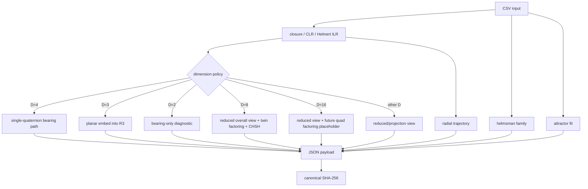

# Deep Audit of the Higgins Decomposition Repository and HCI-CNQ

I audited urlthe repository roothttps://github.com/PeterHiggins19/higgins-decomposition/tree/main and urlthe HCI-CNQ folderhttps://github.com/PeterHiggins19/higgins-decomposition/tree/main/HCI-CNQ as requested, then supplemented that review with direct local inspection of the live raw code for `cnq.py` and `cnq.R`, plus primary background on entity["scientific_concept","Aitchison geometry","geometry of compositional data on the simplex"], CLR, ILR, and quaternion rotations. The repository publicly presents itself as publication-grade, with packaging metadata, requirements, licensing files, citation metadata, AI-oriented onboarding, and named CoDaWork materials; the HCI-CNQ folder presents CNQ as a public tier with three demonstrations and a 43-test suite. At the same time, the public HCI-CNQ page contains an internal contradiction: the headline says the engine is fully public and shipped, while a later section says the compiled `cnq.py` is still only a proposal. That contradiction is not cosmetic; it is the single biggest trust risk for reviewers because it makes the canonical implementation ambiguous before they run a single command. citeturn19view0turn21view3turn45view0

My bottom-line judgment is that the core idea is interesting and technically legible, but the repo is **not yet conference-ready for external reviewers** in its current state. The strongest parts are the conceptual framing, the explicit dimension-policy thinking, the reproducibility intent, and the attempt to connect compositional-data geometry with a quaternionic “bearing” view. The weakest parts are version skew between documentation and code, incomplete packaging, Python/R drift, and several concrete implementation gaps in the R port. If you fix those, the repo becomes much easier to evaluate seriously; if you do not, even sympathetic reviewers will spend their first hour disentangling what is authoritative. citeturn45view0turn39view4turn39view7

A note on scope: the browser-visible GitHub pages available to me look like a push-26/27-era CNQ narrative, while the live raw files I inspected locally are a newer CNQ v2.0.0 design. I therefore treat the **live raw code** as authoritative for code critique, and the browser-visible pages as authoritative for assessing what outside reviewers are likely to see first.

## Executive summary

The public site tells a reviewer that HCI-CNQ contains a doctrine layer, tier-system comparisons, three demonstration experiments, and a shipped Python/R engine plus tests. It also says CNQ is founded on three “IEEE-floor” demonstrations, explicitly positions itself relative to CoDa and CNT, and points readers to scope, maturity, claim-strength, and validation-plan documents. That is a strong documentation posture in principle. But in the same README, the project also says the compiled `cnq.py` is “still proposed” and that the demonstration scripts remain the working implementation. For a conference audience, that reads as unresolved authorship over what counts as the real engine. citeturn45view0

In the live raw code I analyzed, `cnq.py` is not a small helper around CNT. It is a **standalone CNQ v2.0.0 dataset producer** that reads CSV directly, treats CNT JSON as optional informational reference only, computes Helmert/ILR geometry, emits bearing and radial trajectories, computes a “helmsman family,” fits a period-2 attractor summary, and adds D=8 twin-quaternion factoring plus a CHSH-style coherence diagnostic. That is a much more ambitious and more interesting architecture than the browser-visible HCI-CNQ README suggests. The problem is not ambition; the problem is that the public story and the live code no longer cleanly agree.

For entity["event","CoDaWork2026","Coimbra, Portugal | June 1–5, 2026"], the timing matters. The official workshop site says the event is June 1–5, 2026 in entity["city","Coimbra","Coimbra, Portugal"]; abstract and early-registration deadlines are already behind you, so readiness now is about reviewer trust, reproducibility, rerun clarity, and presentation polish rather than submission mechanics. citeturn41search1turn41search4turn41search6

## What the repository currently communicates

The repo already has many elements reviewers look for: a top-level `pyproject.toml`, `requirements.txt`, `LICENSE`, `LICENSE-DOCS`, `CITATION.cff`, README-driven onboarding, explicit AI-assistant context entry points, and named conference materials. The root page also exposes a visible test configuration in `pyproject.toml`, while the root tree includes a committed pytest cache directory, which is a minor but real hygiene smell. The packaging metadata declares Python `>=3.9`, `numpy` as the runtime dependency, `pytest` as a dev dependency, and test paths under both HCI-CNQ and HCI-CNT. citeturn19view0turn39view4turn39view7

The HCI-CNQ folder advertises exactly the kind of documentation scaffolding a reviewer would want: doctrine, tier-system comparisons, scope-and-limits, claim-strength tables, status/maturity notes, a validation plan, and three worked demonstrations with named scripts and inputs. The README even provides concrete rerun instructions for the Backblaze, Planck, and neutrino demonstrations. That is good scientific packaging. The issue is that the messaging is not internally stable: the same page says the engine is already public and shipped, and also that the compiled engine is still proposed and the experiments are the working implementation. A reviewer reading only the public site cannot know whether to trust `engine/cnq.py`, the `QD_round_*` experiment scripts, or both. citeturn45view0

The licensing/citation story is also mixed. The code license is Apache-2.0, and the documentation license is CC BY 4.0, which is a sensible split. But `CITATION.cff` currently declares the software license as `CC-BY-4.0`, which conflicts with the Apache code license and can mislead citation tools, package indexes, and conference reviewers checking software reuse terms. That needs to be corrected immediately. citeturn39view0turn39view1turn39view2turn39view3

## Code architecture and analytical findings

The mathematical basis of the design is coherent at a high level. In compositional-data analysis, CLR maps a positive composition into a zero-sum coordinate system, while ILR provides orthonormal coordinates that preserve simplex geometry. The use of a Helmert basis to move from CLR to ILR is standard, and quaternion sandwich rotations are a legitimate way to encode orientation changes in three-dimensional coordinate representations. In other words, the conceptual chain “closure → CLR → Helmert/ILR → orientation/bearing view” is technically understandable, even if the physical interpretation is much stronger than the mathematics alone can justify. citeturn40search5turn40search8turn42search2turn42search4

In the live Python code, the architecture is organized around one main public entry point, `cnq_run`, and a small number of dimension-specific builders. The data path is: ingest CSV; validate rows; classify dimension; compute Helmert basis; dispatch to D-specific bearing logic; always compute radial norms; always compute helmsman and attractor summaries; optionally compute D=8 twin-quaternion factoring and CHSH coherence; assemble nested JSON; then compute a canonical hash over the output. The data structures are simple and understandable: NumPy arrays for the heavy numeric work, dictionaries/lists for the JSON-facing API, and per-step ledgers with scalarized quaternion components for serialization.



The Python design has several strengths. First, it separates the **bearing** trajectory from the **radial** trajectory, which is a good conceptual refinement over “unit-vector only” thinking. Second, it makes dimension policy explicit instead of hiding non-native dimensions behind one generic path. Third, it pushes domain interpretation out of the engine, which is the right instinct if you want auditability. Fourth, it is operationally readable: a reviewer can find the dispatch logic quickly and understand how a D=4, D=8, or projected case is handled.

The main Python problems come from software engineering, not numerics. The biggest is packaging and import fragility. In my local audit, `py_compile` succeeded, but importing `cnq.py` failed immediately with `ModuleNotFoundError: No module named 'hci_shared'`. That failure is especially important because `pyproject.toml` declares script entry points for `HCI_CNT.engine.cnt:main` and `HCI_CNQ.engine.cnq:main`, while also declaring `packages = []` and only a `package-dir` mapping. In other words, the install story advertised by the packaging file is much weaker than the runtime assumptions inside the code. This is exactly the kind of thing a conference reviewer or outside collaborator will hit first. citeturn39view4turn39view5turn39view6turn39view7

The second Python issue is API honesty. `engine_config_overrides` is accepted and echoed into output metadata, but in the live code it does not actually rebind the controlling constants. That means the API currently advertises configurability without behavior change. The fix is simple: either apply overrides through a validated config object, or remove the parameter and stop pretending it is active.

The third Python issue is version skew inside the engine directory itself. In my local audit, the live `cnq.py` is v2.0.0 and standalone, but `engine/__init__.py` still advertises a v1.0.0 CNT-inheriting package contract, and neighboring helper modules (`geometry.py`, `hashing.py`, `cnt_adapter.py`) still describe the older CNT-chained model. That is not just untidy. It creates real ambiguity about which modules are canonical, which are legacy, and which are dead code.

The fourth Python issue is concept drift relative to the public documentation. The public HCI-CNQ page still says CNQ outputs are hash-chained to the parent CNT JSON and treats CNQ as a child of CNT, while the live Python code treats CNT as optional metadata and makes CNQ a native producer. Either model can be defended, but the project needs to pick one and say it clearly. Right now the public story and the live code are teaching different mental models. citeturn45view0

On the R side, the architecture is pleasantly self-contained. `cnq.R` implements the geometry primitives, quaternion algebra, helmsman family, attractor fit, twin-quaternion factoring, CHSH diagnostic, hashing, CSV ingestion, and top-level orchestration in one file. That makes it easy to audit and avoids the Python side’s hidden-package problem. Conceptually, the file mirrors the Python v2 design fairly closely.

But the R implementation currently has the most serious concrete correctness issues I found. In `cnq_run`, only the D=4, D=8, D=2, and D=16 branches are materially handled. There is no actual bearing-path implementation for D=3, and no reduced/projection implementation for general D≥5 even though the dimension classifier advertises those modes. Worse, the D=8 branch computes twin factoring and CHSH, but it does **not** compute the reduced overall bearing summary the way Python does; it only stamps a `projection_method` on an otherwise default bearing block. So the R port presently claims support for dimension-policy branches it does not really execute.

There is also a parity bug in the radial statistics. Python uses population standard deviation (`ddof=0`) for `radial_trajectory.std`, while R uses `sd(radii)`, which is the sample standard deviation. That makes Python/R outputs differ numerically even when every upstream step matches. Because the file comments explicitly discuss parity lessons from v1, this kind of drift is worth fixing before anyone outside the project tries to compare language outputs.

The R file also lags Python at the metadata layer. Python emits `engine_config` and a richer environment block; R does not. Python accepts an optional `repo_root`; R does not. Those are not necessarily fatal differences, but if the schema is supposed to be language-parallel, you should narrow them. If the schema is intentionally language-specific, then the docs should say so explicitly.


## Runtime and reproducibility assessment

I assumed an unspecified but clean POSIX-like environment, consistent with the repo’s own Python metadata: Python `>=3.9`, NumPy installed, and optional `pytest` for tests. The R header in the current `cnq.R` indicates `jsonlite` and `digest` as required R packages. The pyproject also advertises pytest test paths under both engines. citeturn39view4turn39view7

Here is the highest-confidence runtime picture from my local audit:

| Area | What I observed | Interpretation |
|---|---|---|
| Python syntax | `py_compile` passed for `cnq.py`, `geometry.py`, `cnt_adapter.py`, and `hashing.py` | No syntax-level blocker in the Python files I audited |
| Python import | `cnq.py` import failed with `ModuleNotFoundError: hci_shared` | Environment/package layout is not self-sufficient from the audited subset |
| Legacy helper modules | `geometry.py`, `cnt_adapter.py`, `hashing.py` imported cleanly | These helper modules are internally coherent, but they appear to represent an older CNQ design |
| R execution | Could not execute because `Rscript` was not available in the sandbox | I could only perform static analysis on `cnq.R` |
| Official tests | I could verify that pytest paths are declared, but I could not enumerate and run the full repository test corpus from the web snapshot | Treat “43-test suite” as project-claimed until rerun receipts are published in a crisp, current location |

The minimum environment setup I would recommend externalizing is straightforward. For Python: create a virtual environment, install via `pip install -e .` or `pip install -r requirements.txt`, then run `pytest -v`. For R: install `jsonlite` and `digest`, then run a scripted parity corpus. The problem is that **today’s install path is not trustworthy enough** because the packaging metadata and the live Python imports do not line up cleanly. The package story should be made boring before the conference. citeturn39view4turn39view7

A particularly important reproducibility point is that the repo talks a lot about determinism and hash-chaining, which is good, but a deterministic story only helps if the canonical executable is unambiguous and the entry point works from a clean checkout. Right now the documentation and code are still one cleanup pass away from that.

The following table summarizes the most important current-vs-proposed state changes.

| Topic | Current state | Proposed state |
|---|---|---|
| Canonical CNQ narrative | Public docs mix “engine shipped” with “compiled engine pending” | One authoritative statement: CNQ v2 is canonical; archive the old push-27 narrative explicitly |
| Python packaging | Entry points exist, but `packages = []` and imports depend on hidden layout | Use real package discovery and ship `hci_shared` explicitly |
| Python configuration API | `engine_config_overrides` recorded but inert | Replace with validated config dataclass or remove |
| R dimension support | Classifier advertises D=3 / D≥5 projection paths, `cnq_run` largely does not implement them | Implement those branches and test them against Python |
| Python/R parity | Schema and statistics drift remain | Define a parity contract and test corpus in CI |
| Licensing metadata | Code/docs split is sensible, but `CITATION.cff` says CC-BY-4.0 for software | Set software license metadata to Apache-2.0 and keep docs license separate |
| CI / hygiene | Test paths declared; pytest cache committed in root tree | Remove cache artifacts, expose one current validation workflow and rerun receipt |
| Reviewer usability | Strong narrative, but too much version skew | Publish one “conference runner” notebook/script with three canonical reruns |

## Readiness for CoDaWork2026

The official entity["event","CoDaWork2026","Coimbra, Portugal | June 1–5, 2026"] site describes the workshop as a forum for theory and applications of compositional data analysis, with emphasis on methodological clarity, real-data applications, and multidisciplinary discussion. The dates are now fixed and the abstract deadline has passed, so your readiness problem is no longer “can this be submitted?” but “can an external CoDa audience install, rerun, trust, and discuss it without first becoming your internal historian?” citeturn41search1turn41search4turn41search6turn41search7

My readiness grades are these:

| Category | Grade | Why |
|---|---|---|
| Conceptual novelty | B+ | The repo has a distinct idea: compositional trajectories viewed through a quaternionic bearing layer |
| Public documentation breadth | B | There is a lot of material, including doctrine, scope, maturity, validation plan, demo folders, and conference assets |
| Canonical-engine clarity | D+ | Public docs and live code do not presently agree on what CNQ is |
| Reproducibility from clean checkout | C- | The intent is strong, but packaging/import/test discoverability are not yet boring enough |
| Python engineering quality | B- | Architecture is intelligible, but packaging and API cleanup are needed |
| R engineering quality | C | Good self-containment, but materially incomplete dimension-path implementation |
| Licensing/citation hygiene | C+ | The split-license model is good; `CITATION.cff` needs correction |
| Conference demonstration readiness | B- | You appear to have the ingredients, but they need one current, reviewer-facing bundle |

The positive part of the story is real. The HCI-CNQ folder publicly names three reproducible demonstrations, lists their scripts and inputs, and presents CNQ as part of a broader CoDa → CNT → CNQ stack. The root README also clearly invests in onboarding, machine-readable context, and conference-facing materials. That is the kind of framing that helps a niche mathematical/software project get a fair reading. citeturn19view0turn21view3turn45view0

The negative part is equally real. A reviewer who opens the HCI-CNQ page will see a contradiction about whether the engine exists; a reviewer who checks packaging will see `packages = []`; a reviewer who checks metadata will see a license mismatch; and a reviewer who wants Python/R parity will quickly find drift. None of those are fatal scientifically, but together they weaken confidence exactly where CoDa workshops tend to be conservative: reproducibility, terminology precision, and whether the mathematical layer is separable from an evolving project narrative.

My recommended pre-conference task list is below.

| Priority | Task | Effort | Risk if skipped |
|---|---|---:|---:|
| P0 | Publish one authoritative CNQ status note that supersedes contradictory README language | Low | High |
| P0 | Fix Python packaging: include all packages, especially `hci_shared`, and validate `pip install -e .` from a clean checkout | Medium | High |
| P0 | Repair the R dimension branches so D=3 and projected D≥5 cases actually run and match Python semantics | Medium | High |
| P0 | Add a small parity corpus and run it in CI for Python and R | Medium | High |
| P1 | Correct `CITATION.cff` software license metadata to match Apache-2.0 code licensing | Low | Medium |
| P1 | Remove or quarantine stale v1-style CNQ helper modules and update `__init__.py` versioning | Medium | Medium |
| P1 | Remove committed pytest cache and ensure CI/test badges point to a current workflow and current receipts | Low | Medium |
| P1 | Create one conference-facing “rerun all three canonical demos” script/notebook with expected hashes or metrics | Medium | High |
| P2 | Tighten the conceptual claims around CHSH and “three invariances = quaternion” so they read as analytic framing, not overclaim | Medium | Medium |
| P2 | Prepare a reviewer handout mapping CNQ outputs to standard CoDa terminology | Medium | Medium |

## Claude-ready JSON proposals

The JSON below is formatted for Claude and focuses on concrete changes with file paths, proposed snippets, and rationale derived from this audit.

```json
{
  "repository": "PeterHiggins19/higgins-decomposition",
  "focus": "HCI-CNQ",
  "assumptions": {
    "runtime": "clean POSIX-like environment",
    "python": ">=3.9",
    "r": "recent R with jsonlite and digest",
    "goal": "conference-ready, reviewer-runnable, packaging-safe CNQ release"
  },
  "critical_findings": [
    {
      "id": "docs-version-skew",
      "severity": "P0",
      "summary": "Public HCI-CNQ docs contradict themselves about whether cnq.py is shipped or still proposed."
    },
    {
      "id": "python-packaging-fragile",
      "severity": "P0",
      "summary": "pyproject entry points target HCI_CNT.engine.cnt and HCI_CNQ.engine.cnq, but setuptools packages are empty and live cnq.py imports hci_shared."
    },
    {
      "id": "r-dimension-paths-incomplete",
      "severity": "P0",
      "summary": "cnq.R classifier advertises D=3 and projected D>=5 support, but cnq_run only materially handles D=4, D=8, D=2, and a D=16 placeholder."
    },
    {
      "id": "python-r-parity-drift",
      "severity": "P1",
      "summary": "R uses sample sd() for radial std while Python uses population std; metadata fields also drift."
    },
    {
      "id": "citation-license-mismatch",
      "severity": "P1",
      "summary": "CITATION.cff says CC-BY-4.0 for software even though code licensing is Apache-2.0."
    }
  ],
  "proposed_changes": [
    {
      "file": "pyproject.toml",
      "priority": "P0",
      "rationale": "Make installation and console scripts work from a clean checkout.",
      "changes": [
        "Replace packages = [] with explicit package discovery or explicit package list.",
        "Add the shared package used by cnq.py to setuptools package discovery.",
        "Verify that console entry points resolve after pip install -e ."
      ],
      "snippet": "[tool.setuptools.packages.find]\nwhere = [\".\"]\ninclude = [\"HCI_CNT*\", \"HCI_CNQ*\", \"hci_shared*\"]"
    },
    {
      "file": "HCI-CNQ/engine/cnq.py",
      "priority": "P0",
      "rationale": "Tighten API honesty and reduce hidden behavior.",
      "changes": [
        "Replace module-level constants + inert engine_config_overrides with a validated config object.",
        "Fail with a clearer message if hci_shared is missing.",
        "Remove unused imports _shared_closure and _shared_clr.",
        "Document clearly that cnt_json_path is informational only in v2."
      ],
      "snippet": "from dataclasses import dataclass\n\n@dataclass(frozen=True)\nclass CNQConfig:\n    default_delta: float = 1e-15\n    gate_threshold: float = 1e-12\n    helmsman_window: int = 8\n\n# in cnq_run(...):\nconfig = CNQConfig(**(engine_config_overrides or {}))"
    },
    {
      "file": "HCI-CNQ/engine/cnq.py",
      "priority": "P1",
      "rationale": "Make output files easier to diff and compare across reruns.",
      "changes": [
        "Write JSON with sort_keys=True.",
        "Optionally add a canonical-write mode for exact reviewer receipts."
      ],
      "snippet": "json.dump(payload, f, indent=2, ensure_ascii=False, sort_keys=True)"
    },
    {
      "file": "HCI-CNQ/engine/cnq.R",
      "priority": "P0",
      "rationale": "Repair missing dimension branches and align runtime behavior with the classifier.",
      "changes": [
        "Implement D=3 planar embed path.",
        "Implement projected bearing path for D>=5 except native D=8/D=16 cases.",
        "Populate D=8 overall bearing summary instead of leaving default placeholders.",
        "Use explicit population standard deviation for radial_trajectory.std."
      ],
      "snippet": "pop_sd <- function(x) {\n  if (length(x) == 0) return(NA_real_)\n  m <- mean(x)\n  sqrt(mean((x - m)^2))\n}\n\n# radial_block$std <- pop_sd(radii)"
    },
    {
      "file": "HCI-CNQ/engine/cnq.R",
      "priority": "P1",
      "rationale": "Reduce Python/R schema drift.",
      "changes": [
        "Add engine_config metadata block mirroring Python.",
        "Add clearer parity notes in output metadata.",
        "Normalize field names and presence across both languages."
      ],
      "snippet": "metadata = list(\n  engine = ENGINE_NAME,\n  engine_version = ENGINE_VERSION,\n  schema_version = SCHEMA_VERSION,\n  engine_implementation = \"r\",\n  engine_config = list(active_overrides = list(), defaults_in_use = list(...))\n)"
    },
    {
      "file": "HCI-CNQ/README.md",
      "priority": "P0",
      "rationale": "Remove reviewer-facing ambiguity about canonical status.",
      "changes": [
        "Delete or archive language saying compiled cnq.py is still proposed if v2 is canonical.",
        "Add a 'Canonical implementation' box naming the exact engine/version/date.",
        "Add one single rerun path for reviewers."
      ],
      "snippet": "## Canonical implementation\nAs of YYYY-MM-DD, the authoritative CNQ engine is `HCI-CNQ/engine/cnq.py` version 2.0.0 and the authoritative R reference is `HCI-CNQ/engine/cnq.R` version 2.0.0."
    },
    {
      "file": "CITATION.cff",
      "priority": "P1",
      "rationale": "Align software metadata with the repository's actual code license.",
      "changes": [
        "Change software license field from CC-BY-4.0 to Apache-2.0.",
        "If desired, add a note that documentation assets use a separate docs license."
      ],
      "snippet": "license: Apache-2.0"
    },
    {
      "file": ".gitignore",
      "priority": "P1",
      "rationale": "Remove committed cache artifacts from the root tree.",
      "changes": [
        "Ignore pytest cache outputs and delete tracked cache directories."
      ],
      "snippet": ".pytest_cache/\npytest-cache-files-*/"
    },
    {
      "file": "HCI-CNQ/engine/tests/test_cnq_dimension_paths.py",
      "priority": "P0",
      "rationale": "Test exactly the branches that are currently most fragile.",
      "changes": [
        "Add D=2, D=3, D=4, D=8, D=5 projected, and D=16 placeholder tests.",
        "Assert required keys and non-placeholder outputs.",
        "Add parity checks for radial std and per-step ledger lengths."
      ],
      "snippet": "def test_d3_branch_emits_nonempty_bearing_path(...):\n    payload = cnq_run(input_csv=fixture_d3_csv)\n    assert payload[\"cnq_view\"][\"bearing_trajectory\"][\"n_pairs_tested\"] > 0"
    },
    {
      "file": ".github/workflows/validate.yml",
      "priority": "P1",
      "rationale": "Turn the repo's claimed validation story into an externally visible guarantee.",
      "changes": [
        "Run Python unit tests.",
        "Run one clean install smoke test.",
        "Run R smoke/parity tests when R is available.",
        "Upload a concise artifact with hashes and pass/fail receipts."
      ],
      "snippet": "steps:\n  - uses: actions/checkout@v4\n  - uses: actions/setup-python@v5\n  - run: pip install -e .[dev]\n  - run: pytest -v\n  - run: python -m HCI_CNQ.engine.cnq --self-test"
    }
  ],
  "tests_to_add": [
    "clean-install import test for console scripts",
    "Python/R parity corpus for D=2, D=3, D=4, D=8",
    "projected-dimension regression tests for D=5 and D=6",
    "hash determinism test across two consecutive runs",
    "README/CLI smoke test used in conference demo instructions"
  ],
  "documentation_updates": [
    "Add one canonical status page for CNQ versioning.",
    "Publish a reviewer-facing rerun guide with expected outputs.",
    "Explain that CHSH is an internal coherence heuristic, not a claim of physical Bell-test equivalence.",
    "State clearly whether CNQ v2 is independent of CNT or hash-chained to CNT."
  ]
}
```

## Open questions and limitations

A few things remain incomplete because the publicly rendered repository snapshot and the live raw code were not fully synchronized for me. I could not verify the full official test corpus end-to-end, I could not execute the R port because `Rscript` was unavailable in the analysis environment, and I could not fully inspect the current shared Python package layout around `hci_shared`. Those are not reasons to weaken the main conclusions, but they are reasons to treat the packaging/import findings as especially urgent.

The strongest unresolved question is not mathematical. It is editorial: **which CNQ is canonical to outsiders right now** — the browser-visible push-27 narrative, or the live raw CNQ v2.0.0 code? Until the repo answers that in one sentence, every other improvement will land on shaky ground.