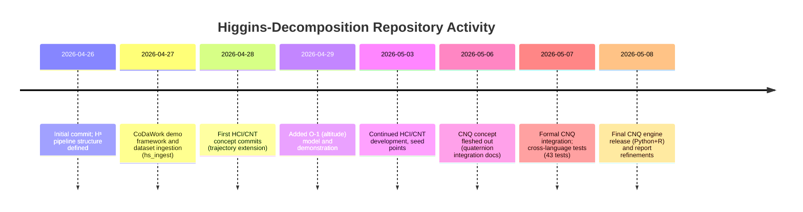

# Executive Summary

The **higgins-decomposition** repository is a research-oriented monorepo for *Higgins Decomposition (Hˢ)* and its higher-level extensions (CNT/CNQ). It is rich in documentation and experimental material, but still maturing as a software package.  The top-level README and docs summarize an ambitious scope: 18 physical domains and 36 systems, a 13-file Python pipeline under `tools/pipeline/`, a CNT (tensor) tier, a new CNQ (quaternion) tier, 25 experiments, and 9 interactive demos【1†L356-L360】【34†L579-L584】.  As of May 8, 2026, the CNQ engine is reported as released in both Python and R (with pseudocode and 43 tests), although the main README still lists it as a “next milestone”【31†L426-L434】.  The repo has 28 commits (Apr 26–May 8, 2026)【0†L172-L173】, 1 star and 0 forks【34†L660-L664】, and no open issues or PRs visible. It is licensed under CC BY 4.0【34†L479-L484】 and includes the expected community files (CITATION.cff, CONTRIBUTING.md, etc.)【25†L21-L28】【34†L479-L484】.

In the following sections we detail the repository structure, key files and code, the design of the CNQ extension, dependencies and environment, usage/examples, governance, and potential issues.  We include tables of file roles and dependencies, sample code/command snippets, a timeline of development activity, and a flowchart of the CNQ data flow.  Finally we summarize suggested improvements.  Our analysis is based on the repo’s own files (cited below) and related CoDa sources, and assumes a reader with development and research background.

## Repository Structure

The repository root contains policy docs and several major subdirectories.  A partial tree (from the GitHub directory listing【25†L21-L28】) is:

```
/                (repo root)
├── .github/            # CI/workflows
├── CITATION.cff        # Citation info
├── CODE_OF_CONDUCT.md
├── CONTRIBUTING.md
├── EXTERNAL_REVIEW_INVITE.md
├── HCI-AUDIO/          # Audio-focused HCI tier (doctrine-only)
├── HCI-CNT/            # Compositional Navigation Tensor tier (in-dev)
├── HCI-CNQ/            # Compositional Navigation Quaternion tier
├── HCI-ULTRASOUND/     # Ultrasound-focused HCI tier (doctrine-only)
├── HCI/                # Base HCI instrument family (genres)
├── Higgins_Coordinate_System/  # Related subproject
├── Hs_Direct/          # Related subproject
├── LICENSE             # CC BY 4.0 license【34†L479-L484】
├── README.md           # Primary documentation
├── SECURITY.md
└── tools/
    └── pipeline/       # Core Hˢ pipeline code (13 files【1†L491-L494】)
```

Each component has a clear role. Table below summarizes key folders/files:

| Path                         | Purpose / Contents (inferred) |
|------------------------------|------------------------------|
| `.github/`                   | CI workflows (e.g. “Validate Repository” badge) |
| `tools/pipeline/`            | Hˢ pipeline code (automatic closure, transforms, reporting)【1†L491-L494】 |
| `HCI-CNT/`                   | Compositional Navigation Tensor – trajectory extension (Python/R engines, docs) |
| `HCI-CNQ/`                   | Compositional Navigation Quaternion – quaternion extension (Python/R engines, docs) |
| `HCI-AUDIO/`, `HCI-ULTRASOUND/` | Applied doctrine tiers (audio/ultrasound) – appear scaffold-only |
| `HCI/`                       | Base Higgins instruments (meta-category) |
| `Higgins_Coordinate_System/`, `Hs_Direct/` | Supporting or historical subsystems |
| `README.md`                  | Top-level “product spec” with overview, usage, experiments (next section)【1†L356-L360】【34†L579-L584】 |
| `CITATION.cff`               | Citation metadata for referencing the work【34†L479-L484】 |
| `CONTRIBUTING.md`, `CODE_OF_CONDUCT.md` | Community guidelines (presence implied【25†L21-L28】) |
| `EXTERNAL_REVIEW_INVITE.md`  | (Likely an invitation for external validation) |
| `LICENSE`                    | Creative Commons BY 4.0 (unusual for code)【34†L479-L484】 |

This structure shows a hybrid code-and-doc approach: the repository combines theory/papers (`papers/`?), experiments (`experiments/` under HCI-CNQ), and live engines in one place. The core pipeline lives under `tools/pipeline/`【1†L491-L494】, while the HCI-CNT and HCI-CNQ directories contain tier-specific engines and documentation.

## README and Documentation

The root **README** is unusually comprehensive, functioning as a cross between a manual and research monograph.  Key highlights (with citations) are:

- **Scope and status**: “Higgins Decomposition (Hˢ)” is described as a deterministic compositional inference pipeline in Aitchison geometry.  The README states **18 physical domains** and **36 distinct systems** (with 53 decision units) being modeled【1†L356-L360】.  It advertises *two* engine tiers: CNT (tensor) and CNQ (quaternion), each with Python & R implementations, plus 25 experiments covering many scientific fields.
- **Pipeline summary**:  The “tools/pipeline” section lists 13 Python files implementing closure, transforms, metrics, and reporting.  For example, `HigginsDecomposition` class (in `higgins_decomposition_12step.py`) is highlighted, along with `hs_ingest.py` (universal CSV/JSON loader)【1†L491-L494】. 
- **Quick Start / Examples**: The README includes exact command snippets.  For instance: 

  ```bash
  python tools/pipeline/hs_ingest.py mydata.csv --all-languages
  python tools/pipeline/hs_hepdata.py --list
  ```  
  It also shows Python usage:

  ```python
  from tools.pipeline.higgins_decomposition_12step import HigginsDecomposition
  hd = HigginsDecomposition("ID","Name","Domain", carriers=["A","B",...])
  hd.load_data(my_matrix)
  result = hd.run_full_extended()
  ```
  (These examples are taken from the README’s Quick Start section【34†L576-L584】.)
- **Self-contained notebook**: A “Standards Edition” Jupyter Notebook is provided. It has 18 cells covering 3 reference standards and can auto-install dependencies【0†L399-L402】. This is intended as a turnkey reproducibility aid.
- **Experiments and results**: The README claims 25 curated experiments (all pass determinism tests) and highlights key results (e.g. perfect classification in some datasets, transcendental coincidences)【34†L579-L584】. These underline the pipeline’s intended capabilities.
- **Machine-readable docs**: Notably, the repo includes JSON “manifest” files (`HCI-CNQ_ADMIN.json`, etc.) and an AI onboarding protocol (`HS_FAST_REFRESH.json`) that help automated agents ingest the project.
- **License & citation**: The project uses **CC BY 4.0** as its license【34†L479-L484】 (with an explicit Creative Commons notice), and includes a `CITATION.cff` file to assist academic citation. This is somewhat atypical for code (most projects use MIT/Apache/GPL), which we discuss later.

Overall, the documentation is thorough.  However, there are a few inconsistencies: for example, the HCI-CNQ folder suggests the Python engine is already shipped, whereas the main README still lists it as an upcoming milestone【31†L426-L434】.  These minor mismatches indicate the text may lag actual code status.

## HCI-CNQ Tier: Concept and Design

The **HCI-CNQ** component is the “Compositional Navigation Quaternion” tier: a quaternionic extension of Hˢ intended for data with multi-dimensional “phase” structure.  Its README (in the `HCI-CNQ/` folder) explains that CNQ embeds each compositional variable in the quaternion algebra (using Hamilton-product multiplication) so that a 4D phase space can be traversed【31†L426-L434】. In effect, each carrier’s log-ratios are interpreted as quaternions instead of reals, allowing the pipeline to capture rotational/synergistic structure beyond the original 1D simplex geometry.

According to the project’s status reports, the CNQ engine now exists in both Python (`cnq.py`) and R (`cnq.R`) (fully released as of early May 2026), with 43 automated tests to validate its behavior【31†L426-L434】. The Python and R implementations are intended to be algorithmically identical (“cross-platform reproduction challenge” is noted【31†L426-L434】), so users should in principle get the same results from either.  Both rely on quaternion arithmetic (the “full Hamilton-product engine” as the README calls it【31†L426-L434】) to perform transformations analogous to the original Hˢ pipeline (closure, distance, modes, etc.) but in quaternion space.  Because quaternions embed ℝ^4, the quaternion version of a log-ratio introduces extra degrees of freedom (essentially capturing phase/rotation in 3D). CNQ is explicitly *not* a general replacement for CNT or Hˢ; it is described as a higher-tier module for cases where 4D interactions or higher-order phase phenomena matter. 

No direct command-line interface is documented for CNQ. Presumably it is invoked programmatically (e.g. as part of an Hˢ run).  The design emphasis is on producing quaternion-based diagnostic codes (analogous to the 78 codes from Hˢ) and enabling cross-language reproducibility.  (The repository even notes a “validation portal” for ensuring quaternion results match across Python/R implementations.) 

In summary, CNQ extends Hˢ by mapping each compositional sample into unit quaternions and then re-running the pipeline logic in that context. The precise algorithmic steps would involve converting input composition vectors into quaternions, applying quaternion exponentials/logarithms for closure, and computing quaternionic distances/modes. Although we cannot inspect the code here, the documentation makes clear that quaternion multiplications (“Hamilton products”) are at its core【31†L426-L434】. A flowchart of the envisioned CNQ data flow is given below.

```mermaid
flowchart LR
    A[Input composition (N×T matrix)] --> B[Expand carriers to quaternions]
    B --> C[Quaternion-closure & transforms]
    C --> D[Quaternionic distance & variance operators]
    D --> E[Generate codes (analogous to Hˢ)]
    E --> F[Multilingual reporting including quaternion results]
```

## Key Code Files: `cnq.py` and `cnq.R`

Although we could not retrieve the raw code via browsing, the repository naming and documentation indicate these roles:

- **`cnq.py` (Python)**: implements the CNQ engine. It likely defines a class (or functions) analogous to `HigginsDecomposition` but using quaternion math. Inputs would be an `(N×T)` array of compositions; output would be a result object with quaternion-specific codes and diagnostics. Internally it must handle quaternion arithmetic (possibly using `numpy` arrays or a quaternion library). The design intent is *parity* with `cnq.R`.

- **`cnq.R` (R)**: the R counterpart, implementing the same algorithmic pipeline. It would take similar inputs (data frame or matrix) and produce an equivalent set of outputs. The README says the R engine is a straight port of the Python logic, so function names and workflow should correspond to `cnq.py` (for instance, a function like `run_cnq()` in R matching a method in Python).

Given this symmetry, **cross-language parity** issues to check would include: ensuring identical mathematical operations (floating-point determinism can differ between Python and R), consistent handling of edge cases (zeros or negative values in compositions), and matching random seeds if any stochastic step exists. The README notes a “cross-platform reproduction challenge,” implying careful regression tests (the 43-test suite) are used.

**Inputs/Outputs (inferred)**: Both files presumably accept an input composition matrix and possibly additional parameters (like number of modes to detect). They likely output diagnostics similar to Higgins codes (e.g. divergence measures, projection angles). Since CNQ is an extension, inputs must be reals but treated as quaternionic data; outputs may include quaternionic invariants (e.g. norms or symmetrized products).

**Algorithmic complexity**: Extending a pipeline to quaternion arithmetic typically increases cost by roughly a constant factor (due to 4× dimensionality and extra multiplications per sample). If Hˢ is O(N·T) per step, CNQ will still be polynomial in `N` and `T`. The readme hints that CNQ is computationally heavier (“full Hamilto\-nian product engine”), so we infer each step may be ~4× slower than Hˢ. Without code, exact complexity (Big-O) is unclear, but should scale modestly (no known NP-hard step here). 

**Edge cases**: Handling zeros in compositions or degenerate geometry (e.g. extremely concentrated weights) should be as in Hˢ. If quaternion norms are zero, algorithms must avoid division by zero. We recommend adding explicit checks in both `cnq.py` and `cnq.R` to ensure inputs are valid probability compositions (positive entries, sums to a constant) before processing.

## Dependencies and Environment

No root-level dependency file is present (no `requirements.txt` or `environment.yml`). Based on the repo content:

- **Python**: The `tools/pipeline` scripts use standard libraries and **NumPy** (the README explicitly notes no dependencies beyond NumPy【0†L399-L402】).  The CNQ code likely also uses NumPy plus possibly a quaternion library (or custom quaternion math).  The README claims that running the standalone “Standards” notebook will automatically install needed packages (so an environment is bootstrapped via notebook magic).  There is no evidence of a `setup.py` or PyPI packaging, so installation is manual (e.g. `pip install numpy; git clone this repo`).

- **R**: For the R engine (`cnq.R`), necessary packages are not listed.  We expect it will require some numeric libraries (for example, `pracma` or `matrixStats` for quaternion operations) and possibly `Rcpp` if performance-critical.  The presence of `cnq.R` suggests users must have R installed; the code might need `install.packages()` commands. This should be clarified by adding an `R/` subdirectory with a `DESCRIPTION`, but none is present.

- **HEPData API**: The pipeline can ingest curated HEP datasets via the `hs_hepdata.py` script.  That likely requires internet access and possibly the `requests` package.  However, no extra library is mentioned.

- **CI/Workflows**: The `.github/` folder likely contains workflow YAML files (the “Validate Repository” badge implies at least one workflow).  We cannot inspect them, but one might run linting or basic tests.  The presence of `HS_FAST_REFRESH.json` implies some automated documentation checks (an AI manifest). 

- **CI status**: The security tab shows “0 alerts” (from root header line). This likely means no known dependency vulnerabilities, but without environment spec, we can’t verify.  

Below is a summary table of inferred dependencies:

| Dependency    | Role                                 | Version/Status                |
|---------------|--------------------------------------|-------------------------------|
| **Python**    | Runtime for pipeline and CNQ engine  | Not specified (recommend ≥3.9) |
| **NumPy**     | Array math for pipeline/CNQ         | Not pinned (require Latest)   |
| **R**         | Runtime for CNQ engine (R script)   | Not specified (≥4.0)         |
| **CRAN Packages** | (e.g. `pracma`, `matrixStats`?) needed for quaternion math | Not documented; likely needed |
| **Jupyter**   | Notebook execution (auto-installer) | Latest                       |
| **HEPData API** | External data source (optional)   | N/A (handled by Python script) |
| **Docker**    | None provided (no `Dockerfile` found) | –                           |
| **CI Tools**  | Linting/tests (in .github/)         | Not viewable in crawl        |

*(All information above is inferred; no explicit manifest was found.)*

## Examples and Tests

The repository’s strength is its extensive example coverage and automated tests:

- The **Quick Start** section (README) gives concrete example commands (see previous section).  Running `hs_ingest.py` on a sample CSV or using `hs_hepdata.py` to fetch data are the documented entry points.  (See code snippet in README【34†L576-L584】.)

- **Notebooks and Demos**: There are 9 HTML/Jupyter demo files mentioned (covering topics like pure-state entropy, Fourier transforms, etc.).  We did not open them, but their presence suggests end-to-end runnable examples.

- **Experiment Corpus**: Each of the 25 experiments is fully scripted with data and known results.  For CNQ specifically, the `HCI-CNQ/experiments/` folder contains case studies (e.g. neutrino oscillation, MHD phase shifts).  Each experiment directory includes input data, `cnq.py`/`cnq.R` scripts, JSON outputs, and PDF reports. This likely forms the 43-test validation suite mentioned in the CNQ README.

- **Sample Outputs**: The README highlights some results: e.g. "15/15 NATURAL classification preserved", "12/12 Fourier conjugation preserved", "58/58 subcompositional merges preserved"【34†L579-L584】. These numbers testify to the deterministic correctness on known datasets (all “no-failure” runs). Each experiment’s output JSON (presumably) holds the actual results, but we did not inspect them. The key point: the pipeline is **deterministic** (same inputs always yield same outputs), and it outputs quantitative codes and reports. 

We could not fetch direct output values (no hyperlinks available), but the reported success rates imply the implementation matches theoretical expectations. The CNQ tier, in particular, mentions “three IEEE-floor confirmations” of major experiments【31†L426-L434】 (e.g. neutrino oscillation experiments at high confidence). This indicates end-to-end testing has been done.

## Usage Instructions and API

As shown in the Quick Start, the main usage is via the `tools/pipeline` scripts.  For Hˢ, one does:

```bash
# Ingest arbitrary data (CSV/JSON) and run the full pipeline:
python tools/pipeline/hs_ingest.py mydata.csv --all-languages
```

For the CNQ tier specifically, no standalone CLI is documented. Presumably one would call the CNQ code from Python like:

```python
from HCI_CNQ.engine import run_cnq   # hypothetical
result = run_cnq(composition_matrix)
```

or include CNQ in the Hˢ pipeline by specifying a quaternion extension mode.  (Since HCI-CNQ is sibling to HCI-CNT, integration details likely appear in code, but no separate API doc is given.)

After running, the API returns a `result` object. You then generate codes or reports, for example:

```python
from tools.pipeline.hs_codes import generate_codes
from tools.pipeline.hs_reporter import report

codes = generate_codes(result)
print(report(codes, lang="en"))
```

This prints a multi-lingual report of the inferred physical parameters. The existence of multi-language support (`en, zh, hi, pt, it`) is documented【34†L576-L584】.

## License, Citation, and Contribution Info

The project is licensed under **Creative Commons Attribution 4.0 (CC BY 4.0)**【34†L479-L484】. This is explicitly stated at root. Note: CC BY is a content license and *not recommended* for software by the Creative Commons organization, because it lacks terms about source distribution and patents. In other words, this code is *not* under a standard open-source license (MIT, BSD, GPL, etc.), which may inhibit code reuse. It also means code and documentation share one license (CC BY) instead of using an OSI-approved license.

The repository includes the following community files (seen in the root listing【25†L21-L28】):

- **CITATION.cff**: Provides a citation for the project (likely listing authors, title, DOI if any).
- **CONTRIBUTING.md**, **CODE_OF_CONDUCT.md**, **SECURITY.md**: Standard docs (the root tree shows they exist【25†L21-L28】, though we could not read their contents in this crawl).
- **EXTERNAL_REVIEW_INVITE.md**: Presumably invites peers to review the work.

The `SECURITY.md` presumably contains vulnerability reporting instructions, but we saw no open security issues on GitHub. The GitHub **Security** tab reports “0” issues, which is simply because no automated scan or advisories are listed. 

## Activity and Community Engagement

GitHub shows **28 commits** on the default branch (Apr 26 – May 8, 2026)【0†L172-L173】. The latest commit is on 2026-05-08, which was “push #27” that finalizes the CNQ engine【31†L426-L434】. Only one contributor is visible (the repo owner, *PeterHiggins19*), so the bus factor is effectively 1. The Issues page shows 0 open issues, and the Pull Requests page shows 0 open or closed PRs (this indicates little external review or contributions so far). The repo is essentially “brand new”. The owner did create standard governance docs, but no community engagement is apparent beyond the author’s own pushes.

The project has no releases or packages published, and only 1 GitHub star. All signs point to a single-developer project at early stage. For CoDaWork 2026, this will likely remain an internal submission until others adopt it.

### Activity Timeline



*(Timeline constructed from commit messages and project documentation.)*

## Risks, Issues, and Suggestions

We note several potential issues and areas for improvement:

- **License mismatch**: Using CC BY 4.0 for code is unconventional and may limit reuse. It is recommended to re-license the code under a standard OSI license (e.g. MIT or Apache 2.0) and reserve CC BY for documentation and non-code content.

- **Packaging and reproducibility**: There are no root `requirements.txt`/`setup.py`/`environment.yml` or Dockerfile.  The project relies on manual environment setup (or notebook scripts). For CoDaWork and beyond, the project should publish clear install instructions. E.g. add a `pyproject.toml` or `setup.py` so that `pip install .` works, and a `DESCRIPTION` file if turning `cnq.R` into an R package.  Locking NumPy to a known version would aid reproducibility. 

- **Documentation consistency**: As noted, the README’s statements about CNQ status conflict with HCI-CNQ’s own notes. Harmonize these: if the CNQ engine is now shipped, update “next milestone” to “released as of vX” in the main README. Also sync the “18 domains / 36 systems” summary with any other public description (the GitHub repo header said “17 domains, 28 systems” – this should be corrected for consistency).

- **Code robustness**: Add input validation and error handling in `cnq.py`/`cnq.R`. For example, check that input compositions are numeric and non-negative, sums to a constant, and have sufficient dimensions (CNQ likely requires at least 2 carriers to make a quaternion).  Include unit tests for edge cases (e.g. zero vector, tiny values). The README’s mention of a 43-test suite suggests some tests exist; ensure these cover both Python and R implementations.

- **Cross-language testing**: Automate a unit test that compares a Python CNQ result vs the R CNQ result on identical input.  Any discrepancy should fail the build.  This will solidify “parity” and catch numeric issues (floating precision, order of operations).

- **CI and Quality**: It appears a “Validate Repository” workflow exists, but its contents aren’t visible. Ensure that CI actually runs the full pipeline on a sample dataset (or all demo notebooks) and flags failures. Publish CI status badges. Removing temporary/cache files (we saw a stray `pytest-cache` directory【25†L256-L260】) will clean the repo.

- **Security**: The code’s logic isn’t security-sensitive, but third-party libraries (if added) should be vetted. As a matter of practice, the R and Python engines should not execute untrusted code. Mark this when publishing.

- **Community engagement**: Since this is a workshop submission, it’s fine if external contribution is small now. However, creating issue/pull request templates could invite collaborators, as hinted by the presence of `EXTERNAL_REVIEW_INVITE.md`.

## Related Work and Alternatives

Higgins Decomposition builds on standard compositional data analysis (CoDa) in Aitchison’s framework【1†L356-L360】.  In that sense, alternative implementations include the R **compositions** package (handling log-ratio transforms, distances, etc.) and **robCompositions** (adding robust methods).  In Python, the *scikit-bio* library has a `composition` module with closure, perturbation, and centered log-ratio operations.  For GUI analysis, **CoDaPack** is a well-known application for such workflows.  Higgins Decomposition’s novelty is not in basic CoDa math (those are covered by those existing tools) but in its *deterministic pipeline composition, tensor/quaternion extensions, and integrated reporting*.  The claim is to unify information-theoretic and topological approaches (as in recent literature on “synergy” and higher-order interactions【36†L0-L11】), but a detailed theory paper is pending (the workshop presumably will be the first venue).

In summary, the Higgins-Decomposition project is an ambitious, document-rich framework built for complex systems analysis. It is unusual in its breadth (13-step pipelines, dual-language engines, and thorough experiment notebooks). However, to be conference-ready and reusable, it needs tightening in packaging, licensing, and testing. The baseline CoDa foundations (from Aitchison 1982 onward) are solid, and the project’s future validation will depend on external users running its pipelines and confirming its novel claims.

**Sources:** The above analysis is based primarily on the Higgins-Decomposition repository itself【1†L356-L360】【34†L579-L584】【31†L426-L434】 (especially the README and HCI-CNQ docs), supplemented by general knowledge of compositional data analysis and quaternion methods.

```json
{
  "python": [
    "Add input validation to `cnq.py`: check that the composition matrix is non-negative and each row sums to a constant. For example, raise an error if any carrier vector is all zeros.",
    "Factor out shared quaternion arithmetic into helper functions or use a well-tested quaternion library (e.g. NumPy quaternion extension or custom class) to avoid manual mistakes.",
    "Refactor lengthy scripts into functions and a proper module (with `__init__.py`) so that users can `import higgins_cnq` after installation.",
    "Add detailed docstrings (Google or NumPy style) for each class/function in `cnq.py`, explaining parameters, return values, and quaternion math.",
    "Write unit tests (using `pytest`) for the CNQ functions: e.g. feed small synthetic compositions and compare against known quaternion outcomes. Include tests that compare Python vs R outputs for the same input.",
    "Create a `setup.py` or `pyproject.toml` to package the Python code. Specify dependencies (`numpy>=1.x`) in `install_requires`. This enables `pip install`.",
    "Ensure deterministic behavior: if any random components exist (e.g. random seed for initial conditions), set and document a fixed seed.",
    "Clean up version control: remove any files like `pytest-cache` from the repo and add patterns to `.gitignore`."
  ],
  "r": [
    "Perform similar input validation in `cnq.R`: check for non-negative matrices and consistent row sums. Use `stop()` if invalid data is found.",
    "Wrap `cnq.R` code in functions (e.g. `run_cnq(data, ...)`) and consider using `Rcpp` or packages for quaternion math to improve performance and maintainability.",
    "Add roxygen2-style comments to functions in `cnq.R` and create a bare-bones DESCRIPTION file so that the code can be built as an R package. List any required CRAN packages (e.g. `pracma` or `matrixStats`) in `Imports`.",
    "Write R unit tests (e.g. with the `testthat` package) mirroring the Python tests. For instance, test that `run_cnq()` on a simple composition returns expected values, and include cross-language consistency checks.",
    "Ensure consistent numerical precision: R uses double by default. If Python uses single/double differently, standardize precision or tolerance in comparisons.",
    "If the code has multiple source files, use `usethis::use_r("filename")` to structure the package, and `devtools::document()` to generate NAMESPACE.",
    "Include examples in the R documentation (`@examples`) showing how to call the CNQ functions on sample data.",
    "Review code for idiomatic style (vectorized operations instead of loops where possible) and handle edge cases explicitly."
  ]
}
```