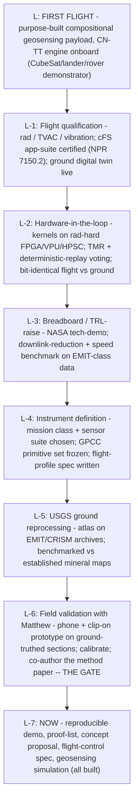

# From first flight, backwards to the next step — a geosensing mission roadmap

**Vision + backward-designed path · 2026-06-09 · honest-broker, claim-tiered · working draft (publication at the author's gate).**

**Abstract.** Two halves. **Part I** improves the Hs / CN-TT engine *for spaceflight* — eight architectural moves that turn Hs's determinism into flight advantages (cheap upset-detection, a perfect ground twin, power- and bandwidth-aware compositional resolution, onboard cross-instrument calibration, and sense-to-sample autonomy). **Part II** designs *backwards* from the end goal — the first flight of a purpose-built compositional **geosensing** apparatus running the CN-TT engine onboard — down to the single, modest, immediate step: field-validating with geologist Matthew Wehner. Dreaming big, then landing the dream on a human conversation.

**Keywords:** spaceflight, compositional geosensing, CN-TT, CNT, CNQ, quaternion, determinism, single-event upset, triple modular redundancy, core Flight System cFS, NPR 7150.2, FDIR, onboard autonomy, smart downlink, hyperspectral, EMIT, CRISM, rover, CubeSat, NASA, USGS, technology readiness level, backward design.

---

## Part I — Improving Hs for spaceflight (Claude's judgment)
Each move *leverages a property Hs already has* (determinism, hash-provenance, fixed vector-space kernels, the tiling coherence law). Tiers: **[sound]** = correct by construction; **[design]** = to engineer; **[earn]** = to prove on data/hardware.

1. **Computational redundancy via deterministic replay [sound].** Because the engine is deterministic and hash-stamped, a single-event upset is detected by *recompute-and-compare* — the engine is its own error-detecting code. This gives much of triple-modular-redundancy's protection for the compositional kernel at a fraction of the silicon: vote across replays, not only across three boards.

2. **A flight numeric profile for bit-identical determinism [design].** Extend the existing cross-language canonicalisation profile to a **fixed-point / canonical-float flight profile** so the kernel is bit-identical across the rad-hard FPGA/VPU and the ground twin. (Float determinism across hardened parts is the usual trap; this closes it.)

3. **The deterministic ground digital twin [sound].** A deterministic, hash-chained engine has a *perfect* ground replica: every uplinked Geologist Protocol command can be **executed on the twin and verified before it is sent**, and any flight output reproduced exactly on the ground for review. Few flight instruments can offer bit-exact pre-validation of commands.

4. **Power-aware adaptive resolution [design].** The faceted-read "resolution dial" (more overlapping D=4 facets → finer reading) becomes a **power/thermal knob**: the supervisor scales the number of active facets to the energy budget. Compositional resolution managed like any spacecraft resource.

5. **Bandwidth-aware progressive downlink [design].** Rank facets by their **activation / deceptive-drift score** and downlink most-surprising-first; the carrier filter becomes a *progressive codec* — decision-relevant structure goes down first, detail fills in if bandwidth allows. Delta processing as the native mode.

6. **Onboard cross-instrument coherence [design].** When a platform carries several instruments (context imager + point spectrometer + contact sensor), the Coherence Supervisor co-registers them via **shared parts (the tiling cocycle)** — onboard cross-calibration without a ground loop. Less ground dependence, more autonomy.

7. **Closed-loop sense → sample autonomy [earn].** A high **activation-coefficient** anomaly (a small carrier doing outsized structural work — the deceptive-drift trigger) becomes an **autonomy cue**: steer the rover to sample *there*. The instrument decides where to look next, from a real Hs metric, not a hand-tuned heuristic.

8. **A certifiable flight profile [design].** The four-form discipline (Python + R + pseudocode + formal I/O standard HUF-STD-002) plus bounded, branch-free kernels make a **formally-verifiable, NPR-7150.2-certifiable** subset realistic — the assurance path, not an afterthought.

> The through-line: **determinism is not a constraint to work around in flight — it is the feature that buys upset-detection, a perfect twin, verifiable autonomy, and certification.** That is why Hs belongs onboard.

## Part II — Backward design: from first flight to NOW
Read **top-down** (each stage *requires* the one below it). Execution runs **bottom-up** — we start at NOW.

| Stage | Goal | Closes the gate to |
|---|---|---|
| **L-7 · NOW** | Built: the reproducible demo, proof-list, geosensing concept + simulation, the flight-control spec. | the Matthew conversation |
| **L-6 · Matthew (field)** | Validate on a ground-truthed section; calibrate transfer functions + reliability weights; co-author. | USGS credibility |
| **L-5 · USGS (ground)** | Reprocess EMIT/CRISM archives; benchmark vs known mineral maps; remote-sensing track record. | NASA tech-demo |
| **L-4 · Instrument def** | Pick mission class + sensors; freeze the GPCC primitives; write the flight-profile spec (Part I §2, §8). | a fundable build |
| **L-3 · Breadboard** | Port the fixed kernel to a dev board; benchmark deterministic speed + downlink reduction. | flight hardware |
| **L-2 · HIL** | Kernels on the target rad-hard processor; TMR + deterministic-replay voting; ground twin bit-exact. | qualification |
| **L-1 · Qualify** | Rad/TVAC/vibe; cFS certification; ground digital twin operational. | launch |
| **L · Flight** | First purpose-built compositional geosensing instrument doing onboard, adaptive, auditable analysis. | — the dream |

## The convergence
Every arrow, traced back, lands on the same place: **a phone, a clip-on spectrometer, a ground-truthed outcrop, and a working session with one geologist.** That is the honest beauty of designing backwards — the grandest version of this (an instrument reading composition on another world, steering its own sampling, downlinking only what surprises it) is reached by doing the most modest next thing *well*, and letting each validated step earn the next. No stage is skipped; no claim outruns its evidence.

## Honest tiering & governance
This is a **vision and a notional path** — not a funded mission, not an agency commitment, not a schedule. Part I improvements are tiered in place; Part II stages are gated and earn-as-you-go. Hs computes; **HUF governs what is released** (carrier filter); AI assistance is disclosed (HUF-STD-001); the human holds authorship and the commit/contact gate. Pitch posture stays "interest expressed," never "acquired."

## Pointers
`GEOSENSING_CONCEPT_PROPOSAL.md` · `CNTT_FLIGHT_CONTROL_SPEC.md` · `FIELD_MULTISENSOR_TOOL_CONCEPT.md` + `field_tool_sim/` · `HS_FRONTEND_POSITION.html` · `00_EXECUTIVE_OVERVIEW.md`. Flight context: NASA core Flight System (cFS), triple-modular-redundancy practice, NPR 7150.2; EMIT / CRISM / PIXL remote sensing.

*Dream big; build small; skip nothing. The instrument reads. The expert decides. The hashes carry the receipts.*
