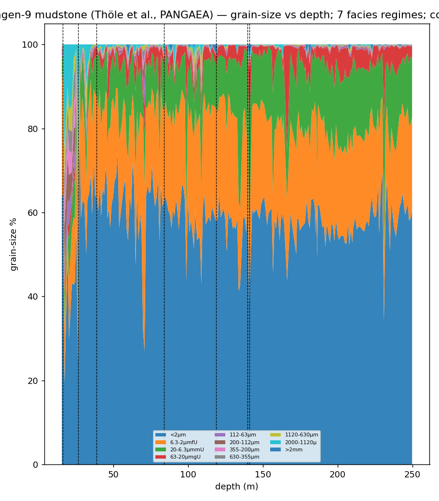

# Real‑data run — Frielingen‑9 mudstone (Thöle et al., PANGAEA)

> **Headline research:** Hˢ read the **real Frielingen‑9 grain‑size composition** (11 size fractions, 218 samples down‑section) **losslessly** (3.6×10⁻¹⁵), named the **coarse sand/gravel pulses as the dominant compositional drivers** in an otherwise mud‑dominated section, and detected **7 facies/lithology regime boundaries** — deterministic, with a hash receipt. · **Engine:** CN‑TT v4 (`../../../HCI-CNTT/`). · **Goal:** the geosensing study on *real* geochemical/granulometric data.

*2026‑06‑11. Author: Peter Higgins (human authorship for claims); AI‑assisted per HUF‑STD‑001. Geological interpretation belongs to the domain expert (Matthew Wehner / the authors). Claim‑tiered. Instrument, not data.*

## Source (public)
**Thöle, Bornemann, Heimhofer, Luppold, Blumenberg, Dohrmann, Erbacher (2019/2020)** — Frielingen‑9 core, Lower Saxony, N Germany; geochemical + lithological log; **PANGAEA** https://doi.org/10.1594/PANGAEA.897615 (file `Toehle-etal_geochem_litho_Frielingen-9.tab`). Depth 15.4–249.8 m; 427 samples. The `.tab` also carries SiO₂, Al₂O₃, Rb, Zr, CaCO₃, TOC, δ¹³C — a geochemical run is a natural follow‑up.

## What was run
Grain‑size composition: the 11 size fractions (<2 µm clay → >2 mm gravel; sum ≈ 100%) ordered by **depth** (218 samples with complete granulometry). Derived composition kept off‑repo (`DATA/_derived/`); engine output + figure here.

## Results (real engine output — `out.json`)
- **Lossless read 3.6×10⁻¹⁵** (D=11); deterministic hash `82c818ff…`.
- **Drivers (helmsman):** the **coarse fractions dominate** — 2000–1120 µm (very coarse sand) is the leading driver, then 1120–630 µm and >2 mm gravel. Geologically sensible: in a mud‑dominated section the *rare coarse pulses* are the most compositionally diagnostic events.
- **`K_eff` 1.93 → 8.08** — swings from near‑single‑fraction (mud‑dominated) intervals to well‑mixed grain‑size intervals.
- **7 regime boundaries** down‑section — candidate facies / lithology transitions for the geologist to interpret.

## Honest notes
- Hˢ supplies the geometry + the flags; **the geologist assigns facies meaning**. The coarse‑fraction dominance is the compositional read, not a depositional interpretation.
- A **geochemical** composition (major oxides + the available trace elements) and the published log‑ratios (log SiO₂/Al₂O₃, log Zr/Rb) are an obvious second run on this same core.

## Claim tiers
- **Tier 1:** the computed outputs (lossless 3.6e‑15; coarse‑fraction helmsman; 7 regimes; `K_eff` range; hash) — reproducible from the PANGAEA `.tab`.
- **Tier 2:** grain‑size fractions as a faithful granulometric composition; coarse pulses as the diagnostic movers.
- **Tier 3:** any stratigraphic/facies/depositional conclusion (the expert's call).

*Cross‑ref: the geosensing → flight arc (`../00_EXECUTIVE_OVERVIEW.md`, `../CNQ_TILING_METHOD_AND_PROOF.md`). The instrument reads. The expert decides. The data belongs to the domain.*
