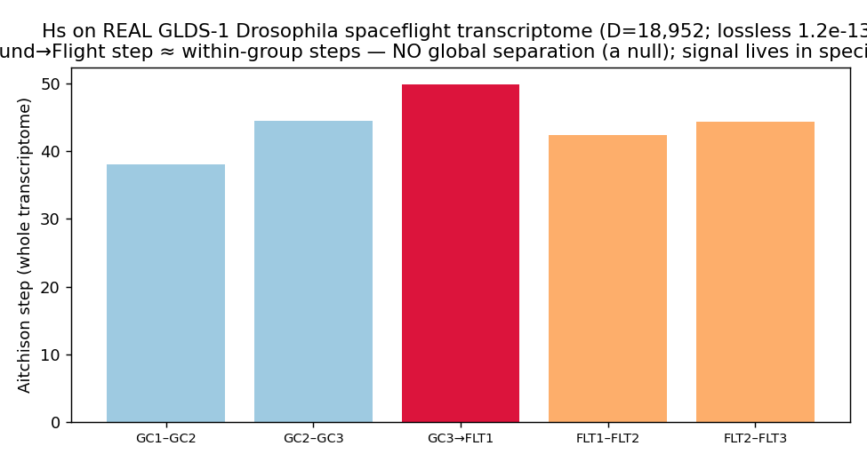

# Real‑data run — NASA GeneLab GLDS‑1 (Drosophila spaceflight transcriptome)

> **Headline:** Hˢ read a **real ~19,000‑dimensional spaceflight transcriptome losslessly** (D = 18,952 probesets, reconstruction 1.2×10⁻¹³) — and returned an **honest global null**: at the whole‑transcriptome compositional level the **ground‑vs‑flight separation is 0.95× the within‑group replicate variation** (no global separation). The spaceflight signal lives in *specific genes*, not the global composition — which is exactly why GeneLab's gene‑by‑gene differential‑expression analysis is the right tool. The same lesson as the Crohn microbiome null. · **Engine:** CN‑TT v4. · **Goal:** the space‑biology arm of the Earth/space program ([`../../SPACE_READINESS_AND_CHALLENGE.md`](../../SPACE_READINESS_AND_CHALLENGE.md)), on real OSDR data.

*2026‑06‑11. Author: Peter Higgins (human authorship for claims); AI‑assisted per HUF‑STD‑001. Instrument, not data. Claim‑tiered.*

## Source (public)
**NASA GeneLab GLDS‑1 / OSD‑1** — the inaugural GeneLab study: *Drosophila melanogaster* immune response in spaceflight (Affymetrix Drosophila_2 microarray; flight FLT vs ground control GC × infection {uninfected, E. coli, B. bassiana}, 3 reps each). Portal: https://osdr.nasa.gov · OSDR/GeneLab AWS S3: `s3://nasa-osdr/`. Files supplied by Peter (GeneLab processed array set: normalized expression, contrasts, differential expression, QC plots).

## What was run
The **uninfected** subset (the cleanest spaceflight contrast): 6 samples = GC Rep1–3 → FLT Rep1–3, GeneLab‑normalized log₂ intensities exponentiated to linear intensity and read as a per‑sample composition over **all 18,952 probesets** (D = 18,952). Derived composition kept **off‑repo** (`DATA/_derived/`); engine output + figure here. *(Compositional reading of microarray intensities is exploratory — see honest notes.)*

## Results (real engine output — `results/out.json`)
- **Lossless high‑D read: reconstruction 1.2×10⁻¹³ at D = 18,952** — Hˢ's tiling handles a real, full transcriptome losslessly and deterministically (hash `bcdc19e9…`). `K_eff` ≈ 5,000–6,200 effective genes.
- **Honest global null:** mean Aitchison distance — within‑Ground 47.0, within‑Flight 46.6, **Ground‑vs‑Flight 44.6** → separation = **0.95×** the within‑group average. The whole‑transcriptome composition does **not** separate flight from ground; the effect is within replicate noise across 19k genes. (No regime boundary fired.)

## Why the null is the right answer (and the doctrine it reinforces)
With 3 replicates and ~19,000 genes, a **global** compositional distance is dominated by gene‑level noise; the spaceflight signal is real but **sparse and gene‑specific**. This is precisely why the field — and the GeneLab‑provided analysis — uses **differential expression** (gene‑by‑gene, with variance shrinkage), i.e. a *targeted signature*, not a global scalar. It is the same lesson as:
- the **Crohn microbiome null** (global `K_eff` doesn't separate CD vs control, p=0.78 → seek a taxa signature), and
- **MC‑4 / Ratio Blindness** ([`../../../HUF/huf-gov/RATIO_BLINDNESS_DOCTRINE.md`](../../HUF/huf-gov/RATIO_BLINDNESS_DOCTRINE.md)): the global read is a *finding* (a null), and the value is in the specific carriers.
Hˢ's automated **NULL flag** (`DX‑NUL‑DIS`) is the coded form of this outcome. The complement to Hˢ here is GeneLab's `GLDS-1_array_differential_expression.csv` (the gene‑level signature).

## Honest notes
- **Compositionality caveat:** treating microarray log₂‑normalized intensities as a composition (2^x → close) is a modeling choice, **not** the domain standard (RNA‑seq counts are the cleaner CoDA target; GeneLab has RNA‑seq studies). Read this as a *high‑D lossless capability demo + an honest global‑separation test*, not a biological result.
- **Small n:** 3 reps/group; the global‑separation test is descriptive.
- **The authority is GeneLab's DE table**, not this global read.

## Claim tiers
- **Tier 1:** lossless read at D = 18,952 (1.2e‑13); the within/between Aitchison distances (0.95× — a global null) — reproducible from the GLDS‑1 file.
- **Tier 2:** the null‑→‑seek‑a‑signature lesson; the parallel to the microbiome null and MC‑4.
- **Tier 3:** any biological/spaceflight conclusion; the validity of microarray‑as‑composition; gene‑level signatures (use GeneLab's DE).

*The global read is a finding. The signal lives in the specifics. The instrument reads; the expert decides; the hashes carry the receipts. The data belongs to the domain.*
