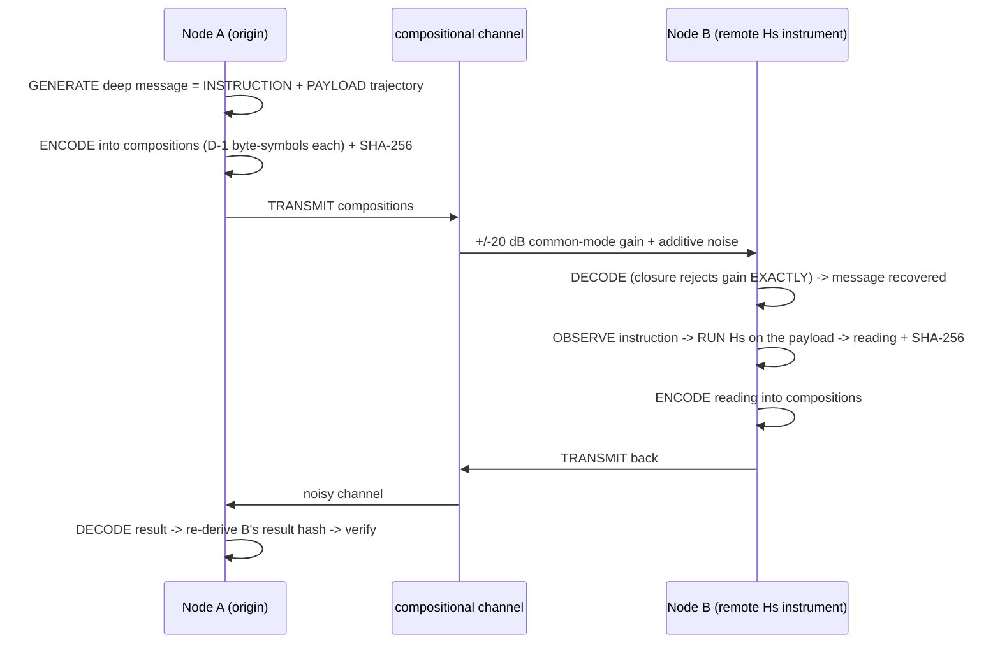

# Hˢ Duplex — the crowning jewel: a complete compositional communication loop

*Author: Peter Higgins (human authorship for all claims); AI-assisted per HUF-STD-001. 2026-06-23. The
capstone of the "composition's relational geometry is a channel whose capacity grows with the number of parts"
line: a **full bidirectional communication system done entirely by compositions** — generate, transmit, decode,
observe an instruction, compute, encode, transmit back, decode — with the remote computation performed *by Hˢ*,
the message protected by the compositional geometry, and every hop hash-verified. Receipt `4241d38a…`.
Honest-broker tiered; nothing posted; Peter is the sole gate.*

---

## The loop (all by compositions, all by Hˢ)

## What was measured (real run, receipt `4241d38a…`)

| stage | quantity | value |
|---|---|---|
| **Forward A→B** | deep message (instruction + 32-byte payload) | 77 bytes → **11 compositions**, decoded **exact at B** |
| **Channel** | common-mode ±20 dB gain rejection | **8.9×10⁻¹⁶** (exact, by closure) |
| **B observes** | instruction | `HUF-RPC/1 READ traj4 REPORT arrow,effdim,coh` |
| **B computes (by Hˢ)** | reads the payload trajectory | `arrow=part3, effdim=1.05, coh=0.30` — recovers the planted drift toward part 3 |
| **Return B→A** | the reading | 39 bytes → **6 compositions**, decoded **exact at A** |
| **Round trip** | exactness | **EXACT** (both directions byte-perfect) |
| **Integrity** | A re-derives B's result hash | **MATCH** — end-to-end verified, no trust required |
| **Capacity** | bits per composition vs D | **16 (D=3) → 24 → 56 → 120 → 376 (D=48)** — grows with parts |
| **Additive margin** | exact-decode noise tolerance | up to **0.1·Δ**; operated at 0.03·Δ |

## Why this is the use case Hˢ exists for

This is a **remote compositional instrument over a compositional link**: a node (a satellite, a sensor array, a
fleet member, a lab probe) receives a *compositional instruction*, **reads its own composition with Hˢ**, and
reports the reading back — all in the same compositional alphabet, end-to-end verifiable. It is the *conductor*
(`../../papers/frontier/HS_ENGINE_MORPHOLOGY_AND_CODEC.md`) made concrete and bidirectional:

- **the message is the medium** — instruction, payload, and result all ride as compositions;
- **the channel is self-protecting** — closure rejects common-mode gain exactly (the RWA ground-state law), so
  level/distance/illumination drift cannot corrupt the link;
- **the remote end is an instrument, not just a receiver** — it *acts on* the instruction (runs Hˢ) and returns
  a measurement, so the link carries *understanding*, not just bytes;
- **every hop is hash-verified** — the origin confirms the far-end computation without trusting it.

That is a genuinely good reason for Hˢ to exist and be used: **an auditable, self-protecting, compute-in-the-loop
instrument bus, in which the data, the instruction, and the answer are all the same kind of object.**

## Pure information theory — stated honestly

- **Capacity grows with D.** Each composition is a D−1-dimensional constellation carrying (D−1)·8 bits here;
  the alphabet grows with the number of parts — the dimensional-articulation result (`bf24c615…`) put to work.
- **No Shannon limit is beaten.** Capacity is bounded by the usual information theory; the additive margin is
  a finite, measured operating point. The *advantage* is determinism, end-to-end integrity (receipts), and the
  exact common-mode rejection — not bits beyond the bound.
- **Deterministic and reproducible.** Same input → same compositions → same receipts, any machine.

## Tiers

- **T1 (measured):** the exact bidirectional round trip; ±20 dB common-mode rejection 8.9e-16; the additive
  margin; the compute-in-the-loop Hˢ reading; end-to-end hash integrity; capacity-vs-D; receipt `4241d38a…`.
- **T2 (reasoned):** the remote-instrument-bus use case (constellation/sensor-array RPC) — a sound architecture,
  demonstrated in simulation, not yet on hardware.
- **T3 (open / rejected):** any beyond-Shannon or hardware-rate claim — **rejected**; this is a deterministic,
  self-verifying compositional protocol *within* information theory.

*Reproduce: `python3 hs_duplex.py`. Cross-refs: `../dimension_is_the_message_2026-06/` (capacity grows with D),
`../conformance_fixtures_2026-06/hs_codec_demo.py` (the codec), `../ground_state_noise_cancel_2026-06/`
(common-mode rejection), `../qam_spaceradio_2026-06/`, `../../papers/COMMUNICATIONS_GEOMETRY_LITERATURE_SCAN.md`.
Peter is the sole gate; nothing posted.*

*Proof & Honesty Standard — numbers cited-or-fenced · math proven + receipted · value shown · experts decide.*
