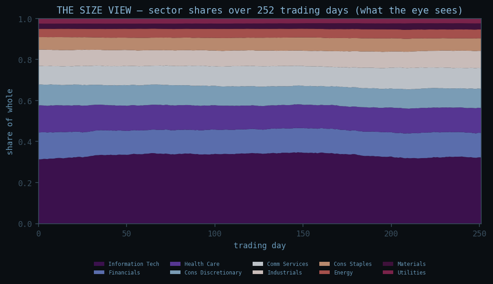
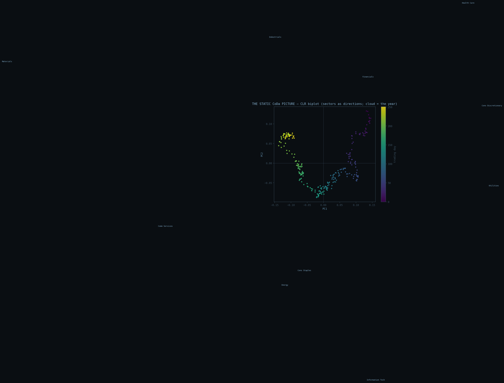
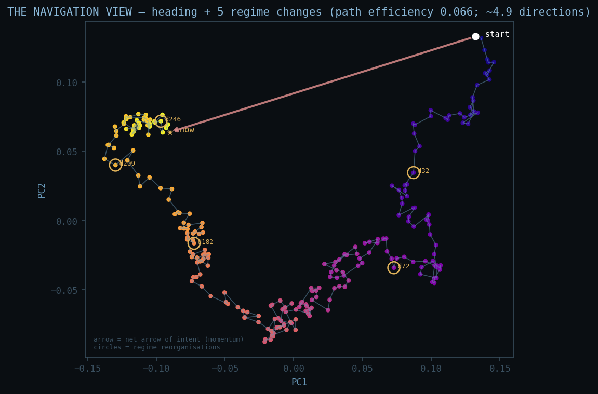
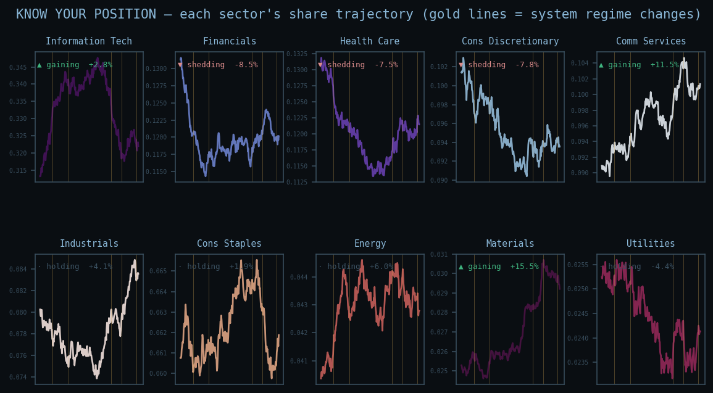

# The Financial Navigation Study — reading the system that moves the money

*A comprehensive Hˢ study for financial experts. The **thesis is the concept**: a financial system
leaves a compositional trail, and that trail has a direction you can read deterministically. The
**data is the conclusion**: a real S&P 500 ten-sector composition, read four ways, for an expert to
diagnose. Shown in the same visual language used in the CoDaWork 2026 presentations — the share view,
the CLR biplot — plus the navigation view that is this project's addition. Author: Peter Higgins
(human authorship for claims); AI-assisted per HUF-STD-001. Deterministic; reproducible to
`content_hash = 5b2a32d6…`. **Descriptive, not a forecast, not investment advice.***

---

## 1. The thesis (the concept)

Money moves people, and institutions move money. You cannot read a single price as a composition —
but the **way the system allocates itself is** a composition: sector weights, asset-class mixes,
fund flows, the holdings of institutions, the positioning of the very people who study the market.
Those are parts of one whole, tracked in order, and **a composition in motion has a heading.**

So this study does not study the market. It studies the **composition of the system that studies and
moves it**, and reads the vector map that system draws by its own behaviour. Every method, every
expert decision, every bit of chaos is already baked into the allocation trail; we read the trail and
project its vectors of significance. This is for the group that is usually invisible in such analyses —
not the outside observer, but **the institutions inside the mix**. Those inside need to know their
position. This study shows it to them.

This is not statistics and competes with none. The statistical compositional-finance work — e.g. the
CoDaWork 2026 contributions by **Vega Baquero & Santolino** (allocation *proportionality*) and
**Keivani & Coenders** (bankruptcy *prediction*) — characterises and predicts. Hˢ reads *motion*:
which way the whole is going, and where it reorganised. The two are orthogonal and complementary.

## 2. The method (CoDaWork techniques, then the navigation extension)

The data is a composition `M` of `T = 252` trading days × `D = 10` S&P 500 sectors, each row summing to
one. The reading is built in the standard compositional way, then extended into motion:

1. **Closure & CLR.** The shares are closed and centred-log-ratio transformed — the standard Aitchison
   move, exactly as in the CoDaWork presentations.
2. **The static CoDa picture (a CLR biplot).** The same plot the field already uses: sectors become
   directions, the year becomes a cloud. This is the snapshot view, shown for continuity.
3. **The Hˢ navigation extension.** The CLR trajectory is projected onto its first two principal axes —
   the **manifold projection** — and read as a *path*: the **arrow of intent** (where net weight is
   flowing), the **helmsman** (who steers), the **effective dimensionality** (how many independent
   directions are really moving), and the **regime changes** (where the composition genuinely
   reorganised, noise-survived). This motion layer is what Hˢ adds to the static picture.

Every number is deterministic and hash-receipted; a second analyst gets the identical map.

## 3. The data as conclusion — diagnose it

### 3.1 The size view — what the eye sees

Stacked shares over the window. To the eye it looks calm — the bands barely move. This is exactly the
trap the project was built around: **the size view hides the work.** The motion is real but small, and
magnitude-watching misses it. (This is the MC-4 / ratio-blindness point, in finance.)

### 3.2 The static CoDa picture — the snapshot

The standard biplot: each sector is a direction (gold), the 252 days are a cloud coloured by time. A
compositional analyst reads structure here — which sectors oppose, which co-move. It is a still
photograph. It does not yet tell you the *order* the cloud was traced, or where it turned.

### 3.3 The navigation view — the heading and the turns

This is the instrument. The same cloud, now read as a **path in time** (purple → yellow). The system
swept a long arc — it did not sit still; it *travelled*. The red arrow is the **net arrow of intent**:
over the window the weight moved toward **Comm Services, Information Tech, Materials** and away from
**Financials, Health Care, Cons Discretionary**. The gold circles mark the **five regime changes**
(trading days 32, 72, 182, 209, 246) — the points where the composition genuinely reorganised, not
every wiggle. Path efficiency is **0.066** and coherence **0.048**: this is a **rebalancing, mixing**
system, not one marching in a single direction — and it moves in about **5 independent directions**,
not 10 and not 1.

### 3.4 Know your position — the institutions inside the mix

Each panel is one sector's own trajectory, tagged by what the system is doing to it — **▲ gaining**,
**▼ shedding**, or **· holding** — with the net change since day 0 and the system's regime changes
(gold) overlaid. This is the page each institution inside the mix reads first: *where am I, and which
way is the system carrying me?* **Financials**, the loudest mover, is shedding; the technology and
communications complex is gaining. The system tells each part its position; the part decides what it
means.

## 4. The interactive instrument — read it live

**[`navigation_projector.html`](navigation_projector.html)** — open it in any browser (offline,
nothing sent). Scrub or play the 252 days and watch the **share radar** (where each sector sits today)
and the **navigation path** move together; click any sector to read **your position** — current share,
net change, and whether the system is steering toward or away from you. The regime changes light up on
the timeline as the system passes through them. This is the navigational instrument for the people
inside the mix.

## 5. How an expert diagnoses with this

- **Arrow of intent** — the net direction of compositional momentum. Reads *where the system is
  reallocating*, not where prices are going.
- **Helmsman** — the single most-moving coordinate (here Financials). The loudest part of the change.
- **Path efficiency / coherence** (near 0) — the system is **diffusive** (rebalancing, wandering), not
  **ballistic** (a directed policy). Character, not value judgement.
- **Effective dimensionality (~5)** — how many independent stories are running at once; a guard against
  over-reading ten sectors as ten independent moves.
- **Regime changes** — datable structural reorganisations to line up against known events; the
  instrument finds them from the chemistry of the allocation alone, then hands them to the expert.

## 6. The honest envelope

The reading is **Tier 1 — verified, deterministic, reproducible to the hash**. Its *meaning* — what any
heading or reorganisation implies, and any decision taken — is **Tier 3, the expert's entirely**. This
study computes no probability, fits no model, predicts no price, and is **not investment advice**. Hˢ is
not a financial advisor. It complements the statistics others publish; it never restates them. Public,
aggregate data only; the demonstration series is a generic public S&P 500 sector composition, and any
allocation / holdings / flows / positioning series runs the same way (see
[`DATA_AND_SOURCES.md`](DATA_AND_SOURCES.md)).

## 7. Reproduce or refute

- The reading: `python3 run_financial.py` → the vector map + `content_hash = 5b2a32d60a32a78a32240058c58a6eed46eb8e7ffacf32ddec70406ae7227d7e`.
- The visuals: `python3 build_visuals.py` → regenerates every figure here from the same data and engine.
- The instrument: open `navigation_projector.html`.

Same data → same map → same hash. Bring your own composition and it joins on the same terms.

*The data is the star; Hˢ is the lens; the receipt is the proof. The system draws its own vector map —
we only read it, and hand each institution inside the mix its position.*
