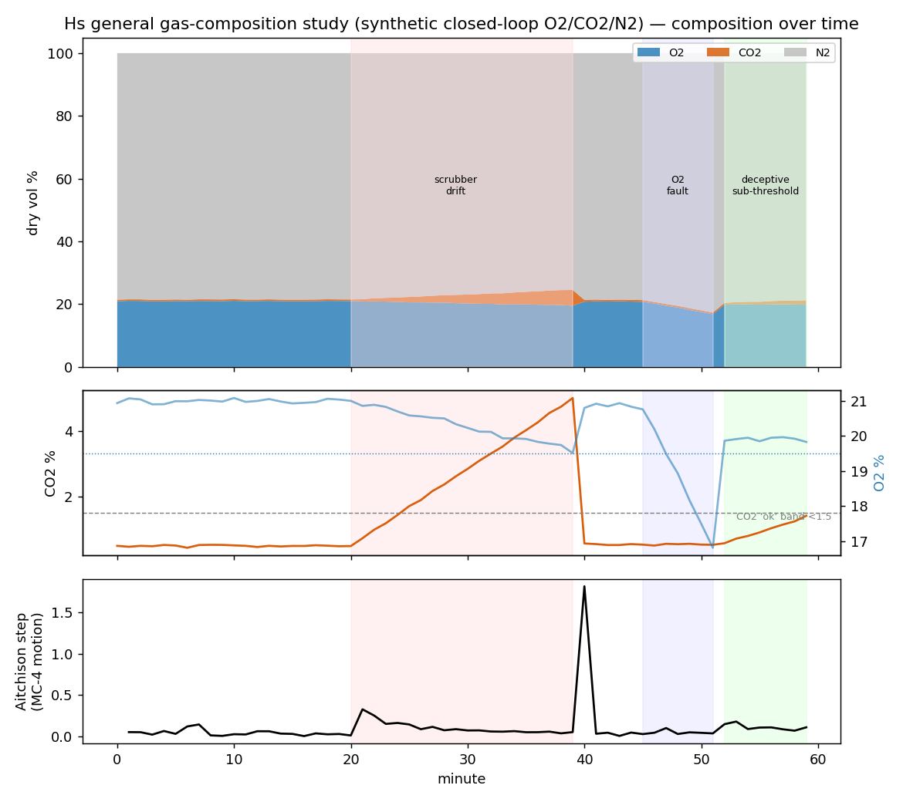

# Hˢ Gas & Process‑Fluid Compositional Studies — Composition Monitoring (MC‑4)

> **Headline research:** one deterministic engine reads gas/fluid composition across **four open studies** — closed‑loop life‑support gas, oil & gas produced water, blood/alveolar gas, and spacecraft cabin atmosphere — naming *which component drives each change*, *when the regime shifts*, and *real change vs sensor fault*, each lossless and hash‑receipted. · **Engine:** CN‑TT v4 ([`../../HCI-CNTT/`](../../HCI-CNTT/)). · **Goal:** give everyone a public, reproducible way to read gas/fluid composition (the fourth monitoring category) and **share the results for all to use — on any composition.**

## Studies in this collection
| # | Study | D | Headline result |
|---|---|---|---|
| 1 | closed‑loop O₂/CO₂/N₂ life‑support (below) | 3 | lossless 8.9e‑16; **40/60 single‑channel alarms green while the composition moved** (ratio blindness) |
| 2 | [oil & gas produced water](produced-water-codawork/) — CoDaWork/Engle; USGS DB | 7 | lossless 3.6e‑15; formation transition detected; censored values handled |
| 3 | [blood / alveolar gas](blood-gas/) — D=4 CNQ‑native | 4 | **exact quaternion read 4.7e‑16**; O₂/CO₂ drive desaturation |
| 4 | [spacecraft cabin atmosphere](cabin-atmosphere/) — ISS‑style | 5 | lossless 2.2e‑15; CO₂ duty cycle tracked; **VOC event caught** (helmsman→trace) |

*Each study: a transparent generator + a real CN‑TT run + a figure + the science + a named public‑data verification target. **Experiments and science only — no outreach letters in this repo.** Below is **Study 1** in full; Studies 2–4 are in their subfolders. **Real‑data sources (public sites) for every study: [`../../DATA_SOURCES.md`](../../DATA_SOURCES.md).***

---

# Study 1 — Closed‑loop O₂/CO₂/N₂ life‑support gas (MC‑4)

*Public Hˢ industrial‑instruments study. 2026‑06‑11. Author: Peter Higgins (human authorship for all claims); AI‑assisted per HUF‑STD‑001. Engine: **CN‑TT v4** ([`../../HCI-CNTT/`](../../HCI-CNTT/)). Demonstrates the HUF‑Gov **Ratio Blindness / MC‑4** doctrine ([`../../../HUF/huf-gov/RATIO_BLINDNESS_DOCTRINE.md`](../../../HUF/huf-gov/RATIO_BLINDNESS_DOCTRINE.md)) on the gas domain. Claim‑tiered.*

---

## 1 · Why this study exists (and why it's public)

A breathing or life‑support gas is a **composition** — O₂, CO₂, N₂ (and, in anaesthesia, agents and N₂O) that close to a whole and **drift over time**. Reading that drift compositionally was always a necessary Hˢ capability: gas is one of the cleanest, most universal compositional‑monitoring domains there is (clinical respiration, closed‑loop life support, anaesthesia, combustion flue gas, fermentation/bioreactor off‑gas, diving rebreathers). This study stands on its own as a public demonstration that Hˢ reads gas composition deterministically, and it is the worked example behind the **MC‑4 (Composition Monitoring)** doctrine: *three monitoring categories measure magnitude; the fourth reads the ratios.*

## 2 · What was done (reproducible)

CN‑TT v4 was run on a **transparent, clearly‑labelled synthetic** closed‑loop breathing‑gas series — O₂/CO₂/N₂, dry volume %, 60 one‑minute steps — generated by [`code/make_gas_series.py`](code/make_gas_series.py) (fixed seed). It is **not** real patient or flight data; it is a physiologically‑plausible scenario set built to exercise composition monitoring, with the **public‑data verification target specified in §5**. The scenario contains four documented events:

| Window | Event | Designed behaviour |
|---|---|---|
| t00–19 | Nominal closed loop | O₂≈21%, CO₂≈0.5%, N₂ balance |
| t20–39 | **CO₂ scrubber degradation** | CO₂ ramps 0.5→5.0%; O₂ drifts 21→19.6% |
| t40–44 | Scrubber replaced + settle | CO₂ steps back to ≈0.6% |
| t45–51 | **O₂ supply fault** | O₂ falls 20.8→16.8%; CO₂ steady |
| t52–59 | **Sub‑threshold deceptive drift** | every gas kept inside its single‑channel "normal band" while the O₂:CO₂:N₂ **ratio** rotates |

Inputs, the engine output JSON, and the figure are in [`results/`](results/).

## 3 · Results (real engine output — `results/gas_cntt_output.json`)

- **Exact compositional read.** Lossless reconstruction to **8.9 × 10⁻¹⁶** (machine precision) — Hˢ reads the gas composition with no loss; deterministic content hash `a94bc2ad…` on the run.
- **Which carrier moved.** Through the scrubber‑degradation window the **helmsman (dominant driver) is CO₂** — Hˢ names CO₂ as steering the compositional change, exactly the real cause; 10 helmsman flips total across the series as drivers hand off (CO₂ → N₂/O₂ as the O₂ fault develops).
- **When it changed.** A **regime boundary is detected at minute 39** (the scrubber‑replacement transition, the largest compositional shift); effective gas diversity `K_eff` moves over **1.62–1.98**.
- **The Ratio‑Blindness result (the point of the study).** **40 of 60 timesteps had *every* single‑channel magnitude alarm green** (O₂ within 19.5–23%, CO₂ ≤ 1.5%) while the composition was moving. In the deliberately sub‑threshold window (t52–59) **all single‑channel alarms stayed green** yet CO₂ had risen to **≈ 2× its baseline** and the **MC‑4 motion (Aitchison step) ran ≈ 2.5× the nominal baseline** (0.105 vs 0.042). Magnitude monitoring (MC‑1) was blind; composition monitoring (MC‑4) was not. *One curve lies; two curves diagnose.*



*Figure (`results/gas_composition_figure.png`): top — O₂/CO₂/N₂ composition; middle — CO₂ and O₂ against their single‑channel bands; bottom — Aitchison step (MC‑4 motion). Shaded: scrubber drift, O₂ fault, and the deceptive sub‑threshold window.*

## 4 · What this shows operationally

Hˢ adds, on top of a signal a gas device already captures: **which gas is driving a change** (helmsman), **when the regime shifted** (boundaries), an **effective‑diversity track** (`K_eff`), and — with two redundant sensors — an **internal‑vs‑external shock** read (real physiological change vs sensor fault / mask leak; see [`../../HCI-CNTT/SELF_DIAGNOSTICS_AND_LIFECYCLE.md`](../../HCI-CNTT/SELF_DIAGNOSTICS_AND_LIFECYCLE.md)), each with a hash receipt suitable for device validation. This is exactly the MC‑4 capability that single‑threshold alarms cannot provide.

## 5 · Public‑data verification (the specified next step — open & reproducible)

This demonstration uses a synthetic scenario so it is fully reproducible; the **operational‑value verification is specified on public datasets** and anyone can run it:

- **VitalDB** (open ICU/anaesthesia dataset, `vitaldb.net`) — carries gas‑analyzer tracks (FiO₂, etO₂, inspired/end‑tidal CO₂, agents). Build the inspired/expired gas composition per case, run `run_cntt.py`, and confirm the helmsman/regime read against documented clinical events.
- **PhysioNet** capnography/respiratory records — for breath‑resolved CO₂ dynamics.
- **NOAA / atmospheric composition** — a general‑gas (non‑clinical) baseline for the same pipeline.

Protocol: form the composition CSV (label column + gas columns) → `python ../../HCI-CNTT/run_cntt.py <case>.csv -o out.json` → read `navigation.helmsman`, `regime_boundaries`, `atlas.lossless`, and the hash. *(Downloading any dataset is a deliberate, separately‑authorised step; none is bundled here — we read data where it lives.)*

## 6 · Reproduce this study
```
python code/make_gas_series.py results/gas_series.csv
python ../../HCI-CNTT/run_cntt.py results/gas_series.csv -o results/gas_cntt_output.json
```

## 6b · Self‑serve / Bring Your Own AI
Everything here is public and self‑serve. Point your own AI or agent at [`AI_ASSIST.json`](AI_ASSIST.json) — a small machine‑readable node carrying this study's specific knowledge and a link up to the full Hˢ AI‑refresh chain (convention: [`../../ai-refresh/AI_ASSIST_PATH_PROTOCOL.md`](../../ai-refresh/AI_ASSIST_PATH_PROTOCOL.md)) — and it will self‑onboard on the topic and method, then reproduce the run. No account and no contact are needed to read and assess; assistance is available only if you want it.

## 7 · Claim tiers & scope
- **Tier 1 (verified/computed):** the engine outputs in §3 (lossless 8.9e‑16, CO₂ helmsman, regime boundary at t39, the 40/60 green‑alarm and 2.5× deceptive‑window figures) — all reproducible from the files here.
- **Tier 2 (sound):** that the synthetic scenarios faithfully model real closed‑loop gas behaviour; the MC‑4‑vs‑MC‑1 ratio‑blindness argument.
- **Tier 3 (to earn):** any clinical or flight conclusion; results on real VitalDB/PhysioNet data (the §5 verification, not yet run).
- **Scope:** Hˢ is the instrument; gas data and its clinical/operational meaning belong to the domain. We do not store or redistribute datasets.

*The percentages can lie. The simplex cannot. The instrument reads — the expert decides — the hashes carry the receipts.*
