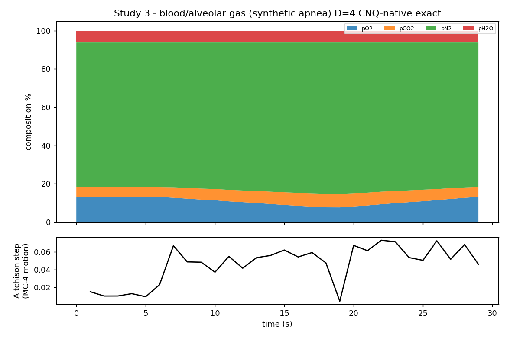

# Study 3 — Blood / alveolar gas, dissolved oxygen (D=4, CNQ‑native)

> **Headline research:** A four‑part alveolar gas composition (O₂, CO₂, N₂, H₂O) is read as an **exact quaternion rotation** — lossless to **4.7×10⁻¹⁶** (machine precision) — through a breath‑hold: Hˢ names O₂ and CO₂ as the drivers of desaturation, deterministically and with a receipt. · **Engine:** CN‑TT v4, D=4 CNQ‑native (`../../../HCI-CNTT/`). · **Goal:** show Hˢ reading dissolved‑gas / blood‑gas dynamics exactly at the dimension where the move *is* a quaternion.

*2026‑06‑11. Author: Peter Higgins (human authorship for claims); AI‑assisted per HUF‑STD‑001. Research demonstration on synthetic physiology — NOT patient data, NOT medical advice. Claim‑tiered. Experiment + science only.*

---

## Why D=4 here
A four‑part composition has exactly three log‑ratio degrees of freedom — the dimension of a unit quaternion (S³≅SU(2)). So a blood/alveolar gas mix of **O₂, CO₂, N₂, H₂O** is the natural CNQ‑native case: the compositional move between time steps is read **exactly**, with no tiling needed. Public reference: the alveolar gas equation / standard values (pH₂O = 47 mmHg at body temperature; partial pressures sum ≈ 760 mmHg).

## What was run
A **transparent synthetic** alveolar partial‑pressure series (mmHg) over 30 seconds through a breath‑hold (apnea) and recovery: resting → pO₂ 100→58 and pCO₂ 40→54 during apnea → recovery. Generator: [`code/make_blood_gas.py`](code/make_blood_gas.py).

## Results (real engine output — `results/out.json`)
- **Exact (lossless) read to 4.7×10⁻¹⁶** — the D=4 quaternion read is exact at the IEEE floor; deterministic hash `f1058863…`.
- **Drivers named:** the helmsman alternates between **pO₂ (falling) and pCO₂ (rising)** through apnea — exactly the desaturation physiology — while pN₂ and pH₂O stay quiet. `K_eff` 2.10→2.24.
- **Honest null on regime detection:** the apnea is a *smooth ramp*, so no abrupt regime boundary fired (`indices: []`). Correctly, Hˢ reports motion and drivers but does not invent a discrete regime shift where there isn't one.

## ✅ Real‑data run (DONE) → [`results_real_vitaldb/`](results_real_vitaldb/REAL_DATA_RESULTS.md)
Ran on a **real VitalDB anaesthesia case** (Peter‑supplied): expired {O₂, CO₂, agent, N₂} (D=4), **lossless 6.7×10⁻¹⁶ (exact quaternion read)**, **O₂ the dominant helmsman** (then CO₂, then agent), **11 regime boundaries** at clinical transitions; deterministic hash `481acf32…`. Derived composition kept off‑repo with the source (instrument, not data). Full write‑up + figure: [`results_real_vitaldb/REAL_DATA_RESULTS.md`](results_real_vitaldb/REAL_DATA_RESULTS.md). **Independent second dataset (UQ Vital Signs, 5 cases) agrees** → [`results_real_uq/`](results_real_uq/README.md): **O₂ dominant in 13/13 real cases across VitalDB + UQ.**

## Verification on public data (more)
Run on public capnography/blood‑gas datasets (e.g. PhysioNet capnography; VitalDB arterial blood‑gas/anaesthesia tracks): form the {O₂, CO₂, N₂, H₂O} composition, run the engine, confirm the O₂/CO₂ helmsman read against documented apnea/desaturation events. *(Dataset download is a separately‑authorised step; none is bundled here.)*

## Claim tiers & scope
- **Tier 1:** the computed outputs (exact 4.7e‑16, O₂/CO₂ helmsman, the regime null) — reproducible here.
- **Tier 2:** the synthetic faithfully models apnea gas dynamics; the D=4 = quaternion‑native framing.
- **Tier 3:** any clinical conclusion; results on real blood‑gas/capnography data (not yet run).
- **Scope:** research‑only; Hˢ is the instrument, clinicians decide meaning; no patient data stored or used.

*Reproduce: `python code/make_blood_gas.py results/blood_gas.csv && python ../../../HCI-CNTT/run_cntt.py results/blood_gas.csv -o results/out.json`*
