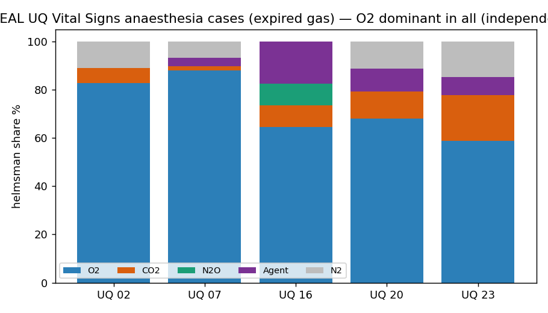

# Independent corroboration — UQ Vital Signs anaesthesia cases (expired gas)

> **Headline:** a **second, independent** real anaesthesia dataset (University of Queensland Vital Signs, different hospital + monitors) gives the **same result**: expired‑gas composition read losslessly, **O₂ the dominant compositional driver in every usable case (5/5)**. Combined with the VitalDB cohort (8/8), that's **O₂‑dominant in 13/13 real anaesthesia cases across two independent datasets.** · **Engine:** CN‑TT v4.

*2026‑06‑11. Author: Peter Higgins (human authorship for claims); AI‑assisted per HUF‑STD‑001. Research demonstration on public anaesthesia data — NOT medical advice. Instrument, not data. Claim‑tiered.*

## Source (public)
**University of Queensland Vital Signs Dataset** (Liu, Görges & Jenkins, *Anesth Analg* 2012; 32 surgical cases, Royal Adelaide Hospital; CC BY‑NC). Per case, the 1‑s `trenddata.csv` carries end‑tidal gas‑analyzer channels: `etO2`, `etCO2` (mmHg), `etN2O`, and three agents `etSEV`/`etDES`/`etISO`. Site: https://outbox.eait.uq.edu.au/uqdliu3/uqvitalsignsdataset/ (per‑case zips via the browse page). Files supplied by Peter (all 32 cases).

## Composition & method
Expired composition {O₂ = etO₂, CO₂ = etCO₂/7.6 → %, N₂O = etN₂O, Agent = etSEV+etDES+etISO, N₂ = balance}; physiological‑window filtered (etO₂ 15–99%, etCO₂ 5–60 mmHg, N₂>2%); all‑zero carriers dropped per case (so D = 3–5). Derived compositions kept **off‑repo** (`DATA/_derived/uq/`); only engine outputs + figure here. Runner: `../../blood-gas/code/run_uq_cohort.py`.

## Results (real engine output — `cohort/cohort_summary.csv`)

| case | T | D | carriers | recon_err | lossless | dominant | regimes |
|---|---|---|---|---|---|---|---|
| 02 | 191 | 3 | O₂+CO₂+N₂ | 5.6e‑16 | ✅ | **O₂** | 13 |
| 07 | 59 | 4 | O₂+CO₂+Agent+N₂ | 8.9e‑16 | ✅ | **O₂** | 2 |
| 16 | 527 | 5 | O₂+CO₂+N₂O+Agent+N₂ | 1.1e‑15 | ✅ | **O₂** | 9 |
| 20 | 54 | 4 | O₂+CO₂+Agent+N₂ | 8.9e‑16 | ✅ | **O₂** | 4 |
| 23 | 555 | 4 | O₂+CO₂+Agent+N₂ | 6.7e‑16 | ✅ | **O₂** | 6 |

All lossless at the IEEE floor; **O₂ dominant in all 5**. Case 16 ran the full **D=5** {O₂, CO₂, N₂O, agent, N₂} (UQ records N₂O + three agents, richer than the VitalDB export).

## Cross‑dataset finding (Tier 1)
**O₂ is the dominant per‑step compositional driver in 13/13 real anaesthesia cases — 8 VitalDB (Seoul) + 5 UQ (Adelaide)** — two independent datasets, hospitals, and monitor makes. The breathing‑gas composition during anaesthesia is steered mostly by O₂ (FiO₂/FEO₂ management); a deterministic, reproducible result with a hash receipt on every case.

## Honest notes (data heterogeneity, not an Hs issue)
Only **5 of 32** UQ cases yielded a clean expired‑gas composition. The rest were excluded for *data* reasons, surfaced by the run: several cases have **no etO₂** logged (e.g. case 03 — etO₂ all‑NaN), and some heavy‑N₂O cases have **anomalous etCO₂** values (cases 22/26: median ~150, not mmHg). These are 2011‑era multi‑monitor records with varied channel coverage — a dataset‑curation reality, reported straight rather than hidden. The 5 complete cases are the valid expired‑gas subset.

## Claim tiers
- **Tier 1:** the 5 per‑case outputs (all lossless; O₂ dominant) + the 13/13 cross‑dataset tally — reproducible from the UQ zips.
- **Tier 2:** the expired {O₂,CO₂,N₂O,agent,N₂} composition as a faithful breathing‑gas representation.
- **Tier 3:** any clinical conclusion; cohort statistics beyond these cases.

*Two datasets, one answer. The instrument reads. The expert decides. The hashes carry the receipts. The data belongs to the domain.*
