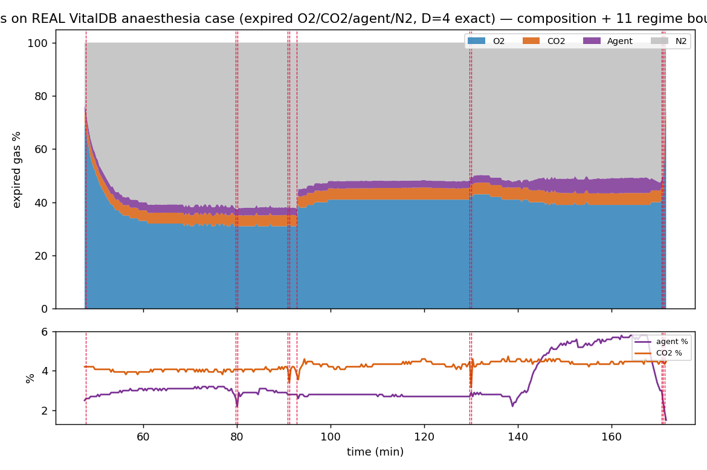

# Study 3 — REAL DATA run on a VitalDB anaesthesia case (expired gas, D=4 exact)

> **Headline:** Hˢ read a **real ~2‑hour anaesthesia expired‑gas trajectory** {O₂, CO₂, agent, N₂} **exactly** (lossless 6.7×10⁻¹⁶, the D=4 quaternion read), named **O₂ as the dominant driver** (then CO₂, then volatile agent), and flagged **11 regime shifts** — deterministic, with a hash receipt. · **Engine:** CN‑TT v4.

*2026‑06‑11. Author: Peter Higgins (human authorship for claims); AI‑assisted per HUF‑STD‑001. Research demonstration on public anaesthesia data — NOT medical advice. Claim‑tiered. Instrument, not data.*

## Source (public)
**VitalDB** — open surgical/ICU vital‑signs database (Lee et al., *Sci Data* 2022); https://vitaldb.net (also on PhysioNet). One case's gas‑analyzer tracks (Dräger **Primus**): `Primus/FEO2` (expired O₂ %), `Primus/ETCO2` (end‑tidal CO₂, mmHg), `Primus/EXP_SEVO` + `Primus/EXP_DES` (volatile agent %). The case used sevoflurane then desflurane, O₂‑enriched (FIO₂ ≈ 46%), **no N₂O**.

## Composition built (derived; kept off‑repo with the source)
Expired breathing‑gas composition, **D=4** (CNQ‑native): **O₂** = FEO₂(%); **CO₂** = ETCO₂(mmHg)/7.60 → % of 1 atm; **Agent** = EXP_SEVO + EXP_DES (%); **N₂** = balance. Physiological‑window filter (O₂ 25–70%, CO₂ 1–8%, N₂ > 5%), light 3× downsample → **389 readings over ~7,450 s**. The derived composition CSV lives in the data folder (`DATA/Industrial Compositions/_derived/`), **not** in the repo — we read data where it lives and do not redistribute it; only the analysis output + figure are here.

## Results (real engine output — `out.json`)
- **Exact read:** lossless reconstruction **6.66×10⁻¹⁶** (machine precision) — the four‑part move is read exactly as a quaternion. Deterministic hash `481acf32…`.
- **Who drives the case:** helmsman share **O₂ 178 / CO₂ 101 / Agent 93 / N₂ 16** steps — **O₂ is the dominant driver** (FIO₂/FEO₂ adjustments), then CO₂ (ventilation), then the anaesthetic agent. `K_eff` 2.24–2.77.
- **When it shifts:** **11 regime boundaries** detected at ≈ minutes **47.8, 79.7–80.0, 90.9–92.7, 129.7–130.0, 170.7–171.3** — clustered transitions consistent with agent changes (sevo→des), O₂ step changes, and ventilation adjustments during the case.

## Honest notes
- **167 per‑step helmsman flips** — real clinical gas data is noisy at the reading cadence, so the *single‑step* driver flips often. The **robust reads are the helmsman *share*** (O₂‑dominant) **and the regime boundaries**, not each individual flip.
- The clinical meaning of each boundary is for an anaesthetist to assign (we did not have the case's event log); Hˢ supplies the geometry + the flags, the expert decides.
- This is **one case**; it demonstrates the real‑data path. A cohort run across many VitalDB cases is the natural next step.

## Reproduce
Place a VitalDB case CSV (with the `Primus/*` gas tracks) in the data folder; build the expired {O₂, CO₂, Agent, N₂} composition as above; then `python ../../../../HCI-CNTT/run_cntt.py <derived.csv> -o out.json`.

## Claim tiers
- **Tier 1:** the computed outputs above (exact 6.66e‑16; O₂‑dominant helmsman share; 11 regime boundaries; hash) — reproducible from the derived composition.
- **Tier 2:** the expired {O₂, CO₂, agent, N₂} composition faithfully represents the case's breathing gas; the D=4 = quaternion‑exact framing.
- **Tier 3:** any clinical conclusion; cohort‑level results; attribution of each regime boundary to a specific clinical event.

*The instrument reads. The expert decides. The hashes carry the receipts. The data belongs to the domain.*
