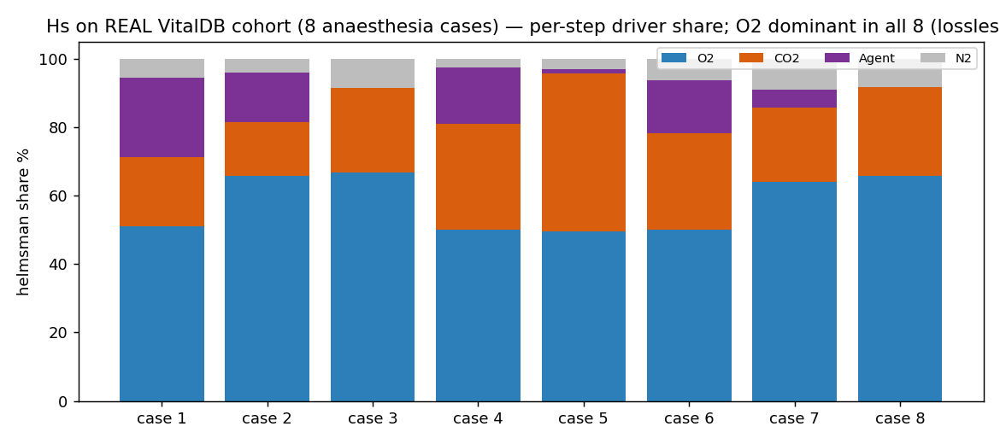

# Real‑data cohort — 8 VitalDB anaesthesia cases (expired gas)

> **Headline:** across **8 real VitalDB anaesthesia cases**, Hˢ read the expired‑gas composition **losslessly in every case** (machine precision), and **O₂ is the dominant compositional driver in all 8** — a robust cross‑case result. 6–21 regime boundaries per case. · **Engine:** CN‑TT v4.

*2026‑06‑11. Author: Peter Higgins (human authorship for claims); AI‑assisted per HUF‑STD‑001. Research demonstration on public anaesthesia data — NOT medical advice. Instrument, not data. Claim‑tiered.*

## Source
**VitalDB** (open; https://vitaldb.net) — 8 cases supplied by Peter (`DATA/Industrial Compositions/1–8.csv`). Per case: expired composition {O₂ = FEO₂, CO₂ = ETCO₂/7.6, Agent = EXP_SEVO+EXP_DES, N₂ = balance}; physiological‑window filtered, light‑downsampled. Derived compositions kept **off‑repo** with the source (`DATA/_derived/`); only engine outputs + this summary are in the repo.

## Results (real engine output — `cohort_summary.csv`, `case*.json`)

| case | T | D | carriers | recon_err | lossless | dominant driver | regimes |
|---|---|---|---|---|---|---|---|
| 1 | 586 | 4 | O₂+CO₂+Agent+N₂ | 6.66e‑16 | ✅ | **O₂** | 12 |
| 2 | 656 | 4 | O₂+CO₂+Agent+N₂ | 1.78e‑15 | ✅ | **O₂** | 17 |
| 3 | 408 | 3 | O₂+CO₂+N₂ | 5.55e‑16 | ✅ | **O₂** | 10 |
| 4 | 590 | 4 | O₂+CO₂+Agent+N₂ | 8.88e‑16 | ✅ | **O₂** | 12 |
| 5 | 575 | 4 | O₂+CO₂+Agent+N₂ | 1.78e‑15 | ✅ | **O₂** | 14 |
| 6 | 569 | 4 | O₂+CO₂+Agent+N₂ | 6.66e‑16 | ✅ | **O₂** | 6 |
| 7 | 599 | 4 | O₂+CO₂+Agent+N₂ | 8.88e‑16 | ✅ | **O₂** | 21 |
| 8 | 651 | 3 | O₂+CO₂+N₂ | 4.44e‑16 | ✅ | **O₂** | 15 |

**Cross‑case finding (Tier 1):** every case reads losslessly at the IEEE floor, and **O₂ is the dominant per‑step driver in 8/8 cases**, with CO₂ second — the breathing‑gas composition during anaesthesia is steered mostly by O₂ (FIO₂/FEO₂ management), then ventilation (CO₂). Two cases (3, 8) used no volatile agent in‑window, so the agent carrier was dropped (D=3) — see the engine note below.

## Engine‑hardening finding (honest, from real data)
Real data exposed an edge case the synthetic studies did not: **an identically‑zero carrier** (a case with no volatile agent → the Agent column is all zeros) is **not compositional** — `log(0)` propagates to `nan`, which made a downstream matrix‑diagnostic eigendecomposition (`diagnostics.py` `eigh`) fail to converge. **Fix applied in the harness:** drop any all‑zero carrier before running (cases 3, 8 → D=3). **Recommended engine hardening (flagged, not patched — Peter's gate):** CN‑TT should detect an all‑zero/constant carrier, drop it (or guard the `eigh` with a jitter/SVD fallback), and emit a `CAL`/structural diagnostic code rather than producing `nan`. Logged as an engine item.

## Honest notes
- Per‑step helmsman flips are frequent (real gas data is noisy at the reading cadence); the robust reads are the **dominant‑driver share** and the **regime boundaries**, not each flip.
- Clinical meaning of each regime boundary is for an anaesthetist (no case event logs here).
- This is a **method demonstration on 8 cases**; a larger cohort would let the regime/driver statistics be characterised properly.

## Claim tiers
- **Tier 1:** the per‑case outputs (all lossless; O₂ dominant 8/8; regime counts; hashes) — reproducible via `code/run_vitaldb_cohort.py`.
- **Tier 2:** the expired {O₂,CO₂,agent,N₂} composition as a faithful breathing‑gas representation; the all‑zero‑carrier hygiene rule.
- **Tier 3:** any clinical conclusion; cohort‑level statistics beyond these 8.

*Reproduce: `python code/run_vitaldb_cohort.py 1 2 3 4 5 6 7 8` (expects the VitalDB CSVs in the data folder). The instrument reads. The expert decides. The data belongs to the domain.*
