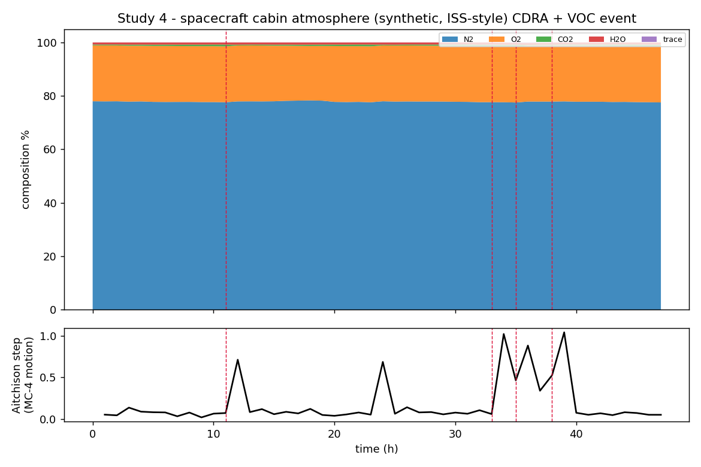

# Study 4 — Spacecraft cabin atmosphere gas composition

> **Headline research:** Hˢ reads an ISS‑style cabin atmosphere (N₂, O₂, CO₂, H₂O, trace) — lossless to **2.2×10⁻¹⁵** — tracking the CO₂‑removal duty cycle and **catching a trace‑contaminant (VOC) event as detected regime boundaries** (t33–38, helmsman → trace), deterministically and with a receipt. · **Engine:** CN‑TT v4 (`../../../HCI-CNTT/`). · **Goal:** demonstrate deterministic composition monitoring for closed‑loop life support — the space arm of the gas studies (see `../../../SPACE_READINESS_AND_CHALLENGE.md`).

*2026‑06‑11. Author: Peter Higgins (human authorship for claims); AI‑assisted per HUF‑STD‑001. Claim‑tiered. Experiment + science only.*

---

## Public reference
ISS cabin atmosphere management (public NASA references): total pressure ≈ 14.7 psia (sea‑level‑equivalent), ppO₂ ≈ 21%, CO₂ held low by the **Carbon Dioxide Removal Assembly (CDRA)** on a duty cycle, humidity controlled. Cabin atmosphere is a composition that drifts — exactly Hˢ's regime, and a named space‑readiness application area.

## What was run
A **transparent synthetic** ISS‑style cabin composition (N₂, O₂, CO₂, H₂O, trace; dry vol % + humidity + trace; D=5) over 48 hours: a CDRA CO₂ sawtooth, an O₂ consumption dip + top‑up, and a **trace‑VOC contaminant spike at t34–38**. Generator: [`code/make_cabin_atmosphere.py`](code/make_cabin_atmosphere.py). Not telemetry; clearly labelled scenario.

## Results (real engine output — `results/out.json`)
- **Lossless read to 2.2×10⁻¹⁵**; deterministic hash `11b04810…`.
- **CO₂ duty cycle tracked:** the helmsman is **CO₂** through the scrubber‑loading phases; `K_eff` 1.78→1.83 (an O₂/N₂‑dominated atmosphere with small movers).
- **Contaminant event caught:** regime boundaries at **[11, 33, 35, 38]** — t11 a CDRA cycle edge, and **t33–38 the VOC event**, where the **helmsman flips to `trace`** as the contaminant briefly drives the composition. A magnitude alarm on N₂/O₂ would not budge; the compositional read flags the event and names the culprit channel.
- **FDIR‑ready:** with a redundant sensor, the internal‑vs‑external shock test (`../../../HCI-CNTT/SELF_DIAGNOSTICS_AND_LIFECYCLE.md`) separates a real cabin event from a sensor fault — the diagnostic a life‑support controller wants.

## Verification on public data (next step)
Run on public spacecraft/analog cabin atmosphere logs (e.g. published ISS environmental data or closed‑habitat analog studies): build the {N₂, O₂, CO₂, H₂O, trace} composition over time, run the engine, confirm regime boundaries against logged CDRA cycles and contaminant events. *(Dataset download is a separately‑authorised step; none is bundled here.)*

## Claim tiers & scope
- **Tier 1:** the computed outputs (lossless 2.2e‑15, CO₂ helmsman, the VOC‑event regime boundaries + trace helmsman) — reproducible here.
- **Tier 2:** the synthetic faithfully models CDRA‑managed cabin behaviour; the life‑support monitoring argument.
- **Tier 3:** any flight conclusion; results on real cabin telemetry (not yet run); the space twin‑study (`SPACE_READINESS_AND_CHALLENGE.md`).
- **Scope:** Hˢ is the instrument; mission/life‑support experts decide meaning. Unfunded, no agency involvement implied.

*Reproduce: `python code/make_cabin_atmosphere.py results/cabin_atmosphere.csv && python ../../../HCI-CNTT/run_cntt.py results/cabin_atmosphere.csv -o results/out.json`*
