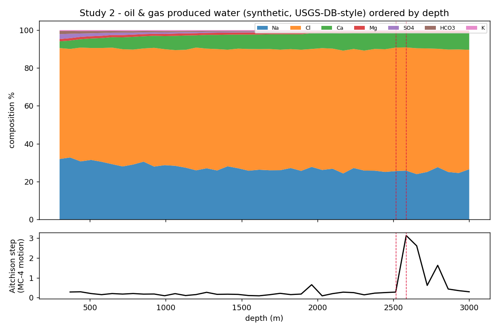

# Study 2 — Oil & gas produced water (CoDaWork 2026 referenced)

> **Headline research:** Hˢ reads an oil & gas **produced‑water** major‑ion composition down‑depth — lossless to **3.6×10⁻¹⁵**, names the ion driving each change, flags the formation transition, and handles below‑detection (censored) values deterministically. · **Engine:** CN‑TT v4 (`../../../HCI-CNTT/`). · **Goal:** demonstrate a deterministic, reproducible produced‑water composition read on the public **USGS National Produced Waters Geochemical Database**, complementary to the imputation work presented at CoDaWork 2026.

*2026‑06‑11. Author: Peter Higgins (human authorship for claims); AI‑assisted per HUF‑STD‑001. Claim‑tiered. Experiment + science only — no outreach here.*

---

## Source talk & public site
**Engle, Venzor Nava & Sanchez** (University of Texas at El Paso), *"Assessing performance of compositional data analysis algorithms for the imputation of missing geochemical data to inform oil and gas wastewater re‑use,"* CoDaWork 2026 Book of Abstracts p.18. They impute missing/censored values in **publicly available produced‑water datasets** (Appalachian Basin shale + commingled samples) using robCompositions/zCompositions. The canonical public site is the **USGS National Produced Waters Geochemical Database** (Engle et al.) — the verification target for this study.

## What was run
A **transparent synthetic** Appalachian‑Basin‑style produced‑water major‑ion composition (Na, Cl, Ca, Mg, SO₄, HCO₃, K; mg/L; D=7) over 40 samples **ordered by depth**, with a formation boundary near sample 24 and two below‑detection SO₄ zeros (censored). Generator: [`code/make_produced_water.py`](code/make_produced_water.py). Not real samples; the **USGS DB is the named real‑data target** (§verification).

## Results (real engine output — `results/out.json`)
- **Lossless compositional read to 3.6×10⁻¹⁵** (machine precision); deterministic hash `800e6c14…`.
- **Which ion drives the change:** the helmsman moves among the brine ions (Ca, Cl, Na) and the falling SO₄/HCO₃ as the water becomes Na‑Cl brine with depth — Hˢ names the driver at each step rather than reading magnitudes.
- **Formation transition detected:** regime boundary at samples **[32, 33]** (deep‑brine transition + the censored‑SO₄ interval), `K_eff` 2.43→2.87.
- **Censored values handled deterministically:** the two below‑detection SO₄ zeros are treated by the engine's multiplicative zero‑treatment — a principled, reproducible alternative/complement to statistical imputation.

## Relationship to the CoDaWork work (honest)
Engle et al. **complete** the data (impute missing values); Hˢ **reads** the completed composition deterministically (which ion drives change, where the formation turns) and offers a principled zero/censored‑value treatment. Complementary, not competing: imputation fills the matrix; Hˢ navigates it with a receipt.

## ✅ Real‑data run (DONE) → [`results_real_usgs/`](results_real_usgs/README.md)
Ran on the **real USGS Produced Waters DB** (Peter‑supplied `USGSPWDBv2.3c.csv`, Williston Basin, 683 samples down‑depth, D=7): **lossless 3.1×10⁻¹⁵**, and — the real‑data MC‑4 finding — the **dominant drivers are the minor ions SO₄ & HCO₃, not the Na‑Cl bulk brine** (magnitude says Na‑Cl; the ratios say SO₄/HCO₃); 38 regime boundaries; hash `9d76b56c…`. Full write‑up + figure: [`results_real_usgs/README.md`](results_real_usgs/README.md).

## Verification on public data (more)
Run the same pipeline on the **USGS National Produced Waters Geochemical Database** (public): build the major‑ion composition per sample, order by depth/formation, `python ../../../HCI-CNTT/run_cntt.py <csv> -o out.json`, confirm the helmsman/regime read against known basin chemistry. *(Downloading the DB is a separately‑authorised step; none is bundled here.)*

## Claim tiers & scope
- **Tier 1:** the computed outputs above (lossless 3.6e‑15, regime boundary, censored‑zero handling) — reproducible from the files here.
- **Tier 2:** the synthetic faithfully models produced‑water depth structure; the complementarity with imputation.
- **Tier 3:** any basin/geochemical conclusion; results on the real USGS DB (not yet run).
- **Scope:** Hˢ is the instrument; the data and its hydrogeochemical meaning belong to the domain. We read data where it lives; we do not redistribute it.

*Reproduce: `python code/make_produced_water.py results/produced_water.csv && python ../../../HCI-CNTT/run_cntt.py results/produced_water.csv -o results/out.json`*
