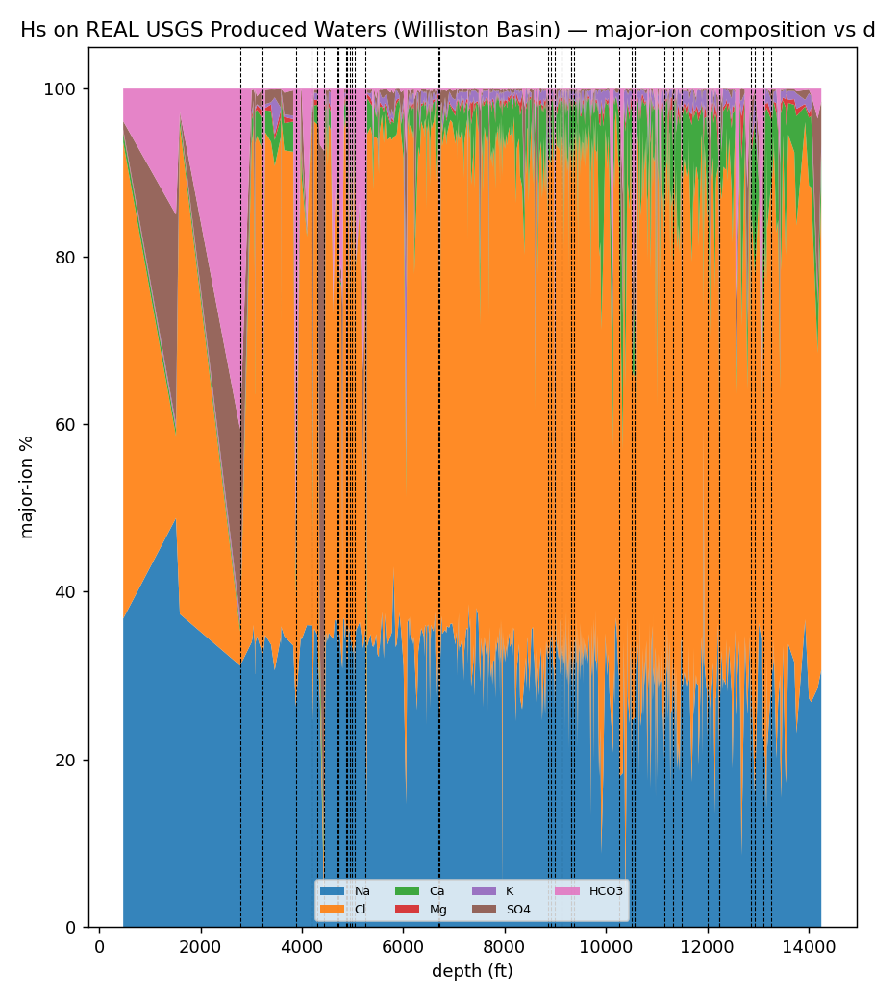

# Study 2 — REAL DATA run on the USGS Produced Waters DB (Williston Basin)

> **Headline:** Hˢ read **683 real produced‑water samples** (USGS DB, Williston Basin) down‑depth as a 7‑major‑ion composition **losslessly** (3.1×10⁻¹⁵), and found the **dominant compositional drivers are SO₄ and HCO₃ — the *minor* ions — not the Na‑Cl bulk brine.** 38 regime (formation/depth) boundaries. A clean, real‑data illustration of MC‑4 / ratio blindness: the bulk ions dominate by *mass* but carry little *compositional* information; the minor redox‑sensitive ions carry the signal. · **Engine:** CN‑TT v4.

*2026‑06‑11. Author: Peter Higgins (human authorship for claims); AI‑assisted per HUF‑STD‑001. Instrument, not data. Claim‑tiered.*

## Source (public)
**USGS National Produced Waters Geochemical Database** (the dataset behind the CoDaWork 2026 talk by Engle, Venzor Nava & Sanchez). File `USGSPWDBv2.3c.csv` (v2.3, 114,943 samples) supplied by Peter; v3.0 DOI https://doi.org/10.5066/P9DSRCZJ. Subset: **Williston Basin**, the 683 samples with all seven majors present + depth, ordered by `DEPTHUPPER` (472–14,252 ft).

## Composition
{Na, Cl, Ca, Mg, K, SO₄, HCO₃} (mg/L), D=7, ordered by depth. Derived composition kept **off‑repo** (`DATA/_derived/usgs_williston_majorions.csv`); only the engine output + figure are in the repo.

## Results (real engine output — `out.json`)
- **Lossless read 3.1×10⁻¹⁵** (D=7); deterministic hash `9d76b56c…`.
- **Dominant drivers = SO₄ (253) and HCO₃ (239)**, then Mg (93), K (53), Ca (32); **Na (9) and Cl (3) barely drive at all.** In a Na‑Cl brine, Na and Cl are huge but their *ratio* is nearly constant — so they carry little compositional information — while the redox/diagenesis‑sensitive **minor ions (SO₄, HCO₃) swing over orders of magnitude and are what actually moves the composition.** This is the MC‑4 point on real geochemistry: *magnitude says Na‑Cl; the ratios say SO₄/HCO₃.*
- **`K_eff` 1.84 → 5.21**; **38 regime boundaries** down the depth‑ordered ensemble — candidate formation/diagenetic transitions.

## Relationship to the CoDaWork work (honest)
Engle et al. **impute** the many missing/censored values in produced‑water datasets (a data‑completion problem); Hˢ **reads** the completed composition's geometry — which ion drives the change with depth, where it shifts — deterministically, and offers a principled zero/below‑detection treatment. Complementary: imputation fills the matrix; Hˢ navigates it with a receipt.

## Honest notes
- This is a **depth‑ordered ensemble across many Williston wells**, not a single‑well profile — so the read is the dominant compositional *gradient with depth across the basin*, and the 38 boundaries mix true depth structure with between‑well variation. A single‑well or single‑formation subset would give a cleaner profile.
- The **hydrogeochemical meaning** (which boundaries are real diagenetic fronts vs sampling structure) is for the domain expert.
- Other basins are equally runnable (Green River 4,706; Permian 855; etc.) — Williston was chosen for size + depth range.

## Claim tiers
- **Tier 1:** the computed outputs (lossless 3.1e‑15; SO₄/HCO₃‑dominant helmsman; 38 regimes; `K_eff`; hash) — reproducible from the USGS CSV.
- **Tier 2:** the minor‑ion‑carries‑the‑signal reading as an MC‑4 illustration; the complementarity with imputation.
- **Tier 3:** any basin/diagenetic conclusion; single‑well profiles; the produced‑water‑reuse decisions the data informs.

*The percentages can lie; the simplex cannot. The instrument reads. The expert decides. The data belongs to the domain.*
