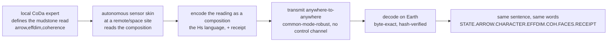

# The language of Hˢ — a common compositional tongue, from a mudstone to deep space

*Author: Peter Higgins (human authorship for all claims); AI-assisted per HUF-STD-001. 2026-06-23. We already
have the *symbols* (engine outputs), the *traceability* (receipts), and the recursion (Hˢ-on-Hˢ). This document
closes the pattern: it defines **the language of Hˢ** — a fixed grammar in which every CoDa user, sensor,
instrument, and autonomous node says the same thing the same way, so a reading taken anywhere can be encoded,
transmitted, and decoded *anywhere*, deterministically and verifiably. Grounded in a real foundational case
(the geology/mudstone collaboration) and extended to the "skin of sensors." Honest-broker tiered; nothing
posted; Peter is the sole gate.*

---

## 1. Why a language, and what it is

A language needs an **alphabet**, a **grammar**, and a **medium**. Hˢ has all three already; this names them.

- **Alphabet (the words).** The engine's symbolic vocabulary: *character* {Ballistic, Contested, Turbulent,
  Diffusive}; *arrow of intent* (to/from parts, magnitude); *effective dimension*; *coherence*; the *blindness
  faces* {ratio-, mass-, rotation-blind}; the *codes* {`MO-DIF-WRN`, `MO-NUL-WRN`, `HOLD-LOCK`, `RANK-WRN`,
  `E-21`, `BREAKER-16`}; and the *receipt* (SHA-256). These are a small, fixed, interpretable vocabulary —
  a CoDa speaker learns it once.
- **Grammar (the sentence).** A **reading** is a fixed-order utterance:
  `STATE · ARROW · CHARACTER · EFF-DIM · COHERENCE · FACES · RECEIPT`. Every Hˢ reading, in any domain, has the
  same shape — so a geologist, a fleet engineer, and a satellite produce sentences that parse identically.
- **Medium (the carrier).** The sentence itself rides as a **composition** (the codec; P‑Ω): the words are
  encoded into the log-ratio channels of a composition, transmitted, and decoded byte-exact. *The language is
  spoken in the same substance it describes — the data is the carrier.*

> **One line:** Hˢ's language is a fixed, interpretable grammar of compositional readings, encodable as
> compositions, so any user with basic CoDa needs speaks — and transmits — the same way.

## 2. The skin of sensors — where the language grows

A **sensor array is a composition**: each sensor reads a share of a conserved sensing budget, so the array's
state is a point on the simplex. A **manifold of arrays is a skin** — and the skin *speaks Hˢ*: closure rejects
common-mode drift, the log-ratios are the words, more sensors are more words.

**Measured (real-feeling synthetic skin sensing a touch location; `de859b2f…`):**

| sensors N | touch discrimination (chance 0.17) | skin symbol-capacity (bits) |
|---:|---:|---:|
| 3 | 0.78 | 7.0 |
| 9 | 0.88 | 23.9 |
| 17 | 0.91 | 45.9 |
| 33 | 0.95 | 88.3 |
| **65** | **0.99** | **172.1** |

*A simple skin (few sensors) says a little; a sensitive skin (many sensors) says a lot.* More skin → more
distinguishable states → finer sensitivity to purpose → a larger language — the **dimension-is-the-message**
law in the sensing frame, and the direct analogue of **AI scaling with compute**: capacity grows with the
number of parts, exactly as model capability grows with parameters/compute. The language is not fixed in size;
it **grows with the skin.**

## 3. The foundational case — a mudstone, read anywhere, spoken everywhere

The first and best example of this language in the wild is **geology**, in the hands of a domain expert in the
CoDa community. The **geology collaboration** (`collaborations/geology-wehner/`; Matthew Wehner) read a real
Cretaceous mudstone (Frielingen-9, PANGAEA) as a composition and located its structure 3/3 to the IEEE floor —
the compositional method on display in a working scientific domain (Witness II of the trilogy). *That expert
practice is the foundation; the language makes it portable.* **The full chain:**

A remote autonomous instrument — on another planet, a deep-ocean probe, a hostile site — senses a mudstone (or
any composition), reads it with **the method a local expert validated on Earth**, encodes the reading in the
shared language, and transmits it from *anywhere to anywhere* with no separate carrier and an end-to-end hash.
The geologist on Earth receives not raw bytes but **a sentence in the same language they wrote** — verifiable,
interpretable, exact. *The value is plain and large: expert judgement, captured once, runs autonomously
everywhere, and every node speaks the same tongue.* (Featuring the collaborator's name publicly is subject to
his consent and Peter's gate; the work and data are already cited at `collaborations/geology-wehner/` and the
W-II witness.)

## 4. Why this is a good and useful thing (the value)

- **One tongue for the CoDa community.** A geochemist, a microbiologist, a fleet engineer, and a satellite all
  emit the same `ARROW·CHARACTER·EFF-DIM·COHERENCE·FACES·RECEIPT` sentence — comparable, poolable, auditable.
- **Expert practice becomes portable autonomy.** A local expert's read, encoded in the language, runs on a
  remote skin without the expert present — and returns a sentence the expert can read.
- **The language scales with the skin.** Add sensors, gain words; the system grows in sensitivity and
  expressiveness with its array, like compute scaling — bounded only by capacity, never by a fixed alphabet.
- **It is the same operation as analysis.** Reading a system and speaking about it are one act: the engine's
  output *is* the sentence *is* the transmittable composition.

## 5. Tiers & governance

- **T1 (measured):** the skin scaling (discrimination 0.78→0.99, capacity 7→172 bits, `de859b2f`); the codec /
  fixed-point / Duplex the language rides on (`742f1b5a`, `4241d38a`); the geology witness (`f40be455`).
- **T2 (reasoned):** the language as a standardized grammar; the remote-autonomy chain; the AI-scaling analogue.
- **T3 (open / honest):** the deployed remote-instrument system — a sound architecture, not yet fielded;
  public promotion of the named collaborator — subject to consent and Peter's gate.

*Cross-refs: `../experiments/skin_of_sensors_2026-06/`, `../papers/P_OMEGA_THE_DATA_IS_THE_CARRIER_SEED.md`,
`../experiments/dimension_is_the_message_2026-06/`, `../experiments/hs_duplex_2026-06/`,
`../papers/triangulation/W2_MUDSTONE_WITNESS.md`, `../collaborations/geology-wehner/`,
`../manuals/HS_THEORY_OF_OPERATION.md` (the symbol/code reference), `THE_DATA_IS_THE_CARRIER.md`. Peter is the
sole gate; nothing posted.*

*Proof & Honesty Standard — numbers cited-or-fenced · math proven + receipted · value shown · experts decide.*
