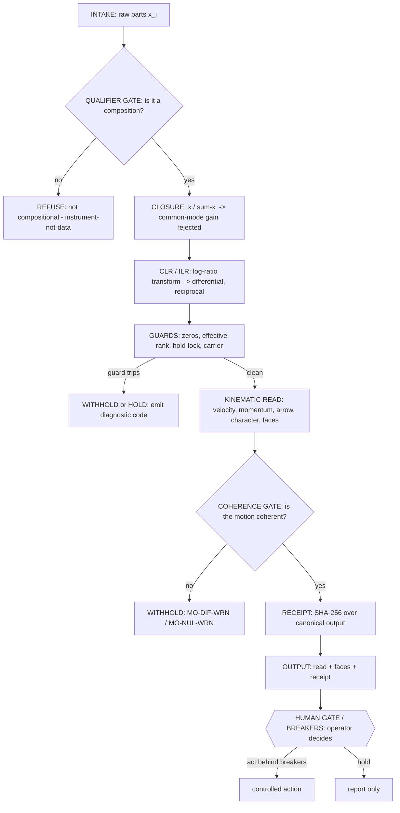
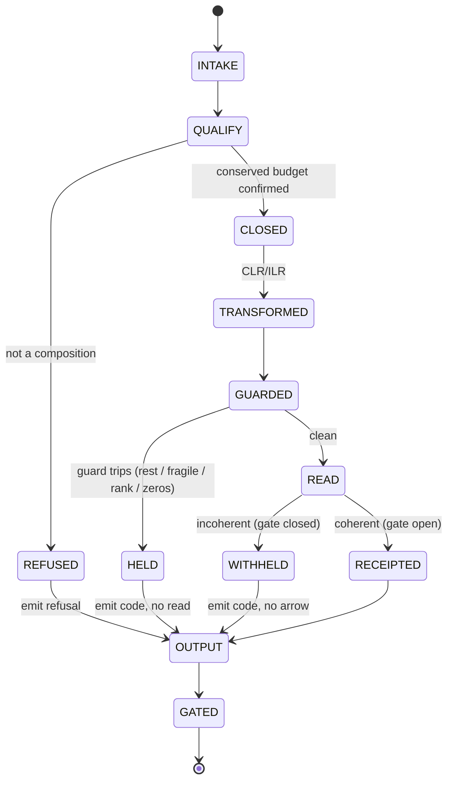
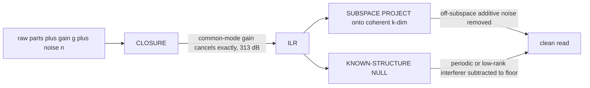
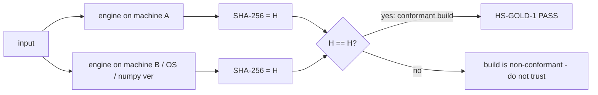

# Hˢ Theory of Operation — the internals as a documented state machine

*Author: Peter Higgins (human authorship for all claims); AI-assisted per HUF-STD-001. 2026-06-23. The engine
documented stage by stage, as a deterministic state machine with flow charts, state table, diagnostic codes,
breakers, and the human gate. This is the integrator's / reviewer's manual: it shows exactly what happens to a
reading from intake to receipt, and exactly where and why it can refuse. Honest-broker tiered; nothing posted.*

---

## 1. The pipeline at a glance (flow chart)

Every edge is deterministic: the same input takes the same path to the same output and the same receipt.

## 2. The state machine (states + transitions)

## 3. State table (the integrator's reference)

| state | input | operation | guard / exit condition | output on pass | output on fail |
|---|---|---|---|---|---|
| **INTAKE** | raw parts `x` | accept vector | finite, length ≥ 2 | proceed | refuse |
| **QUALIFY** | `x` | composition check | parts of a conserved whole, strictly positive | CLOSED | `REFUSED` (instrument-not-data) |
| **CLOSED** | `x` | `c = x/Σx` | — | `c` (gain-normalized) | — |
| **TRANSFORM** | `c` | `clr`, then `ilr = clr·Hᵀ` | — | ILR coords (differential) | — |
| **GUARDED** | ILR | zero-treatment · effective-rank (SVD) · hold-lock hysteresis · carrier (E-21) | rest / fragile-driver / low-rank / zero-heavy | proceed | `HELD` + code |
| **READ** | ILR | velocity, momentum, arrow of intent, character, blindness faces | — | kinematic read | — |
| **COHERENCE** | read | `‖Σv‖/Σ‖v‖ ≥ floor` | below floor → no net intent | `RECEIPTED` | `WITHHELD` + warn |
| **RECEIPT** | read | canonical-JSON SHA-256 | — | hash-stamped read | — |
| **GATE** | output | operator + 16 breakers | safety-critical decisions | controlled action | report-only |

## 4. The two noise-rejection stages (why the read is clean)

<!-- Stage 1 common-mode (multiplicative) cancels to machine precision: clr(g·x)=clr(x), 313 dB; Stage 2
     off-subspace additive removed at 10·log10((D-1)/k) dB. Math kept out of the Mermaid edge labels (bare
     parentheses break the parser); see the prose below for the exact relations. -->
*Edge-label note: the exact relations are `clr(g·x) = clr(x)` (Stage 1) and `10·log₁₀((D−1)/k) dB` (Stage 2);
they live in the prose, not the diagram, because Mermaid edge labels cannot contain bare parentheses.*

- **Stage 1 — common-mode (multiplicative):** exact, machine-precision (the RWA ground-state law). Receipt `d8c21c70`.
- **Stage 2 — additive:** deterministic for off-subspace + known-structure noise; returns NO for in-subspace
  random noise. Receipt `cb0c3f52`. (Full treatment: `../papers/datasheets/AN-001_DETERMINISTIC_NOISE_REJECTION.md`.)

## 5. Diagnostic & breaker codes (what a refusal means)

| code | state | meaning | operator action |
|---|---|---|---|
| `REFUSE/QUAL` | QUALIFY | input is not a composition | supply conserved-budget data, or use a different tool |
| `E-21` | GUARDED | carrier-guard: hashed-path / carrier mismatch | check the input path; the guard prevents a mis-keyed read |
| `HOLD-LOCK` | GUARDED | system at rest within the calibrated noise floor | do not chase noise; wait for real motion |
| `RANK-WRN` | GUARDED | effective rank below threshold (degenerate) | read is fragile; widen the window |
| `MO-DIF-WRN` | COHERENCE | motion is diffuse / churn — no net intent | no arrow drawn; report "movement, no direction" |
| `MO-NUL-WRN` | COHERENCE | system at rest — no motion | report null honestly |
| `BREAKER-16` | GATE | operator's master breaker | only the human opens it; full automation is never reached |

**The design rule:** the instrument would rather **withhold** than be confidently wrong. Every code above is a
deliberate refusal, not a failure.

## 6. Determinism contract (the property that makes it auditable)

Contract: **HS-EPS-1** (machine-epsilon cross-platform conformance). Golden fixtures: **HS-GOLD-1** (master
`d7ac6530…`). A build is genuine Hˢ only if `hs_gold_fixtures.py --verify` reproduces the master hash.

## 7. Governance overlay (the gate is invariant under scale)

The same state machine runs at user scale (flag → human decides) and at machine scale (the same reads behind
breakers, SafeLoop damping toward a setpoint), but the **GATE** state is the one fixed point: the operator
holds Breaker 16, and full automation is never reached. Determinism is what makes delegation safe — a machine
may *act* on a read only because the read is *checkable*.

## 8. Tiers

- **T1 (measured):** every stage's numeric behavior (closure, exact rung, guards, the two noise stages,
  determinism) — receipts `d8c21c70`, `cb0c3f52`, `d7ac6530`, `99ec0581`.
- **T2 (reasoned):** the state-machine framing as the canonical operational model.
- **T3 (held):** any claim of fully-automatic operation — **rejected**; the human gate is structural.

*Cross-refs: `HS_USER_MANUAL.md`, `../papers/datasheets/HS-CN1_DATASHEET.md`,
`../HCI-CNQ/engine/` (the reference implementation), `../experiments/conformance_fixtures_2026-06/` (HS-GOLD-1).
Proof & Honesty Standard throughout. Peter is the sole gate; nothing posted.*
