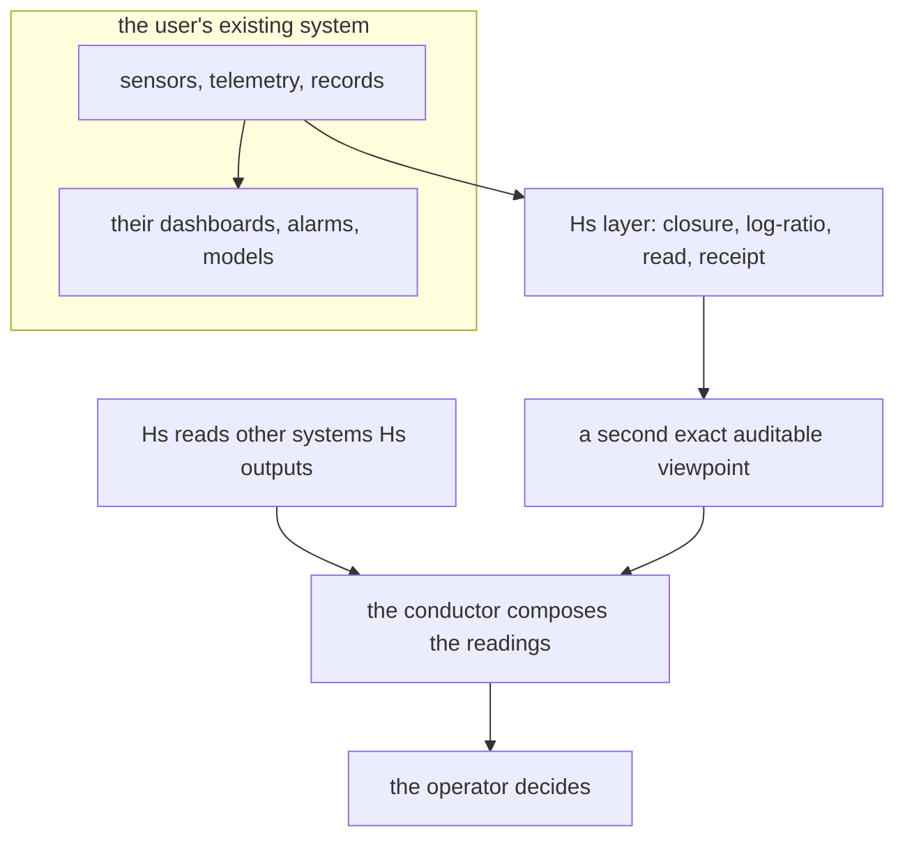

# Hˢ Use Cases — applications, on applications, each with a receipt

*Author: Peter Higgins (human authorship for all claims); AI-assisted per HUF-STD-001. 2026-06-23. Where the
instrument earns its keep. "Applications-on-applications" means Hˢ is a *layer* that sits on top of whatever
system already collects the data and gives a second, exact, auditable reading of it — and that same layer
composes the readings of *other* systems too. Each case below is tied to a measured receipt or a named decisive
test. Honest-broker tiered; nothing posted; Peter is the sole gate.*

---

## 1. The pattern (what "applications-on-applications" means)

Hˢ adds ~nothing of its own (it is inert to ~10⁻¹⁵) yet outputs something useful — a reproducible relational
reading the existing aggregate view cannot see. And because its output is itself a composition, Hˢ reads the
outputs of many systems as one — the conductor.

## 2. Measured use cases (T1 — receipted)

| domain | the composition | what Hˢ surfaces that others miss | receipt |
|---|---|---|---|
| **Engineered fleet health** (drives → GPUs → sats) | failure-mode budget | silent drift toward failure + rotation-blind size events, before threshold alarms | `058fde30`, `d531e545` |
| **Microbiome / clinical** | taxa abundances | the disease signal lives in the ratios (0.832 vs 0.505 diversity-null) | `acf65ce…` |
| **Geoscience / stratigraphy** | oxide / grain-size | provenance + regime change, auditable, with honest boundary reporting | Frielingen-9 |
| **Finance / allocation** | sector / holding weights | arrow of intent + character, model-free, replayable, not advice | P6 |
| **Energy / grid mix** | generation shares | deceptive-drift monitoring + ~10× lossless compression of the record | `305cc0db` |

## 3. Engine-era application stack (T1 mechanism, T2 field-fit)

| application | the Hˢ mechanism | status |
|---|---|---|
| **Deterministic noise rejection** | common-mode (313 dB exact) + off-subspace/known-structure additive | **T1** · `d8c21c70`, `cb0c3f52` · AN-001 |
| **Telemetry source layer for a QAM space link** | encode in log-ratio → ~700× more error-graceful delivery; modem untouched | **T1 measured** · `f502c15d` · AN-003 |
| **Lossless compositional codec / compression** | generate↔read inverse; ~3.5–10× vs naive, near symbol entropy | **T1** · `305cc0db` |
| **Sensor-array / multi-expert conductor** | each expert is a part; common-mode cancels; coherence gate withholds on disagreement | **T2** · AN-004 |
| **Satellite-constellation coherence + 6-DOF pose** | dual-quaternion read of health + geometry + size in one receipt | **T2/T3** · storm-backtest = decisive test |
| **Non-coherent unitary constellation** | SO(n) generator builds differential-unitary signal sets | **T3** · AN-005, named |

## 4. The decisive tests (what would promote the T2/T3 cases)

A deterministic system can be tested — so each reach names the one measurement that settles it:

- **Constellation:** the **storm-backtest** — run the engine on public TLE/F10.7/Kp across the Feb-2022 storm
  and measure the *hours of warning* the compositional drag read gives before the visible orbital decay.
- **Sensor fusion:** a real multi-source set where the fused read **beats the best single source**, receipted.
- **Telemetry coding:** a measured bit-error / integrity-detection rate vs a baseline code on a real link trace.
- **Unitary constellation:** a simulated BER curve for the SO(n)-generated set vs standard QAM at equal rate.

Until a reach's test returns, it stays T2/T3 — named, honest, unproven.

## 5. How to start a new application (the recipe)

1. Confirm the data is a **composition** (parts of a conserved whole). If not, the qualifier gate refuses.
2. Run the engine; read the arrow / character / effective dimension / the blindness faces; keep the receipt.
3. Identify the **decisive test** for your domain (the one number that proves value) and run it.
4. Document it as an **application note** (AN-00x) backwards from the result, tiered, with the receipt.

## 6. Tiers

- **T1:** §2 measured domains + the §3 mechanism rows marked T1.
- **T2:** the conductor/fusion and constellation field-fit — reasoned, decisive test named.
- **T3:** the unitary constellation and any unproven field-fit — to earn, with a receipt.

*Cross-refs: `HS_USER_MANUAL.md`, `../papers/WHERE_HS_BELONGS.md`, `../papers/datasheets/`,
`../papers/THE_HUF_CONSTELLATION_SYSTEM_PROPOSAL.md`, `../experiments/`. Peter is the sole gate; nothing posted.*
