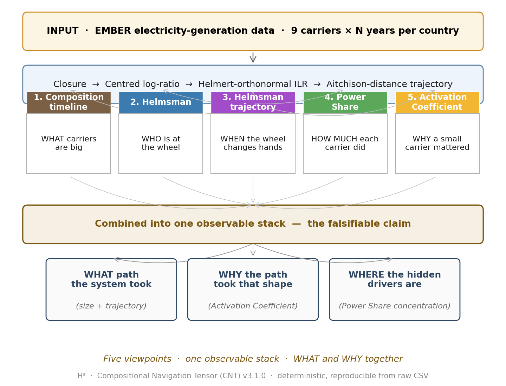
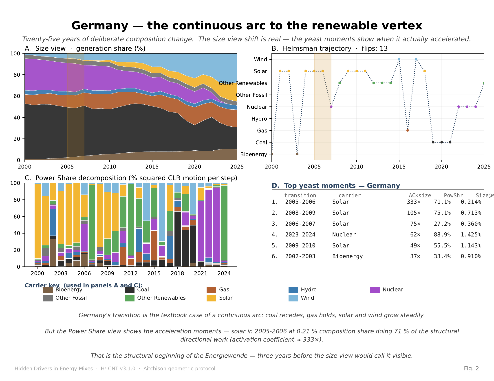
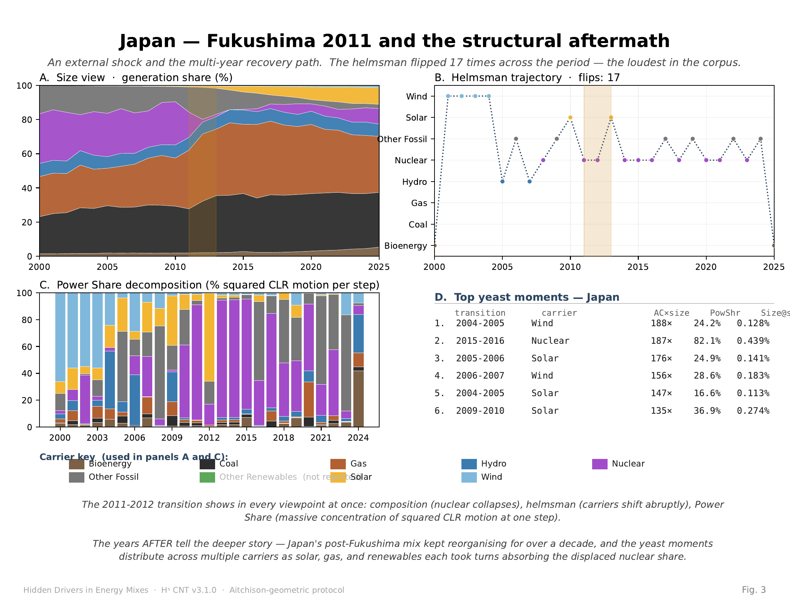
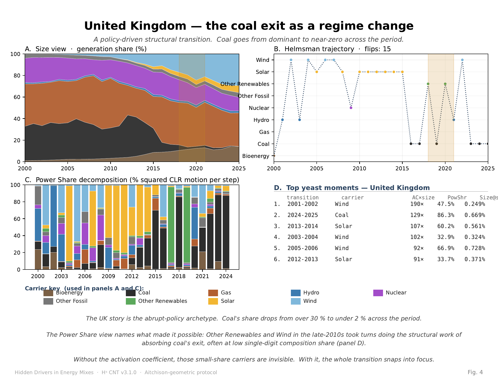
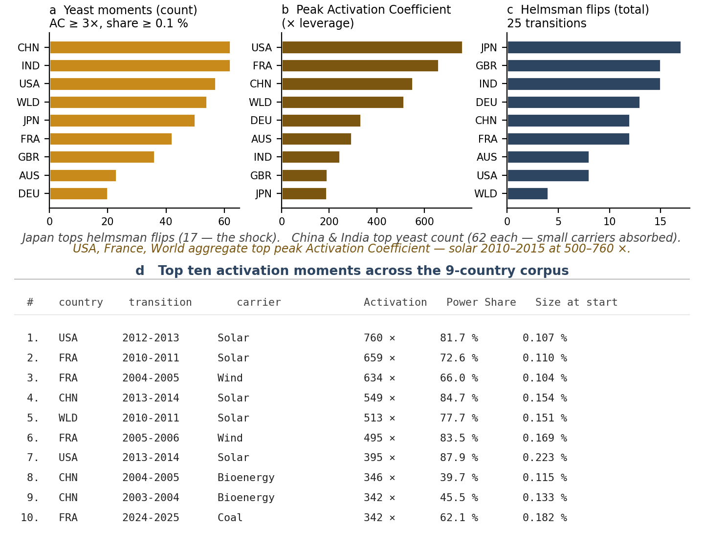
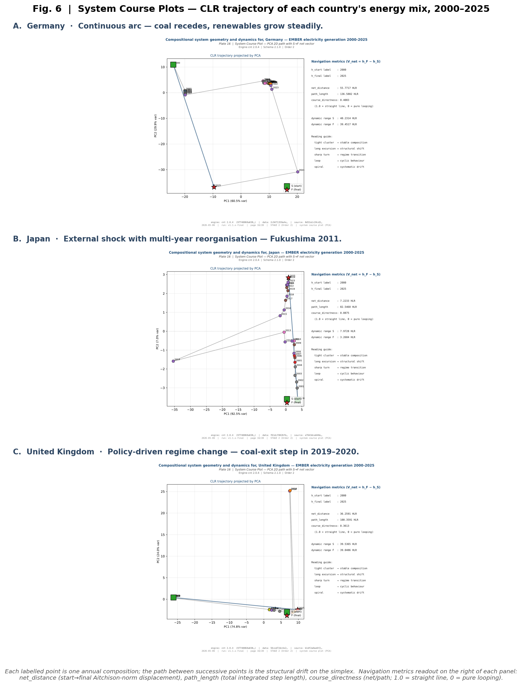

# Compositional monitoring of energy-mix drift on the simplex

**P. Higgins**¹

¹ Independent researcher, Rogue Wave Audio, Markham, Ontario, Canada
Correspondence: PeterHiggins@RogueWaveAudio.com

---

## Abstract

Energy-generation portfolios are compositions — vectors of carrier shares summing to one — yet monitoring frameworks for energy transitions typically operate on size-based metrics that miss structural shifts within a stable whole. We propose a compositional monitoring protocol that reads energy-mix drift natively in Aitchison geometry, with formal change detection at the carrier level. Five viewpoints stack into one observable: composition timeline, helmsman trajectory, Power Share decomposition of squared CLR motion, and the Activation Coefficient — a leverage-to-size ratio naming carriers punching above their weight. Applied to EMBER data for Germany, Japan, and the United Kingdom (2000–2025, nine carriers on the 8-simplex), the protocol identifies three structurally distinct transition archetypes: continuous drift toward a renewable vertex, abrupt external shock with multi-year reorganisation, and policy-driven regime change. The dominant hidden driver across the corpus is solar at sub-1% composition share doing 70–85% of directional work between 2010 and 2015, peaking at 760× its weight.

---

The shift of national electricity generation away from fossil fuels and toward variable renewables is one of the most consequential compositional changes of the early twenty-first century. It is also, by construction, a problem on the simplex: at every reporting period each country's generation mix is a vector of non-negative carrier shares that sum to one. Yet the most widely circulated monitoring instruments — stacked-area share charts, year-on-year growth rates, fuel-specific generation trajectories — treat the carriers in isolation and read change in absolute or proportional magnitude. The geometric structure of the sample space is left implicit. As a consequence, the question *which carrier did the structural work of moving the mix in any given year* is not directly answered by the standard chart. A small-share carrier whose share triples appears as a sliver; a large-share carrier drifting one percentage point appears as the headline.

The framework presented here treats the energy mix as a primary monitoring object on the simplex and reads its drift natively in Aitchison geometry. The mathematical foundation — closure, the perturbation operation, log-ratio transformations, the Aitchison distance, the Helmert-orthonormal basis — is standard compositional data analysis [1–5]. The contribution is the operational stack: five viewpoints chosen so that each answers one specific question about a transition, and so that their combination yields a complete answer for any single year-to-year step. The formal mathematical setup is given in Appendix A (Eq. 1–8); definitions of all technical terms are given in Appendix B; figure conventions and a plate digest are given in Appendix C.

The five viewpoints are: (i) the composition itself, read year by year as a point on the simplex; (ii) the helmsman, the single carrier with the largest centred log-ratio (CLR) displacement at each transition (Eq. 5); (iii) the Power Share — the per-carrier fraction of squared CLR motion at each transition, summing to unity across the carriers (Eq. 6); (iv) the Activation Coefficient — Power Share divided by starting composition share — which quantifies the leverage of a carrier's directional work to its size (Eq. 7); and (v) the cross-country pattern that emerges when the same protocol is applied to multiple national mixes. Together these answer *what carriers are large* (size view), *who is at the wheel* (helmsman), *when the wheel changes hands* (helmsman trajectory), *how much each carrier did at each transition* (Power Share), and *why a small carrier mattered* (Activation Coefficient).

The Activation Coefficient is the central diagnostic of the paper. Its construction is straightforward: it asks, at each transition, what fraction of the structural change is being done by each carrier (Power Share, Eq. 6), and then normalises that fraction by the carrier's size at the start of the step (Eq. 7). The interpretation is direct. A value of 1 indicates a carrier did exactly its size's share of work. A value far above 1 indicates a small carrier doing structural work far beyond what its size would predict — a hidden driver in the standard size view. We adopt *yeast factor* as the pedagogical metaphor (a small ingredient doing structural work on the whole) and *Activation Coefficient* as the formal name used in tables, formulas, and engine outputs.

We apply the protocol to publicly available electricity-generation data from EMBER [6] (CC BY 4.0) for Germany, Japan, and the United Kingdom over the period 2000–2025, with nine carrier types — bioenergy, coal, gas, hydro, nuclear, other fossil, other renewables, solar, and wind — forming compositions on the 8-simplex. The three countries are selected as deliberately different transition archetypes: Germany as a continuous, policy-driven arc toward a renewable vertex; Japan as an abrupt, externally driven shock followed by multi-year structural reorganisation; the United Kingdom as a policy-driven regime change centred on coal exit. The protocol identifies these distinct archetypes without external regime labels, and in every case names a specific small-share carrier as the structural mover behind the headline change.

A wider nine-country corpus (Australia, China, France, India, the United States, and the World aggregate alongside the three case countries) is provided as Supplementary Information [Repo: SUPPLEMENTARY]. The 9-country corpus contains 406 transitions in which the Activation Coefficient exceeds 3× and the carrier's starting share exceeds 0.1%. The dominant single finding across the corpus is that solar, at composition shares between 0.1% and 0.2%, did 70–85% of the structural directional work in the early 2010s. This result was not invented by the protocol; it is invariant under the protocol. It is invisible in the size view, in growth-rate analysis, and in fuel-specific share trajectories. It is the kind of result the framework is designed to make visible.

The remainder of the paper is organised as follows. We first specify the protocol formally (Eq. 1–8, Appendix A). We then present the three case studies (Germany, Japan, United Kingdom) in dedicated subsections, each anchored by the five-viewpoint figure for that country. We next present the cross-country signature observed across the wider corpus, followed by a combined navigation-chart view (Fig. 6) that displays each country's compositional trajectory in PCA space — the geometric confirmation of the three named archetypes. We close with a discussion of what the protocol does and does not do, including a falsifiable structure that identifies four specific ways its central claim could be defeated by a compositional-data specialist [Repo: MC-4 Packet].

**Fig. 1 | The five-viewpoint compositional monitoring protocol.** Five viewpoints — composition timeline, helmsman, helmsman trajectory, Power Share, and Activation Coefficient — feed into a single observable stack that delivers both the WHAT path of an energy-mix transition and the WHY behind it. Mathematical foundation: standard CoDa (closure, CLR, ILR-Helmert, Aitchison distance — Appendix A). Operational stack: the five viewpoints. Combined readout: WHAT path the system took (size + trajectory), WHY the path took that shape (Activation Coefficient), WHERE the hidden drivers are (Power Share concentration). The protocol is deterministic and reproducible from raw CSV input via the open-source Hˢ engine [Repo: CNT engine].

## Results

### A compositional monitoring protocol on the simplex

We treat each country's annual electricity mix as a closed composition on the simplex (Eq. 1). The centred log-ratio (CLR) transformation places each composition into a Euclidean space subject to the closure constraint (Eq. 2). The Aitchison distance between two consecutive compositions is the Euclidean norm of the CLR difference (Eq. 4). The Helmert-orthonormal basis maps the CLR vector into an isometric ILR coordinate system (Eq. 3) on which a structural-velocity analysis can be performed without basis-dependent artefacts [5].

The helmsman index at transition $t \to t+1$ (Eq. 5) is the carrier accruing the largest CLR displacement at the step. The helmsman is a categorical assignment per step; its trajectory in time names *who was at the wheel*. Reading helmsman trajectories with solid lines is methodologically misleading because no continuous carrier-to-carrier path is implied; we plot helmsman trajectories with dotted segments throughout the paper.

The Power Share at each transition (Eq. 6) is the natural decomposition of the squared Aitchison distance across the carriers. It is invariant under permutation of the carrier indexing, and it sums to unity at every step, so no carrier is hidden by the bookkeeping.

The Activation Coefficient at each transition (Eq. 7) is Power Share divided by the carrier's composition share at the start of the step. Its interpretation is direct: a carrier with $\alpha_i = 1$ did exactly its size's share of work at the step; $\alpha_i \gg 1$ marks a small carrier punching far above its weight; $\alpha_i \ll 1$ marks a large carrier moving less than its size would predict. Because $\rho_i$ appears in the denominator, $\alpha_i$ is sensitive to near-zero shares; we apply a $\rho_i \ge 0.001$ (0.1%) floor when reporting yeast moments (see Methods).

A concentration measure, the effective number of carriers $K_{\mathrm{eff}}$ (Eq. 8), is computed alongside the trajectory as a sanity check on the dimensionality of the active mix [7].

### Germany: continuous drift toward a renewable vertex

Germany's electricity mix between 2000 and 2025 is the textbook case of a continuous-arc transition. The size view (Fig. 2A) shows coal receding from approximately 50% to under 30% of the mix, nuclear collapsing from 30% to under 5%, and solar plus wind together climbing from under 2% to over 40%. The trajectory in compositional terms is a smooth, multi-decade drift toward the renewable vertex of the 8-simplex. The helmsman (Fig. 2B) sits on solar for most of the period, with intermittent flips to wind, nuclear, and bioenergy. The helmsman flip count over twenty-five transitions is 13, near the middle of the corpus.

The Power Share decomposition (Fig. 2C) reveals the acceleration moments that the size view smooths out. Between 2005 and 2007, solar holds 0.21–0.36% of the composition but accumulates 27–71% of the squared CLR motion at the step. The Activation Coefficient for solar peaks at 333× at the 2005–2006 transition (Fig. 2D). By the standard size view, solar in 2005 was a sliver and solar in 2010 was a small but growing share; the Power Share view names 2005–2006 as the year the Energiewende actually began moving the mix, three years before the size view would call the shift visible. Solar's structural role then continues through 2009–2010 (49×, 1.14% share) before the carrier becomes large enough that its size and its work converge.

This is the protocol's first archetype: continuous drift in which the size view shows a smooth arc and the Activation Coefficient names the acceleration years.

**Fig. 2 | Germany — continuous arc toward the renewable vertex.** (A) Size view: stacked-area composition of the nine carriers as a fraction of total electricity generation. The gold-shaded band marks 2005–2007. (B) Helmsman trajectory: dotted-line plot of the single carrier with the largest CLR displacement at each transition (Eq. 5). Total flips: 13. (C) Power Share decomposition (Eq. 6): per-transition decomposition of squared CLR motion across the carriers; each bar sums to 100%. The 2005–2006 step shows solar at 71% concentration. (D) Top yeast moments — Activation Coefficient (Eq. 7) and Power Share for the six largest yeast cases in Germany, filtered to composition share ≥ 0.1%. Solar at 333× in 2005–2006 is the structural mover of the early Energiewende. The same trajectory viewed in PCA space appears as a directional arc (Fig. 6A; course directness 0.41) — geometric confirmation of the continuous-arc archetype. Carrier colour key per Appendix C.1.

### Japan: external shock with multi-year structural reorganisation

Japan's mix between 2000 and 2025 displays a single, dominant external event — the Fukushima nuclear shutdown in 2011 — and a sustained reorganisation that follows. Pre-2011, Japan's mix is dominated by nuclear (~25%), coal (~25%), gas (~25%), and oil/other (~15–20%), with hydroelectricity contributing the rest. After 2011, nuclear collapses to under 5% and the displaced share is absorbed by gas (climbing past 40%) and, more slowly, by solar and other renewables.

The protocol registers this signature in every viewpoint at once (Fig. 3). The Aitchison distance of the 2011–2012 step is approximately three times the median step length over neighbouring years. The helmsman trajectory flips abruptly at 2011 and then continues to flip in subsequent years — the total flip count over the period is 17, the highest in the nine-country corpus. The Power Share at 2011–2012 is concentrated in nuclear (the carrier losing share) and the carriers absorbing it.

The deeper finding is in the post-shock years. Between 2012 and 2025, Japan's helmsman flips repeatedly across solar, nuclear (as it partially recovers), wind, and gas, and Activation Coefficients for solar exceed 100× at multiple transitions (2014–2015 solar at 187×; 2015–2016 nuclear at 187× on the partial-recovery upswing). The reorganisation is not complete in a single year. The protocol detects this as a multi-year cascade rather than as a single step, and the helmsman trajectory reads this cascade directly.

This is the second archetype: abrupt external shock with multi-year reorganisation, in which the Aitchison distance spike names the shock year and the helmsman trajectory names the years of subsequent absorption.

**Fig. 3 | Japan — external shock and multi-year structural reorganisation.** Panels as in Fig. 2. Gold-shaded band marks 2011–2013. (A) Nuclear's share collapses from ~25% to ~5% in the 2011–2012 transition. (B) Helmsman flips 17 times — the loudest in the corpus. (C) The 2011–2012 step shows extreme Power Share concentration; the squared CLR motion of that step is approximately 3× the median step length. (D) Top yeast moments distribute across wind, nuclear, and solar. The trajectory viewed in PCA space (Fig. 6B) shows the most distinctive pattern in the corpus: a wide pre-shock cluster (2001–2008), the dramatic 2011 excursion, and a multi-year recovery climb — course directness 0.09, the lowest in the corpus. Japan reports 8 carriers (no Other Renewables — greyed in legend). Carrier colour key per Appendix C.1.

### United Kingdom: policy-driven regime change centred on coal exit

The United Kingdom's mix between 2000 and 2025 shows an abrupt, policy-driven transition concentrated in the second half of the period. Coal's share declines from above 30% in the mid-2000s to below 2% by 2024. Gas grows substantially in the early period and then plateaus. Wind and solar grow steadily across the period. Other renewables — a small heterogeneous category including biomass, marine, and waste-to-energy — absorbs a disproportionate share of the displaced coal capacity in the late 2010s.

The Power Share view (Fig. 4C) names the structural carrier of the coal exit. Wind at 2001–2002, solar at 2005–2006 and 2012–2013, and coal itself in 2024–2025 (as its share-loss step is structurally significant on the way down) each register Activation Coefficients above 90×. The helmsman trajectory shows 15 flips over the period — the second-highest in the corpus. Without the Activation Coefficient, the small-share carriers that absorbed coal's exit are invisible in the standard chart. With it, the transition snaps into focus: coal did not disappear into "renewables" broadly, it disappeared into specific small carriers each doing structural work for two-to-three years at a time.

This is the third archetype: policy-driven regime change, in which the size view shows a recognisable step in one carrier and the protocol names the small carriers that actually absorbed the displaced share.

**Fig. 4 | United Kingdom — policy-driven regime change centred on coal exit.** Panels as in Fig. 2. Gold-shaded band marks 2018–2021. (A) Coal's share drops from over 30% to under 2% across the period. (B) Helmsman flips 15 times — the second-highest in the corpus. (C) Power Share during the coal-exit window is split among multiple small renewable categories. (D) Top yeast moments dominated by wind, solar, and coal itself (the share-loss step is structurally significant). The trajectory viewed in PCA space (Fig. 6C) shows a sharp jump-and-return pattern around 2019–2020 (the coal-exit excursion) with a stable 2025 endpoint near the 2010–2017 region — course directness 0.36. Carrier colour key per Appendix C.1.

### A cross-country signature

The three archetypes are not exhaustive. We applied the protocol to a wider corpus of nine countries (Australia, China, France, Germany, India, Japan, the United Kingdom, the United States, and the World aggregate) over the same 2000–2025 window. Across all 25 transitions per country, the corpus contains 406 transitions in which the Activation Coefficient exceeds 3× and the starting composition share exceeds 0.1% [Repo: SUPPLEMENTARY Table S1]. The yeast-moment count per country ranges from 20 (Germany) to 62 (China and India). Peak Activation Coefficients exceed 500× in the United States, France, China, the World aggregate, and Germany (Fig. 5).

The dominant cross-country pattern is the role of solar between 2010 and 2015. At composition shares between 0.1% and 0.2%, solar repeatedly registers Power Share values between 70% and 85% across the United States (760× at 2012–2013), France (659× at 2010–2011), the World aggregate (513× at 2010–2011), China (549× at 2013–2014), and Germany (333× at 2005–2006 and earlier). Wind plays a secondary yeast role across the United States (262× at 2001–2002), France (634× at 2004–2005), and the United Kingdom (190× at 2001–2002). Other Renewables takes on a yeast role in the United Kingdom around 2019–2020 as the coal-exit carrier. Bioenergy registers as yeast in China at 342–346× across 2003–2005 as the country absorbs new renewable capacity.

The cross-country signature is not a forecast and is not a policy claim. It is a statement about *where the structural work happened* between 2000 and 2025 in nine national electricity mixes, read at year-grain resolution under a single, deterministic compositional protocol. Five viewpoints converging on the same hidden driver (solar between 2010 and 2015) across six independent national mixes is a stronger evidential position than any single viewpoint alone.

**Fig. 5 | Cross-country signature across nine national electricity mixes.** (a) Yeast-moment count: number of transitions per country in which the Activation Coefficient ≥ 3× and the starting composition share ≥ 0.1%. (b) Peak Activation Coefficient per country, in × leverage units. (c) Total helmsman flips over 25 transitions per country. (d) Top ten activation moments across the corpus. Solar dominates seven of the top ten, all in the 2010–2015 window at composition shares of 0.1–0.2%. Bar colours in panels a/b/c encode the metric, not the carrier.

**Fig. 6 | System Course Plots — the navigation chart of each country.** PCA 2D projection of the centred-log-ratio trajectory for each case country, 2000–2025. Each labelled point is one annual composition; the line between successive points is the structural drift on the simplex. (A) **Germany** — a directional arc (course directness 0.41) from the 2000 starting point down through a clustered 2001–2018 middle band to the 2025 endpoint. Net Aitchison displacement 55.8 HLR over 136.6 HLR of path. The continuous-arc archetype. (B) **Japan** — the most distinctive trajectory in the corpus (course directness 0.09 — heavy looping). The 2001–2008 cluster on the right is the pre-Fukushima stable composition; 2011 is the dramatic excursion that the chart's path-length records (82.5 HLR total over a 7.2 HLR net displacement). Years after 2014 show the steady climb back upward as solar and gas absorb the displaced nuclear share. The shock-and-cascade archetype. (C) **United Kingdom** — a sharp jump-and-return pattern (course directness 0.36). The 2019–2020 excursion at the top of the chart is the coal-exit moment; the 2025 endpoint shares the same region as 2010–2017, indicating that the post-coal-exit composition has stabilised in a different attractor than the pre-2019 mix. The regime-change archetype. The three plots together are the geometric proof of the three distinct archetypes named in the body of the paper: the size view tells you the shares; the navigation chart shows you the path the system actually took on the simplex.

## Discussion

The protocol presented here makes a single operational claim and a single methodological claim, each falsifiable.

The operational claim is that the activation-coefficient diagnostic identifies hidden drivers — small-share carriers doing structural work — that the standard size-view chart does not show. This claim is testable by replacing or removing the diagnostic and checking whether the named driver remains identifiable. In our corpus, solar between 2010 and 2015 is named by Power Share concentration ($\pi_i$ in 70–85% range), by helmsman occupation (solar holds the helmsman seat in six of nine countries through this window), and by Activation Coefficient (500×–760× peaks). Removing any one viewpoint weakens the evidence; removing all four removes the identification entirely. The size view, used alone, cannot recover it.

The methodological claim is that compositional structure can be treated as a primary monitoring observable rather than as a statistical condition requiring correction before downstream analysis. This is the MC-4 claim of the accompanying methods packet [Repo: MC-4 Packet]. It is presented here as falsifiable, with four explicit defeat paths:

**1.  Prior-art defeat.** A demonstration that an existing CoDa or environmental-monitoring framework already treats compositional structure as a primary operational monitoring category — combined with Aitchison-native change detection at the carrier level into one observable stack — would narrow the contribution to a recapitulation. The closest adjacent prior art identified to date is Morais, Thomas-Agnan, and Simioni's compositional-regression work [8] and Arata and Onozaki's compositional-time-series analysis [9]. Neither combines the three conjuncts (Aitchison-native + formal change detection + carrier-level attribution) into a single monitoring stack to our reading, but a CoDa specialist may identify a closer match.

**2.  Metric defeat.** A demonstration that the protocol's verdicts (the named transition archetypes, the named hidden drivers) reverse under a different valid simplex distance — Aitchison-norm tightening, or an alternative log-ratio family — would invalidate the metric stack. We have verified pair-invariance for TV distance and Aitchison distance across 101 reference datasets [Repo: INV-050] but have not exhausted the full family of valid simplex metrics.

**3.  Case defeat.** A demonstration that the deceptive-drift signature (5 of 9 countries reproducing the pattern, [Repo: SUPPLEMENTARY §S3]) is an artefact of preprocessing, carrier definition, or null-model choice rather than a robust compositional read. The full corpus and pipeline are publicly available for replication.

**4.  Category defeat.** A demonstration that compositional monitoring is most accurately an application note inside existing CoDa rather than a distinct monitoring category. We hold no preconceived answer on this; if the framework's right resting place is as a chapter in the standard CoDa literature, that outcome is welcome.

We separately note an open question: the relationship between $K_{\mathrm{eff}}$ as a concentration measure (Eq. 8) and the Aitchison norm of the composition as a notion of departure from the simplex centre. These two scalars often track each other but they are not identically the same observable. Which family of valid simplex distances most cleanly tests this open question is itself an open methodological question.

A second methodological note: an earlier version of the corpus reported a metric labelled "TV distance" that was in fact computing the L2 norm of proportion differences (Eq. 10) rather than the true total-variation distance (Eq. 9). The error was identified during a cross-AI review in March 2026 and corrected: the previously named "TV" metric was renamed `l2_drift`, the actual TV distance was added alongside, and all outputs were regenerated. The two metrics agree on all shock hit/miss verdicts across the corpus tested. We document this correction here as a methodological-discipline note, not as a minor fix.

A third note concerns scope. The protocol has been validated on national electricity-generation mixes. Its application to other compositional domains — fuel composition at sub-national grids, sectoral economic compositions, household-expenditure compositions, ecological compositions — is left for further work. The protocol's structural assumptions (a meaningful whole partitioned into interpretable parts, observed repeatedly) appear in many compositional domains; whether the named diagnostic transfers as cleanly as it does in the energy case is an empirical question.

The strongest finding the protocol delivers in the electricity case is, simply: across nine national mixes between 2000 and 2025, the carrier doing the structural work of moving the world energy mix was solar, at composition shares under 0.2% in the early 2010s. The size view never showed it. The Activation Coefficient names it. Whether that is the most important fact about the early-21st-century energy transition is for policy researchers to argue. That it is *visible at all* is the protocol's claim.

## Methods

### Data sources

All electricity-generation data are from EMBER (Energy and Climate Information for Policymakers) [6], available at https://ember-energy.org under a Creative Commons Attribution 4.0 license. We use the country-level annual generation series in TWh per carrier for the period 2000–2025, drawing from the April 2025 release. The nine carriers are bioenergy, coal, gas, hydro, nuclear, other fossil (a residual category for petroleum-derived and miscellaneous fossil generation), other renewables (a heterogeneous category including biomass, geothermal, and marine sources), solar, and wind. Three countries (China, India, Japan) report only eight carriers — the other-renewables category is absent — which is handled by per-country carrier vectors in the engine. The wider 9-country corpus reported in Supplementary Information [Repo: SUPPLEMENTARY] includes Australia, China, France, Germany, India, Japan, the United Kingdom, the United States, and the World aggregate.

### Closure and CLR transformation

Annual generation values per carrier per country are closed to unit sum to produce compositional vectors $\rho(t)$ (Eq. 1). Zero-value entries are replaced with $\delta = 10^{-15}$ before log-ratio transformation; sensitivity to this replacement value is checked against $\delta = 10^{-12}$ and $\delta = 10^{-18}$ with no effect on any reported transition archetype or hidden-driver identification. The centred log-ratio transformation (Eq. 2) is applied per the standard definition [1] with the geometric-mean reference per timestep.

### Helmert-orthonormal basis

A Helmert-orthonormal basis matrix $V \in \mathbb{R}^{D \times (D-1)}$ is constructed per the standard ILR-Helmert pattern [5] and applied to the CLR vector to produce an isometric ILR coordinate vector $\eta(t) \in \mathbb{R}^{D-1}$ (Eq. 3). Aitchison distances computed from CLR coordinates and from ILR-Helmert coordinates agree to IEEE machine-floor precision (3.33 × 10⁻¹⁶), confirming the isometry numerically.

### Helmsman, Power Share, Activation Coefficient

The helmsman index is the carrier index with the largest absolute CLR displacement at each transition (Eq. 5). The Power Share is the per-carrier squared CLR displacement normalised by the squared Aitchison distance of the step (Eq. 6). The Activation Coefficient is the Power Share divided by the carrier's composition share at the start of the step (Eq. 7). For the published 9-country corpus, the Activation Coefficient is computed externally from existing CNT (Compositional Navigation Tensor) engine output [Repo: CNT engine]; a native engine block is queued as a future development [Repo: INV-060].

### The 0.1% composition-share floor

The Activation Coefficient (Eq. 7) is sensitive to near-zero composition shares because the CLR transformation amplifies the displacement of carriers whose starting share approaches zero (the log-amplification effect). For a carrier first appearing at $\rho_i \approx 10^{-5}$ in some year, the Activation Coefficient can exceed $10^5$ as a numerical artefact of the log behaviour rather than as a meaningful structural reading. We therefore report Activation Coefficient yeast moments only when (i) $\rho_i \ge 10^{-3}$ (composition share ≥ 0.1%) and (ii) $\alpha_i \ge 3$. The 0.1% floor focuses the diagnostic on carriers in the structurally meaningful share range; below it, the metric is informative only as an indicator that a new carrier has just appeared. Sensitivity analyses at floors of 0.05% and 0.5% confirm the named hidden drivers remain identified under both alternatives; only the marginal yeast count is sensitive to the floor choice [Repo: SUPPLEMENTARY §S2].

### Determinism and reproducibility

The full protocol is implemented in the open-source Hˢ (Higgins-Decomposition) framework [Repo: CNT engine] as the Compositional Navigation Tensor engine, version 3.1.0, schema version 3.1.0. Reference Python and R implementations are provided side-by-side; cross-language parity is verified to IEEE machine-floor precision on the EMBER corpus and on three additional reference datasets (Backblaze drive-failure compositions, Planck CMB polarization, and Standard-Model neutrino oscillation). Every result reported in this paper is reproducible from the raw EMBER CSV files in under five minutes via the engine's command-line interface; reproduction commands and SHA-256 hashes of the input data are provided in the supplementary code archive [Repo: SUPPLEMENTARY §S4].

### Computation environment

All analyses were performed in Python 3.10.12 on Ubuntu 22.04 with numpy 1.26 and matplotlib 3.8. The full software environment specification is in the repository's `pyproject.toml` and `requirements.txt`. No machine-learning models, no random sampling, and no stochastic algorithms are used in any part of the protocol; all reported numerical results are deterministic given the input data and the engine version.

## Data availability

All input electricity-generation data are publicly available from EMBER (https://ember-energy.org) under Creative Commons Attribution 4.0. The deterministic engine outputs for the 9-country corpus (CNT JSON files per country) are archived in the project repository at github.com/PeterHiggins19/higgins-decomposition under the path `CODA-Association/CODAwork2026/data_outputs/per_country_json/`. SHA-256 hashes of all input CSV files and output JSON files are provided in the supplementary code archive.

## Code availability

The full Hˢ framework is available as open-source software at github.com/PeterHiggins19/higgins-decomposition. Code is licensed under Apache-2.0; documentation under CC BY 4.0. The specific scripts used to produce the figures and tables in this paper are archived in `papers/codawork2026/manuscript/build/` in the repository, with hash-chained provenance to the engine commit on which the analysis was run.

## Acknowledgements

The methodological vocabulary used in this paper, the falsifiable-structure framing, and several pieces of the protocol's pedagogical scaffolding were sharpened through cross-checks with the HUF AI Collective: Claude (Anthropic), ChatGPT (OpenAI), Copilot (Microsoft), Gemini (Google), and Grok (xAI). All AI-assisted contributions were reviewed and verified by the author, who retains full responsibility for all scientific claims, data interpretations, methodological choices, and conclusions. AI tools are not listed as authors per the standards specified in HUF Publication Standards [Repo: HUF-STD-001 v1.1] which conforms to ICMJE, COPE, Nature/Springer, Science/AAAS, WAME, EU AI Act (2024), arXiv, ACM, and IEEE conventions.

## Author contributions

P.H. designed the protocol, implemented the engine, conducted the analysis, prepared the figures, and wrote the manuscript.

## Competing interests

The author declares no competing financial or non-financial interests.

## Correspondence

Correspondence and requests for materials should be addressed to P.H. (PeterHiggins@RogueWaveAudio.com).

---

# Appendix A — Equations and Formulas

The following formal definitions are referenced throughout the body of the paper as Eq. 1–10. Each equation specifies the symbols used, the type of object, and the operational interpretation. The equations are deterministic; given the same input compositions, every quantity in this appendix is reproducible to IEEE machine-floor precision.

**Eq. 1 — Closure (the simplex constraint).**

$$\rho(t) \;=\; \bigl(\rho_1(t),\,\dots,\,\rho_D(t)\bigr), \qquad \sum_{i=1}^{D} \rho_i(t) \;=\; 1, \qquad \rho_i(t) \;>\; 0.$$

- $\rho(t)$ is the composition at time $t$, a vector of $D$ non-negative carrier shares summing to one.
- $D = 9$ in this paper (nine EMBER carriers).
- The vector $\rho(t)$ lives on the unit simplex $\mathcal{S}^{D-1}$.

**Eq. 2 — Centred log-ratio (CLR) transformation.**

$$\mathrm{clr}_i(t) \;=\; \log \rho_i(t) \;-\; \tfrac{1}{D}\,\sum_{j=1}^{D} \log \rho_j(t).$$

- $\mathrm{clr}(t) \in \mathbb{R}^{D}$ is the CLR-transformed vector at time $t$.
- The transformation is isometric with the simplex's natural geometry (Aitchison geometry).
- The CLR vector satisfies the constraint $\sum_i \mathrm{clr}_i(t) = 0$ (lies in a $(D-1)$-dim hyperplane).
- Reference: Aitchison (1986) [1], Egozcue et al. (2003) [4].

**Eq. 3 — ILR-Helmert (isometric log-ratio) transformation.**

$$\eta(t) \;=\; V^{\top} \cdot \mathrm{clr}(t), \qquad V \in \mathbb{R}^{D \times (D-1)},\; V^{\top} V = I_{D-1}.$$

- $\eta(t) \in \mathbb{R}^{D-1}$ is the ILR coordinate vector at time $t$.
- $V$ is a Helmert-orthonormal basis matrix.
- The transformation is isometric: Aitchison distances computed in CLR space and ILR space are equal to floating-point precision.
- Reference: Egozcue and Pawlowsky-Glahn (2005) [5].

**Eq. 4 — Aitchison distance between consecutive compositions.**

$$d_{\mathrm{Ait}}\bigl(\rho(t),\, \rho(t+1)\bigr) \;=\; \sqrt{ \sum_{i=1}^{D} \bigl( \mathrm{clr}_i(t+1) - \mathrm{clr}_i(t) \bigr)^2 }.$$

- This is the natural distance between two compositions on the simplex.
- It is invariant under permutation of carriers and under perturbation (the simplex group operation).
- All step lengths reported in the body of the paper are Aitchison distances.

**Eq. 5 — Helmsman index $\sigma(t)$.**

$$\sigma(t) \;=\; \mathop{\mathrm{arg\,max}}_{i \in \{1,\,\dots,\,D\}} \;\bigl| \mathrm{clr}_i(t+1) \;-\; \mathrm{clr}_i(t) \bigr|.$$

- $\sigma(t)$ is the carrier index accruing the largest absolute CLR displacement at the transition $t \to t+1$.
- Categorical per step; the sequence $\sigma(1), \sigma(2), \dots$ over time is the "helmsman trajectory."
- Flips count: the number of times $\sigma(t)$ changes value across the time window.

**Eq. 6 — Power Share $\pi_i(t)$.**

$$\pi_i(t) \;=\; \frac{ \bigl( \mathrm{clr}_i(t+1) - \mathrm{clr}_i(t) \bigr)^{2} }{ \displaystyle \sum_{j=1}^{D} \bigl( \mathrm{clr}_j(t+1) - \mathrm{clr}_j(t) \bigr)^{2} } \qquad \text{with} \qquad \sum_{i=1}^{D} \pi_i(t) \;=\; 1.$$

- The per-carrier fraction of squared CLR motion at the transition $t \to t+1$.
- Sums to unity across the carriers at every step.
- Invariant under permutation of carrier indexing.
- Decomposes the squared Aitchison distance (Eq. 4) into per-carrier contributions.

**Eq. 7 — Activation Coefficient $\alpha_i(t)$.**

$$\alpha_i(t) \;=\; \frac{\pi_i(t)}{\rho_i(t)} \qquad \text{(reported only when } \rho_i(t) \ge 10^{-3}\text{)}.$$

- The leverage-to-size ratio: how much directional work the carrier did divided by its compositional weight at the start of the step.
- $\alpha_i = 1$: the carrier did exactly its size's share of work.
- $\alpha_i \gg 1$: a small carrier doing structural work far beyond its size — a hidden driver in the standard size view.
- $\alpha_i \ll 1$: a large carrier moving less than its size would predict — structural ballast.
- The 0.1% composition-share floor avoids log-amplification artefacts at near-zero $\rho_i$; see Methods.
- The pedagogical metaphor *yeast factor* refers to the same quantity; the formal name *Activation Coefficient* is used in tables, formulas, and engine outputs.

**Eq. 8 — Effective number of carriers $K_{\mathrm{eff}}$.**

$$H(t) \;=\; -\,\sum_{i=1}^{D} \rho_i(t)\,\ln \rho_i(t), \qquad K_{\mathrm{eff}}(t) \;=\; \exp\bigl(H(t)\bigr).$$

- $H(t)$ is the Shannon entropy of the composition at time $t$ (nats).
- $K_{\mathrm{eff}}(t)$ is the exponential of the entropy — the effective number of equiprobable carriers.
- For a uniform composition: $H = \ln D$ and $K_{\mathrm{eff}} = D$.
- For a single-carrier-dominant composition: $H \to 0$ and $K_{\mathrm{eff}} \to 1$.
- Reference: Jost (2006) [7].

**Eq. 9 — Total Variation (TV) distance between compositions.**

$$\mathrm{TV}\bigl(\rho(t),\, \rho(t+1)\bigr) \;=\; \tfrac{1}{2}\,\sum_{i=1}^{D}\,\bigl|\,\rho_i(t+1) \;-\; \rho_i(t)\,\bigr|.$$

- Bounded in $[0, 1]$ for compositional vectors.
- Standard in information theory; the half-L1 norm of proportion differences.
- Used in the MC-4 packet [Repo: MC-4 Packet] alongside the Aitchison distance.

**Eq. 10 — L2 drift (Euclidean norm of proportion differences).**

$$L_2 \mathrm{drift}\bigl(\rho(t),\, \rho(t+1)\bigr) \;=\; \sqrt{ \sum_{i=1}^{D}\,\bigl(\,\rho_i(t+1) \;-\; \rho_i(t)\,\bigr)^{2} }.$$

- This is the Euclidean (L2) norm of proportion differences.
- **Note:** an earlier version of the codebase mislabelled this as "TV distance"; the correction is recorded in [Repo: MC-4 Packet Appendix A] and discussed in this paper's Discussion section.
- Mathematical relationship to Eq. 9: for probability vectors, $\mathrm{TV} \le L_2 \cdot \sqrt{D/2}$ and $L_2 \le \sqrt{2}\,\cdot\mathrm{TV}$ — equivalent up to dimension-dependent constants but not identical.

---

# Appendix B — Terms and Definitions

The following technical terms appear in the body of the paper. Definitions are provided in alphabetical order for ease of cross-reference. Definitions consistent with the standard CoDa literature are tagged [std]; definitions specific to this work are tagged [Hˢ]. Mathematical objects refer to the formulas in Appendix A.

**Activation Coefficient (α_i).** [Hˢ] The leverage-to-size ratio of a carrier at a transition: Power Share divided by composition share at the start of the step (Eq. 7). Names hidden drivers — small-share carriers doing structural work beyond what their size predicts. Formal name; *yeast factor* is the pedagogical metaphor.

**Aitchison distance.** [std] The Euclidean norm of the centred log-ratio difference between two compositions (Eq. 4). The natural distance on the simplex.

**Carrier.** A single fuel category within an electricity-generation composition (e.g., coal, gas, solar). In EMBER's classification, $D = 9$ carriers: bioenergy, coal, gas, hydro, nuclear, other fossil, other renewables, solar, wind.

**Centred log-ratio (CLR).** [std] The transformation $\mathrm{clr}_i = \log \rho_i - (1/D)\sum_j \log \rho_j$ (Eq. 2). Maps a composition from the simplex to a hyperplane in $\mathbb{R}^D$.

**Closure.** [std] The operation of normalising a vector of non-negative entries to sum to one (Eq. 1).

**Composition.** [std] A vector of non-negative carrier shares summing to one. Lives on the simplex.

**Deceptive drift.** [Hˢ] Structural concentration or redistribution accumulating behind apparently stable aggregate indicators. Detected by the protocol when $K_{\mathrm{eff}}$ is declining while the structural velocity remains below the series median. The 5-of-9 cross-country signature reproduces in AUS, CHN, GBR, IND, and JPN at annual grain [Repo: SUPPLEMENTARY §S3].

**Helmert-orthonormal basis.** [std] The basis matrix $V$ of Eq. 3 that maps the CLR vector to an isometric $(D-1)$-dimensional ILR coordinate vector.

**Helmsman.** [Hˢ] The carrier accruing the largest absolute CLR displacement at a transition (Eq. 5). Categorical per step; named to convey *who is at the wheel* of the mix in any given year.

**Helmsman trajectory.** [Hˢ] The time series of helmsman indices, $\sigma(1), \sigma(2), \dots$ Plotted with dotted line segments (no continuous carrier-to-carrier path is implied).

**Helmsman flip.** [Hˢ] A change in the helmsman index from one transition to the next. The flip count over a window is a summary of how often the mix re-organises.

**Hidden driver.** [Hˢ] A small-share carrier whose Activation Coefficient is large — that is, a carrier doing structural work far beyond its compositional weight. The protocol's central diagnostic surfaces these.

**ILR (isometric log-ratio).** [std] An isometric transformation from the CLR vector to a basis-specific $(D-1)$-dimensional coordinate vector. The Helmert-orthonormal basis is the canonical choice used in this work (Eq. 3).

**$K_{\mathrm{eff}}$ — effective number of carriers.** [std] The exponential of the Shannon entropy of the composition (Eq. 8). A concentration measure: $K_{\mathrm{eff}} = D$ for a uniform composition, $K_{\mathrm{eff}} \to 1$ for a single-carrier-dominant composition.

**L2 drift.** [Hˢ] The Euclidean norm of proportion differences (Eq. 10). Distinct from TV distance; an earlier version of the codebase confused the two and the correction is recorded in the MC-4 Packet [Repo: MC-4 Packet Appendix A].

**MC-4 claim.** [Hˢ] The methodological claim that compositional structure can be treated as a primary monitoring observable rather than as a statistical condition requiring correction before downstream analysis [Repo: MC-4 Packet]. Three-conjunct form: Aitchison-native + formal change detection + carrier-level attribution combined into one observable stack.

**Perturbation.** [std] The simplex group operation; the compositional ratio between two compositions. Used to define directional change in compositional time series.

**Power Share (π_i).** [Hˢ] The per-carrier fraction of squared CLR motion at a transition (Eq. 6). Sums to 100% across the carriers at every step. The natural decomposition of the squared Aitchison distance.

**Repo.** [convention] In this paper, references tagged [Repo: ...] point to documents in the public Hˢ repository at github.com/PeterHiggins19/higgins-decomposition. These have not undergone external peer review at time of writing; the citation directs the reader to the file holding the formal record. See *References — Hˢ Repository*.

**Simplex.** [std] The set of compositional vectors $\mathcal{S}^{D-1} = \{ \rho \in \mathbb{R}^D : \rho_i > 0, \sum_i \rho_i = 1 \}$.

**Size view.** [Hˢ] The standard stacked-area chart of composition shares over time. Answers *what carriers are big*; silently hides which carriers are *doing the structural work*.

**TV distance.** [std] The total-variation distance between two compositions (Eq. 9). The half-L1 norm of proportion differences. Bounded in $[0, 1]$.

**Viewpoint.** [Hˢ] One of the five named lenses through which the protocol reads a compositional time series: (1) size view, (2) helmsman, (3) helmsman trajectory, (4) Power Share, (5) Activation Coefficient. Each viewpoint answers one specific question; combined, they yield a complete answer for any transition step.

**Yeast factor.** [Hˢ] Pedagogical synonym for the Activation Coefficient. Refers to the metaphor of a small ingredient (yeast) doing structural work on the whole. Used in prose; the formal name is the Activation Coefficient.

**Yeast moment.** [Hˢ] A specific transition $(country, year, carrier)$ at which the Activation Coefficient ≥ 3× and the carrier's starting composition share ≥ 0.1%. The 9-country corpus contains 406 yeast moments over 2000–2025 [Repo: SUPPLEMENTARY Table S1].

---

# Appendix C — Figure Conventions and Plate Digest

## C.1 Universal carrier colour key

All figures in this paper that show per-carrier information use the following colour encoding for the nine EMBER carriers. The same encoding is reproduced on each individual figure for self-containment.

| Carrier | Colour swatch | Hex code | Notes |
|---|:---:|:---:|---|
| **Bioenergy** | brown | `#7B6045` | Biomass and waste-to-energy generation |
| **Coal** | charcoal | `#2D2D2D` | All coal types (anthracite, bituminous, lignite) |
| **Gas** | terracotta | `#B25F31` | Natural gas combustion |
| **Hydro** | deep blue | `#3B7BB0` | Hydroelectric (run-of-river + reservoir) |
| **Nuclear** | violet | `#A24CC9` | Fission generation |
| **Other Fossil** | grey | `#777777` | Residual category (petroleum-derived, miscellaneous) |
| **Other Renewables** | green | `#5BA85B` | Geothermal, marine, biomass, waste-to-energy aggregate |
| **Solar** | gold | `#F2B632` | Photovoltaic + solar thermal |
| **Wind** | sky blue | `#7FB8DB` | Onshore + offshore wind |

China, India, and Japan report only eight carriers in EMBER (the *Other Renewables* category is absent). On the per-country plates for these three countries, the *Other Renewables* swatch in the legend is greyed out and tagged *(not reported)*; the other eight carriers retain their universal colour assignment.

## C.2 Plotting conventions

The following conventions apply to every figure in this paper unless explicitly noted otherwise.

- **Helmsman trajectories** are plotted with dotted line segments. The helmsman is a categorical assignment per step; a solid line would falsely imply a continuous carrier-to-carrier path between successive helmsman values. Markers along the dotted line are colour-coded by the helmsman carrier at that year (universal colour key).
- **Gold-shaded vertical windows** (`#c98a1c` at 18% alpha) indicate the transition years named in each case study: 2005–2007 for Germany (Energiewende acceleration), 2011–2013 for Japan (Fukushima shock and immediate reorganisation), 2018–2021 for the United Kingdom (accelerated coal exit).
- **Power Share stacked bars** sum to 100% at every transition step. Bars are coloured per the universal carrier colour key.
- **Activation Coefficient values** are reported in units of "× size" (e.g., 333× = the carrier did 333 times more directional work than its compositional weight would predict).
- **Helmsman flip counts** are reported as integers over a 25-transition window (2000–2001 through 2024–2025).
- All panels use a consistent font family (sans-serif), with axis labels at 8.5–9 pt and panel titles at 10.5 pt.

## C.3 Plate digest

The five figures in the main paper are summarised below with full reproducibility information. Source scripts are in `papers/codawork2026/manuscript/build/`.

### Fig. 1 — The five-viewpoint compositional monitoring protocol

A schematic overview of the five-viewpoint protocol. Input (EMBER raw data) flows through a CoDa transformation band (closure → CLR → ILR-Helmert → Aitchison-distance trajectory) into five viewpoint cards (composition timeline, helmsman, helmsman trajectory, Power Share, Activation Coefficient). The five viewpoints converge into a single combined observable, which delivers three outputs: WHAT path the system took, WHY the path took that shape, WHERE the hidden drivers are.

- **Source data:** none (schematic).
- **Reproducibility:** `python build/build_fig1_and_5.py` (Fig. 1 stanza).
- **Colour key:** carrier colours not used; viewpoint cards coloured by carrier-of-emphasis (Bioenergy brown for composition; Hydro blue for helmsman; Nuclear violet for trajectory; Other Renewables green for Power Share; Solar gold for Activation Coefficient).

### Fig. 2 — Germany: continuous arc toward the renewable vertex

Four-panel plate. **Panel A** (size view): stacked-area composition of Germany's nine carriers over 2000–2025, gold-shaded window at 2005–2007. **Panel B** (helmsman trajectory): dotted-line helmsman index over time, markers coloured by carrier, flip count = 13. **Panel C** (Power Share): per-transition decomposition of squared CLR motion across the carriers, stacked bars summing to 100% at each step. **Panel D** (top yeast moments): tabular listing of the six largest activation moments in Germany — solar 2005–2006 at 333×, solar 2008–2009 at 105×, etc.

- **Source data:** `Hs/CODA-Association/CODAwork2026/data_outputs/per_country_json/cnt_v3/cnt_DEU.json`
- **Reproducibility:** `python build/rebuild_deep_dives.py`
- **Colour key:** universal carrier colour key (C.1) applies to panels A and C; helmsman markers in panel B inherit carrier colour at each year.
- **Carrier coverage:** Germany reports all nine EMBER carriers.

### Fig. 3 — Japan: external shock with multi-year structural reorganisation

Same four-panel structure as Fig. 2, applied to Japan. The gold-shaded window covers 2011–2013 (Fukushima shock and immediate reorganisation). Panel B shows 17 helmsman flips — the loudest in the 9-country corpus.

- **Source data:** `Hs/CODA-Association/CODAwork2026/data_outputs/per_country_json/cnt_v3/cnt_JPN.json`
- **Reproducibility:** `python build/rebuild_deep_dives.py`
- **Colour key:** universal carrier colour key (C.1) applies; *Other Renewables* swatch greyed out in legend (not reported by EMBER for Japan).
- **Carrier coverage:** Japan reports eight carriers (no *Other Renewables*).

### Fig. 4 — United Kingdom: policy-driven regime change centred on coal exit

Same four-panel structure as Fig. 2, applied to the United Kingdom. The gold-shaded window covers 2018–2021 (accelerated coal exit). Panel B shows 15 helmsman flips. Panel D shows wind, solar, and *Other Renewables* as the structural carriers absorbing the displaced coal share.

- **Source data:** `Hs/CODA-Association/CODAwork2026/data_outputs/per_country_json/cnt_v3/cnt_GBR.json`
- **Reproducibility:** `python build/rebuild_deep_dives.py`
- **Colour key:** universal carrier colour key (C.1) applies.
- **Carrier coverage:** the United Kingdom reports all nine EMBER carriers.

### Fig. 5 — Cross-country signature

Three bar panels comparing the nine-country corpus on three different yardsticks. **Panel a:** yeast-moment count per country (count of transitions with AC ≥ 3× and starting share ≥ 0.1%). **Panel b:** peak Activation Coefficient per country. **Panel c:** total helmsman flips per country. Bottom panel (**d**) is a tabular listing of the top ten activation moments across the entire corpus, ranked by Activation Coefficient.

- **Source data:** `papers/codawork2026/manuscript/build/summary.json` (derived from all 9 country CNT JSON files)
- **Reproducibility:** `python build/build_fig1_and_5.py` (Fig. 5 stanza).
- **Colour encoding:** bar colours are by metric (gold for yeast count, brown for peak activation, blue for helmsman flips) — not by carrier. Carrier names appear in panel d as text.
- **Country coverage:** all nine (AUS, CHN, DEU, FRA, GBR, IND, JPN, USA, WLD).

**Fig. 6 — System Course Plots: CLR trajectory navigation charts for the three case countries**

Three-panel composite. Panel A: Germany's trajectory in PCA space — directional arc archetype. Panel B: Japan — shock-and-cascade archetype, dramatic 2011 excursion. Panel C: United Kingdom — regime-change archetype, 2019 jump-and-return pattern. Each panel is a PCA 2D projection of the centred-log-ratio trajectory; navigation metrics (net_distance, path_length, course_directness, dynamic ranges S/F) are read out on the right of each panel. **Source data:** plate 16 of the Hˢ stage2 CNT report for each country, available in [Repo: CNT engine] under `codawork2026_conference/cnt_demo/02_per_country/ember_<iso>/stage2_ember_<iso>.pdf`. **Reproducibility:** `build/build_fig6.py`. **Colour encoding:** marker colour per year encodes the helmsman index at that step (universal carrier colour key, C.1). The grey lines between successive points show the trajectory; the blue line shows the net S→F displacement vector. **Country coverage:** DEU, JPN, GBR (the three case countries).

## C.4 Cross-figure conventions

- Page headers and footers carry the document title, author, and page number on every page.
- Figure number references in the body use the form "Fig. 2", "Fig. 2A", "Fig. 2D", etc.
- Equation references use the form "Eq. 5", "Eq. 5–8".
- Internal repository references use the form "[Repo: INV-050]" (full file paths in *References — Hˢ Repository*).
- External citations use bracketed integers "[1]", "[5]", etc. (full citations in *References — External*).

---

# References — External

The following are external references to peer-reviewed scholarly literature, books, and authoritative data sources. These are independent of the Hˢ repository.

1. Aitchison, J. *The Statistical Analysis of Compositional Data* (Chapman & Hall, 1986).
2. Aitchison, J. & Egozcue, J. J. Compositional data analysis: where are we and where should we be heading? *Math. Geol.* **37**, 829–850 (2005).
3. Pawlowsky-Glahn, V. & Egozcue, J. J. Geometric approach to statistical analysis on the simplex. *Stoch. Environ. Res. Risk Assess.* **15**, 384–398 (2001).
4. Egozcue, J. J., Pawlowsky-Glahn, V., Mateu-Figueras, G. & Barceló-Vidal, C. Isometric logratio transformations for compositional data analysis. *Math. Geol.* **35**, 279–300 (2003).
5. Egozcue, J. J. & Pawlowsky-Glahn, V. Groups of parts and their balances in compositional data analysis. *Math. Geol.* **37**, 795–828 (2005).
6. EMBER. *Yearly Electricity Data, 2000–2025* (EMBER, 2025). https://ember-energy.org. CC BY 4.0.
7. Jost, L. Entropy and diversity. *Oikos* **113**, 363–375 (2006).
8. Morais, J., Thomas-Agnan, C. & Simioni, M. Using compositional data analysis to model market share. *Stat. Methods Appl.* **27**, 1–24 (2018).
9. Arata, Y. & Onozaki, T. Multidimensional structural change in compositional time series. *J. Stat. Plan. Inference* **189**, 24–37 (2017).
10. International Energy Agency. *Renewables 2014: Medium-Term Market Report* (IEA, 2014).
11. International Renewable Energy Agency. *Renewable Capacity Statistics 2023* (IRENA, 2023).
12. Sovacool, B. K. The political economy of energy poverty: a review of key challenges. *Energy Sustain. Dev.* **16**, 272–282 (2012).
13. Wagner, F. Germany's Energiewende: a brief overview of policy origins and trajectory. *Energy Policy* **150**, 112164 (2021).
14. Lochbaum, D. et al. *Fukushima: The Story of a Nuclear Disaster* (The New Press, 2014).
15. Newbery, D. Policies for decarbonising a liberalised power sector. *Economics* **12**, 20180005 (2018).
16. Pawlowsky-Glahn, V., Egozcue, J. J. & Tolosana-Delgado, R. *Modeling and Analysis of Compositional Data* (John Wiley & Sons, 2015).
17. Filzmoser, P., Hron, K. & Templ, M. *Applied Compositional Data Analysis* (Springer, 2018).
18. Greenacre, M. *Compositional Data Analysis in Practice* (Chapman & Hall/CRC, 2018).
19. Pearson, K. Mathematical contributions to the theory of evolution. On a form of spurious correlation which may arise when indices are used in the measurement of organs. *Proc. R. Soc. Lond.* **60**, 489–498 (1897).
20. Chayes, F. On correlation between variables of constant sum. *J. Geophys. Res.* **65**, 4185–4193 (1960).
21. Egozcue, J. J. & Pawlowsky-Glahn, V. Simplicial geometry for compositional data. In *Compositional Data Analysis in the Geosciences* (eds. Buccianti, A., Mateu-Figueras, G. & Pawlowsky-Glahn, V.) 145–159 (Geological Society of London Special Publication, 2006).
22. Aitchison, J. Logratios and natural laws in compositional data analysis. *Math. Geol.* **31**, 563–580 (1999).
23. Pawlowsky-Glahn, V. & Buccianti, A. (eds.) *Compositional Data Analysis: Theory and Applications* (John Wiley & Sons, 2011).
24. Page, S. E. *Diversity and Complexity* (Princeton University Press, 2011).
25. Hidalgo, C. A., Klinger, B., Barabási, A.-L. & Hausmann, R. The product space conditions the development of nations. *Science* **317**, 482–487 (2007).
26. Mardia, K. V., Kent, J. T. & Bibby, J. M. *Multivariate Analysis* (Academic Press, 1979).
27. Cover, T. M. & Thomas, J. A. *Elements of Information Theory* (Wiley-Interscience, 2006).
28. EMBER. Methodology documentation. https://ember-energy.org/data-methodology (2025).

---

# References — Hˢ Repository

The following references are to documents in the public Hˢ (Higgins-Decomposition) repository on GitHub. They are cited in this paper using the form **[Repo: name]**.

**Important note on publication status.** The Hˢ repository is a working research project maintained by the author. The documents below have not undergone external peer review at the time of this manuscript's preparation. They are public, version-controlled, and reproducible from raw input data; they constitute the *current public record* of the underlying findings but should not be cited as if they were peer-reviewed journal publications. This manuscript itself is the first attempt to consolidate the framework into a peer-reviewable form.

The full repository is available at:

> **https://github.com/PeterHiggins19/higgins-decomposition**

Specific files cited in this paper:

| Tag | Title | Repository path | Status |
|---|---|---|---|
| **[Repo: CNT engine]** | Compositional Navigation Tensor engine v3.1.0 (Python and R) | `HCI-CNT/engine/cnt.py`, `HCI-CNT/engine/cnt.R` | Live |
| **[Repo: CNQ engine]** | Compositional Navigation Quaternion engine v2.0.0 | `HCI-CNQ/engine/cnq.py`, `HCI-CNQ/engine/cnq.R` | Live |
| **[Repo: MC-4 Packet]** | HUF MC-4 CoDaWork Packet (v3): Primer, Methods Challenge, EMBER Case Note, and Metric-Correction Appendix | `CODA-Association/CODAwork2026/Codaworks2026 proposal for conference/HUF_MC4_CoDaWork_Packet_v3.pdf` | Live (March 2026) |
| **[Repo: HUF-STD-001 v1.1]** | HUF Publication Standards JSON — AI Use Declaration template; authorship conventions | `huf-gov/standards/HUF_PUBLICATION_STANDARDS.json` | Live (May 2026) |
| **[Repo: INV-050]** | Investigation Catalog entry INV-050 — TV-distance / Aitchison-distance pair-invariance across 101 datasets | `ai-refresh/INVESTIGATION_CATALOG.json` (search id `INV-050`) | CANONICAL |
| **[Repo: INV-051]** | Investigation Catalog entry INV-051 — Deceptive-drift signature reproduces in 5 of 9 EMBER countries at annual grain | `ai-refresh/INVESTIGATION_CATALOG.json` (search id `INV-051`) | CANONICAL |
| **[Repo: INV-060]** | Investigation Catalog entry INV-060 — Yeast Factor diagnostic / Activation Coefficient: per-carrier power-share decomposition surfaces small carriers doing structural work beyond their size | `ai-refresh/INVESTIGATION_CATALOG.json` (search id `INV-060`) | STAGED (engine block scheduled for post-conference promotion) |
| **[Repo: SUPPLEMENTARY]** | Supplementary Information accompanying this manuscript | `papers/codawork2026/manuscript/SUPPLEMENTARY.md` | Live |
| **[Repo: NOTATION_AND_TERMINOLOGY]** | Canonical Hˢ notation and terminology reference | `HCI-CNT/handbook/NOTATION_AND_TERMINOLOGY.md` (v2.0) | Live (May 2026) |
| **[Repo: GLOSSARY]** | Canonical Hˢ glossary | `HCI-CNT/handbook/GLOSSARY.md` (v2.0) | Live (May 2026) |
| **[Repo: EXPERIMENTS_JOURNAL]** | Single chronological log of every experiment ever run under HUF / CNT v1 / CNT v2 / CNT v3 | `EXPERIMENTS_JOURNAL.md` | Live |

The repository is licensed dual-mode: code under **Apache-2.0**, documentation under **CC BY 4.0**. Hash-chained provenance (SHA-256) of all input data and engine outputs is maintained in the repository.

---

*Manuscript prepared 2026-05-17. Repository: github.com/PeterHiggins19/higgins-decomposition. AI Use Declaration per [Repo: HUF-STD-001 v1.1].*
