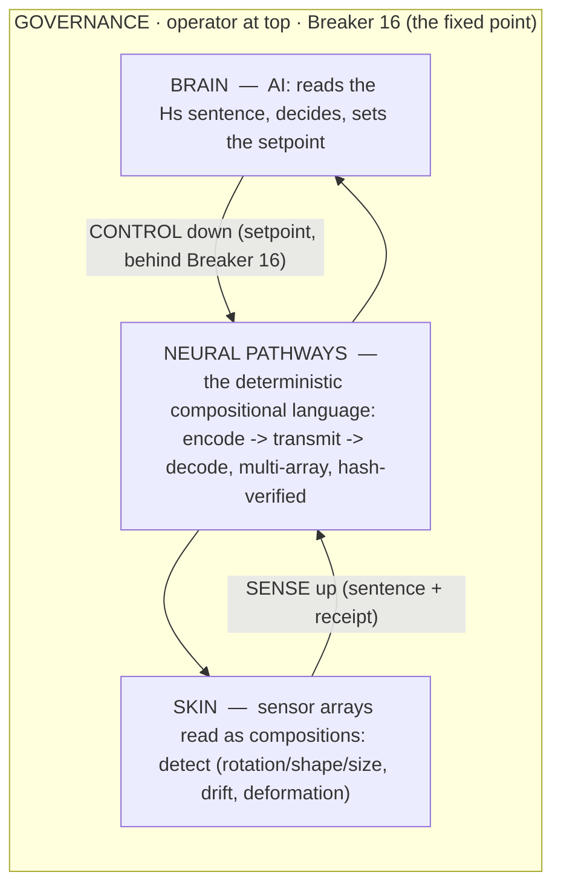

# The distributed intelligent compositional robotic system — skin, pathways, brain, governed

*Author: Peter Higgins (human authorship for all claims); AI‑assisted per HUF‑STD‑001. 2026‑06‑23. The system
model the whole arc was built for: a robotic body whose **skin** is sensor arrays read as compositions, whose
**neural pathways** are the deterministic compositional language, whose **brain** is an AI that reads and
decides, and whose **governance** keeps the operator's Breaker 16 at the top — a closed loop with control
flowing **down** and sensing flowing **up** (cross‑flow), self‑maintaining toward homeostasis and always
connected to a larger node that governs it. For Fuji‑class SMT placement systems and autonomous work cells at
any scale. Honest‑broker tiered; the orchestration is sound and a closed‑loop core is receipted; deployment is
to earn. Nothing posted; Peter is the sole gate.*

---

## 1. The body — four layers, one substance (compositions)

Every layer speaks the **same substance** — a composition — so detect, transmit, decode, decide, and act are
**one language end to end** (`THE_LANGUAGE_OF_Hs.md`). The skin senses (`skin_of_sensors`, deformation sensing);
the pathways carry the reading exactly and verifiably (the Duplex, P‑Ω: *the data is the carrier*, no control
channel); the brain reads the sentence (`ARROW·CHARACTER·EFF‑DIM·COHERENCE·FACES·RECEIPT`) and sets intent; the
governance gates every action.

## 2. The cross‑flow — sense up, control down, operator at the top

The defining structure is a **crossflow** (the RWA design law generalized): the difficulty/authority runs
opposite to the signal.

- **Sensing flows UP:** sensor → array → cell → fleet → governing node. Each level is a composition of the
  level below; Hs reads each, withholds when incoherent, and stamps a receipt.
- **Control flows DOWN:** governing node → fleet → cell → actuator. A SafeLoop restores each composition toward
  its **setpoint** (homeostasis) — but **only behind Breaker 16**, which the operator holds.
- **The operator is the fixed point.** Full top‑down control is available *when armed*; full automation is never
  reached. Measured: with Breaker 16 **armed** the cell holds at the setpoint (distance 0.06); **tripped**, it
  drifts to fault (3.2). The human gate is the one invariant (`c17e9ceb…`).

## 3. Multi‑distribute, multi‑array — encode/decode at any scale

Because a reading **is** a composition and the codec is an exact inverse pair, the system scales by composition
of compositions:

- a **sensor array** is a composition; a **skin** (manifold of arrays) is a composition of arrays;
- a **work cell** is a composition of its skins; a **line** is a composition of cells; a **plant** is a
  composition of lines — the *native recursion* (`THE_ARCHITECTURE_AS_COMPOSITION.md`).
- Each node **encodes** its reading, **transmits** it over the compositional channel (common‑mode‑robust, no
  control channel), and any parent **decodes and re‑verifies by hash** (transitive trust ≠ transitive truth).
  Measured: a governing node reads a 5‑cell fleet, **locates the one distressed cell**, all reads hash‑verified
  (`c17e9ceb…`).

So a Fuji‑class placement cell — `{placement, thermal, feeder, throughput}` as a health budget — is read,
transmitted, and governed by exactly the same operation as a whole plant; only the dimension grows, and with it
the sensitivity (more sensors → more language; `de859b2f…`).

## 4. Detect → transmit → decode → report (what the brain consumes)

1. **Detect.** The skin reads each cell as a composition in motion: the *arrow of intent* (which subsystem is
   gaining/losing health), the *character*, the *effective dimension*, the *blindness faces* (silent ratio
   drift; rotation‑blind size events; deformation as rotation⊕shape⊕size).
2. **Transmit.** The reading rides as a composition over the pathway — exact, integrity‑hashed, carrier‑free.
3. **Decode.** The parent recovers the sentence byte‑exact and re‑derives the child's receipt.
4. **Report.** The brain receives a *sentence in one language*, comparable across every cell and scale, and
   sets the setpoint; the loop closes downward behind Breaker 16.

## 5. Motivation — compositional self‑maintenance, always governed

The system is *properly motivated*: its objective is **homeostasis** — keep each composition near its healthy
setpoint (the barycentre‑relative target). That is not a bolted‑on rule; it is the system's reason to act, and
it is **bounded above** — every node is *always connected to a larger node that governs it*, up to the operator
who holds Breaker 16. A cell maintains itself; a line maintains its cells; a plant maintains its lines; the
human maintains the plant. Power and usefulness come from this: each level is autonomous *within* its setpoint
and *accountable* to the level above. (This is the "alive = homeostasis grounded, human↔machine synthesis"
design philosophy, made operational.)

## 6. The honest envelope

- **What is measured (T1):** the closed‑loop self‑maintenance + Breaker‑16 fixed point + distributed fault
  location + hash‑verified trust (`c17e9ceb…`); the skin scaling, the language, the codec/Duplex, the exact
  rung, the deformation read (all prior receipts).
- **What is reasoned (T2):** the full body/cross‑flow architecture; the plant‑scale recursion; the Fuji‑class
  work‑cell mapping — a sound integration, demonstrated in simulation.
- **What is to earn (T3):** any deployed robotic system; real‑cell hardware integration; performance vs an
  incumbent controller. *No partnership, contact, or endorsement with any named manufacturer is implied —
  "Fuji‑class" denotes a domain of SMT placement systems as an example use case.*
- **Standing guards:** complement not controller‑of‑record; the operator is the sole gate; full automation is
  never reached; safety is dominant; no Shannon‑beating; high‑D is numerical.

> **Make sense and sensitivity:** the system *makes sense* because one composition‑language ties detect →
> transmit → decode → decide → act with a receipt at every hop; it has *sensitivity* because adding sensors adds
> language and resolution; and it stays *sensible* because the operator's breaker is the one fixed point above
> all of it.

## 7. Tiers

- **T1:** `c17e9ceb…` (the closed‑loop cross‑flow demo) + the prior receipted layers.
- **T2:** the integrated body/governance model and the multi‑array recursion.
- **T3:** deployment, hardware, and any manufacturer relationship — to earn; none implied.

*Cross‑refs: `../../experiments/robotic_workcell_2026-06/`, `../../library/THE_LANGUAGE_OF_Hs.md`,
`../../experiments/skin_of_sensors_2026-06/`, `COMPOSITIONAL_DEFORMATION_SENSING.md`,
`../../experiments/hs_duplex_2026-06/`, `../P_OMEGA_THE_DATA_IS_THE_CARRIER_SEED.md`,
`../DISTRIBUTED_CONTROL_TETRAHEDRAL_3N_PAPER_SEED.md`, `../../huf-gov/COMPONENT_REQUEST_ESCALATION_DOCTRINE.md`,
`../../library/THE_ARCHITECTURE_AS_COMPOSITION.md`. Peter is the sole gate; nothing posted.*

*Proof & Honesty Standard — numbers cited‑or‑fenced · math proven + receipted · value shown · experts decide.*
